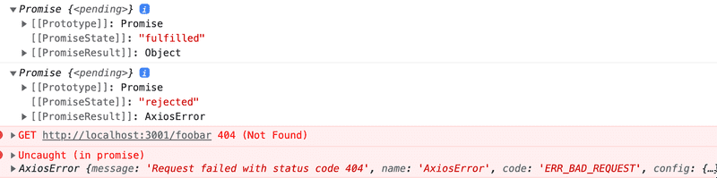
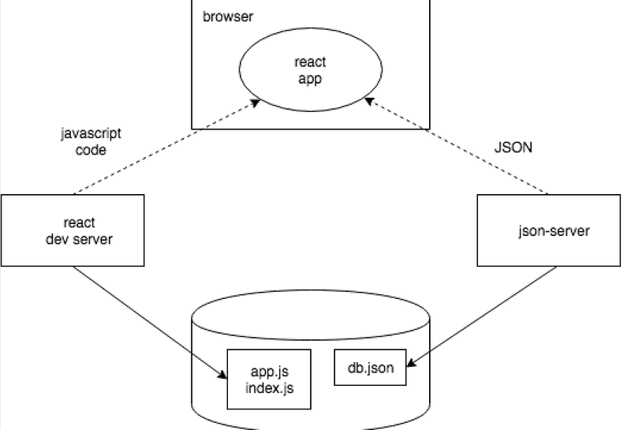

# 2c Getting Data from Server

- [2c Getting Data from Server](#2c-getting-data-from-server)
- [Setup](#setup)
  - [JSON server](#json-server)
  - [npm](#npm)
    - [Installing dependencies with npm](#installing-dependencies-with-npm)
    - [Running npm scripts](#running-npm-scripts)
- [The browser as a runtime environment](#the-browser-as-a-runtime-environment)
  - [Browser-server communication](#browser-server-communication)
    - [Asynchronous code execution](#asynchronous-code-execution)
    - [Why asynchronous?](#why-asynchronous)
  - [Modern ways of Browser-server communication](#modern-ways-of-browser-server-communication)
    - [Axios and promises](#axios-and-promises)
    - [Hooks and effect hooks](#hooks-and-effect-hooks)
      - [The order of events](#the-order-of-events)
- [Summary of our development runtime environment](#summary-of-our-development-runtime-environment)

# Setup

## JSON server

We will use a **JSON server** to simulate a backend. To create a JSON server:

1. Create a file named `db.json` in the root directory of the *notes* app in the previous part.
2. Add the following content to `db.json`:
    
    ```json
    {
    "notes": [
        {
        "id": "1",
        "content": "HTML is easy",
        "important": true
        },
        {
        "id": "2",
        "content": "Browser can execute only JavaScript",
        "important": false
        },
        {
        "id": "3",
        "content": "GET and POST are the most important methods of HTTP protocol",
        "important": true
        }
    ]
    }
    ```

3. You can start the JSON Server by running the following `npx` command in the root directory of the app:

    ```bash
    npx json-server --port 3001 db.json
    ```

    - JSON Server starts running on port 3000 by default, but we will now define an alternate port 3001.
    - Navigate to the address http://localhost:3001/notes in the browser. We can see that JSON Server serves the notes we previously wrote to the file in JSON format (you can install JSONView extension in the browser to view JSON data more easily):

        ```json
        [
            {
                "id": "1",
                "content": "HTML is easy",
                "important": true
            },
            {
                "id": "2",
                "content": "Browser can execute only JavaScript",
                "important": false
            },

            // ...

        ]
        ```
    
- P.S. You don't need to install JSON Server globally, as `npx` allows you to run it without a separate installation. (Global installation means you can run it from any directory without specifying the path to the executable.)
- What we want to do:
    - save the notes to the json-server
    - fetches the notes from the server and renders them in the browser
    - In other words, whenever a new note is added to the application, the React code also sends it to the server to make the new note persist in "memory".
- json-server stores all the data in `db.json` (which resides on the server)
    - In the real world, data would be stored in some kind of database.
    - However, json-server is a simple way to simulate a backend for development purposes.

## npm

> We will use npm to install and manage dependencies (e.g., Axios) which will be needed in the later sections. It's ok to skip this section for now but remember to come back later when you need to install Axios.

- Almost all JavaScript projects use **npm** (**Node Package Manager**) for managing dependencies. 
- React projects that use npm contain a `package.json` file in the root directory.
- React projects created with Vite also follow this npm format. (Vite automatically creates a `package.json` file when you create a new React project.)
- `package.json` defines the metadata, dependencies and other settings of the project:

    ```json
    {
        "name": "part2-notes-frontend",
        "private": true,
        "version": "0.0.0",
        "type": "module",
        "scripts": {
            "dev": "vite",
            "build": "vite build",
            "lint": "eslint .",
            "preview": "vite preview"
        },
        "dependencies": {
            "react": "^18.3.1",
            "react-dom": "^18.3.1"
        },
        "devDependencies": {
            "@eslint/js": "^9.17.0",
            "@types/react": "^18.3.18",
            "@types/react-dom": "^18.3.5",
            "@vitejs/plugin-react": "^4.3.4",
            "eslint": "^9.17.0",
            "eslint-plugin-react": "^7.37.2",
            "eslint-plugin-react-hooks": "^5.0.0",
            "eslint-plugin-react-refresh": "^0.4.16",
            "globals": "^15.14.0",
            "vite": "^6.0.5"
        }
    }
    ```

### Installing dependencies with npm

- **`npm` commands should always be run in the project root** directory where `package.json` locates. 
- `npm install` installs all the dependencies listed in `package.json`
- It creates a `node_modules` directory in the project root, which contains the code for all the dependencies.
- To add a new dependency, you can either:
    - add it directly to the `package.json` file under `dependencies` or `devDependencies` and then run `npm install`
    - use the `npm install <package-name>` command to install it directly, which automatically updates `package.json` for you
- For example, we can install Axios as follows:

    ```bash
    npm install axios
    ```

- After installing Axios, you will also see it added to `package.json`:

    ```json
    //...
    "dependencies": {
        "axios": "^1.7.9",
        //...
    },
    //...
    ```

- To install `json-server` as a **development dependency** (used only during development), use the flag `--save-dev` to specify that it is a development dependency:
  
    ```bash
    npm install json-server --save-dev
    ```

### Running npm scripts

- The `package.json` file contains a `scripts` section that defines various commands that can be run using npm.
- For example, to run the json-server from the project root without setting the parameters everytime, you can define a `server` command in the `scripts` section:

    ```json
    "scripts": {
        //...
        "server": "json-server -p 3001 db.json"
    },
    ```

- Run the command using `npm run`:
 
    ```bash
    npm run server
    ```

- **Note: To run json-server and your react app simultaneously, you can use two terminal windows**

# The browser as a runtime environment

- The browser is a runtime environment for JavaScript
- How does browser-side code communicate between browser and server?
- Consider a simple case where we want to fetch the existing notes from `http://localhost:3001/notes`
- In Part 0, we used JavaScript to send an HTTP request (XMLHttpRequest) using an XMR object:

    ```javascript
    const xhttp = new XMLHttpRequest()

    // Assign an event handler to xhttp
    // the event handler is called whenever the state of xhttp changes
    xhttp.onreadystatechange = function() {
        // Check if the request is complete and successful
        if (this.readyState == 4 && this.status == 200) {
            const data = JSON.parse(this.responseText)
            // handle the response that is saved in the variable data
        }
    }
    // Specify the HTTP method and URL
    xhttp.open('GET', '/data.json', true) 
    // Send the request
    xhttp.send()
    ```

## Browser-server communication

### Asynchronous code execution

- Despite that the event handler is defined before the request is sent, it is called only after the request is sent and the response is received.
- In other words, the above code does not execute sequentially, but some lines (i.e., the event handler) are skipped until the response is received - the code execution is **asynchronous**.

### Why asynchronous?

- Asynchronous code execution is essential for web applications because it allows the browser to remain responsive while waiting for data from the server.
- Compare JavaScript with Java (or other synchronous languages): 
    - In Java, the program runs line by line and pauses when making an HTTP request. 
    - It waits for the request to finish before moving on. 
    - Once the response is received, the data is stored in a variable, and the program can then process it as needed.
- JavaScript follows an asynchronous model:
    - Instead of waiting for an IO function (like a request for data) to complete, JavaScript moves on to the next instruction immediately.
    - This means that most IO operations don’t block the execution of the subsequent code.
- Since JavaScript engines are single-threaded, they can’t run multiple tasks at the same time. 
    - To avoid freezing the browser while waiting for IO operations (like fetching data from a server), JavaScript must use a non-blocking, asynchronous approach.

>- P.S. Single-threaded engines also means that if some code execution takes up a lot of time, the browser will become unresponsive until that code finishes executing.
>- There are ways to handle this, see [What the heck is the event loop anyway?](https://www.youtube.com/watch?v=8aGhZQkoFbQ).

## Modern ways of Browser-server communication

- Instead of using `XMLHttpRequest`, we can use the **`fetch` method** to fetch data from the server
- `fetch` is based on **Promises** (see below) instead of the event-based approach of XMR.
- The `fetch` method is supported by all modern browsers (except IE).
- The **Axios** library is another modern tool for communicating with the server.
- We'll use Axios below because it's more pleasant to use than `fetch` (according to the course creator).
- We will also use **React hooks** to handle asynchronous operations in a React component.

### Axios and promises

- **Promises** can be used to handle asynchronous operations in JavaScript. See Mozilla's documentation: 
    "A Promise is an object representing the eventual completion or failure of an asynchronous operation."
- In simpler terms, a Promise is like a *placeholder* for a value that will be available in the future.
- A promise can be in one of three states:
    - **Pending**: The operation is not yet complete and the promise is still waiting for the final value.
    - **Fulfilled**: The operation completed and the promise gets a value (the result of the operation).
    - **Rejected**: The operation failed (an error occurred) and the final value cannot be determined.

- **Axios** uses Promises to handle HTTP requests and responses.
- When you make a request with Axios, it returns a Promise that:
    - resolves to the response data when the request is successful or 
    - rejects with an error if the request fails.
- We will use Axios to make two requests to the server:
    - One to fetch the notes from `http://localhost:3001/notes`
    - Another to fetch a non-existing endpoint `http://localhost:3001/foobar` to demonstrate error handling
- Add the above requests in `main.jsx` using `axios.get` :

    ```jsx
    import axios from 'axios' // import axios

    const promise = axios.get('http://localhost:3001/notes')
    console.log(promise)

    const promise2 = axios.get('http://localhost:3001/foobar')
    console.log(promise2)
    ```

- Go to http://localhost:5173/. This should be printed to the console:



- As printed in the console, the first promise is fulfilled and the second promise is rejected.
- The second promise is rejected because the endpoint `http://localhost:3001/foobar` was not found. (404 error)

- We can access the response data of the promise when it is fulfilled via an event handler. This can be done using the `then` method of the Promise:

    ```jsx
    const promise = axios.get('http://localhost:3001/notes')
    promise.then(response => {
        console.log(response.data)
    })
    ```

- The `then` method calls the event handler (a callback function passed to `then`) when the promise is fulfilled. We can then access the response data via the `.data` property of the `response` object.
- To make the code cleaner, we can chain the `then` method directly to the `axios.get` call:

    ```jsx
    axios
        .get('http://localhost:3001/notes')
        .then(response => {
            const notes = response.data
            console.log(notes)
        })
    ```

- Axios will automatically parse the response data (as JSON) into an array, so we don't need to use `JSON.parse` like we did with XMR.
    - Axios knows that the response is in JSON format because the server sends the `Content-Type: application/json` header (see the picture above).

### Hooks and effect hooks

- We can use React **hooks** to handle asynchronous operations in a React component.
- A **hook** is a special function that extends the functionality of a React component and allows us to use React features (e.g. managing state, performing side effects, etc.)
    - **State hooks** allow us to manage state in a functional component (see Part 1c).
    - **Effect hooks** allow us to perform side effects (see below) in a component.
- **Side effects** are operations that can affect the outside world, such as fetching data from a server, updating the DOM, or subscribing to events.
- Note that hooks are used inside **functional components**. For **class components**, we use class methods instead (see below).

> **Functional components vs. Class components**
> - Two ways to define a React component:
>     - **Functional components**: defined as a function that returns JSX (what we'be using in this course)
>     - **Class components**: defined as a class that extends `React.Component` and has a `render` method that returns JSX.
> - Class components allows us to use state and lifecycle methods available to `React.Component` class.
> - Functional components have simpler syntax and are easier to read and maintain, however, they do not have built-in support for state and lifecycle methods.
> - To use React features like state and effects in functional components, we can use to use **hooks**.

Effect hook example: fetching data from the server when the component mounts:

1. Remove the data fetching code from `main.jsx`. It should now look like this:

    ```jsx
    import ReactDOM from "react-dom/client";
    import App from "./App";

    ReactDOM.createRoot(document.getElementById("root")).render(<App />);   
    ```

2. In `App.jsx`, import Axios as well as the `useEffect` and `useState` hooks:

    ```jsx
    import { useState, useEffect } from 'react'
    import axios from 'axios'
    import Note from './components/Note'
    ```

3. In the App component, define a state variable to store the notes, as well as other state variables if needed:

    ```jsx
    const App = () => {
        const [notes, setNotes] = useState([])
        const [newNote, setNewNote] = useState('')
        const [showAll, setShowAll] = useState(true)
    // ...
    ```

4. In the App component, use the `useEffect` hook to fetch the notes from the server when the component mounts (i.e., when the component is first rendered). Such an event can be handled by passing an event handler to `useEffect`:

    ```jsx
    const App = () => {
        // ...

        // event handler for useEffect
        const hook = () => {
        console.log('effect')
        axios
            .get('http://localhost:3001/notes')
            .then(response => {
            console.log('promise fulfilled')
            setNotes(response.data)
            })
        }

        useEffect(hook, [])
        console.log('render', notes.length, 'notes')
    ```

- `setNotes(response.data)` stores the fetched notes in the state variable `notes`
- The `useEffect` hook takes two arguments:
    - First argument: an event handler
    - Second argument: an array of variables that trigger the ***effect*** to run again when they change. If the array is empty, the effect runs just once when the component mounts (the default behavior).
- The `console.log` calls help us understand the order of events (see below).

#### The order of events

- The three `console.log` calls in the above code will print the following:

    ```
    render 0 notes
    effect
    promise fulfilled
    render 3 notes
    ```

- This tells us the order of events:
    1. The component is rendered for the first time (i.e., the component is mounted). This also prints:

        ```
        render 0 notes
        ```
        
    2. The mounting of the component triggers `useEffect` to call the event handler `hook`. 
        - This prints:

        ```
        effect
        ```

    3. The event handler `hook` makes a request to the server using `axios.get`.
    4. When the request is fulfilled, the `then` method of the Promise calls its event handler. This prints:

        ```
        promise fulfilled
        ```

    5. This event handler sets the state variable `notes` to the fetched data using `setNotes(response.data)`.
    6. `setNotes` triggers a re-render of the component (like any `setState` function). This causes the component to be rendered again with the fetched notes. This also prints:

        ```
        render 3 notes
        ```

    7. The re-render does not trigger the `useEffect` hook again because the second argument is an empty array, meaning the effect runs only when the component mounts (first render).

- As long as the order of events is correct, we can rewrite the code in different ways. For example, note that the above event handler `hook` contains `axios.get` which returns a Promise, and the `then` method of the Promise calls another event handler.
- We can define the event handler for the `then` method as a separate function:

    ```jsx
    useEffect(() => {
    console.log('effect')

    // event handler for promise.then
    const eventHandler = response => {
        console.log('promise fulfilled')
        setNotes(response.data)
    }

    const promise = axios.get('http://localhost:3001/notes')
    promise.then(eventHandler)
    }, [])
    ```

- We can also write the code in a more concise way without separating event handlers:

    ```jsx
    useEffect(() => {
        console.log('effect')
        axios
        .get('http://localhost:3001/notes')
        .then(response => {
            console.log('promise fulfilled')
            setNotes(response.data)
        })
    }, [])
    ```

# Summary of our development runtime environment



- `npm run dev` starts the **react dev server** (Vite) which serves the React app.
- The **dev server** (also see Part 7):
    - Compiles the React code (JSX) into JavaScript that the browser can understand.
    - Serves the compiled code to the browser.
    - Watches for changes in the source code and automatically reloads the browser when changes are detected.
- The **browser** gets the React app (JavaScript code) from the dev server and runs it.
- The **React app** fetches JSON data from the **JSON server** (running on port 3001), which in turn reads the data from `db.json` stored in the **project root**.
- All the servers (dev server and JSON server) run on the same machine (**localhost**) but on different ports (3000 for dev server and 3001 for JSON server).