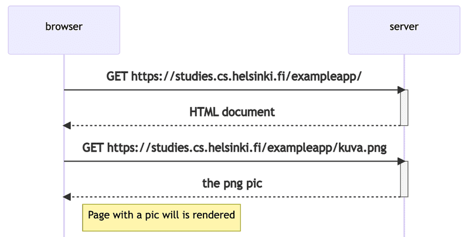
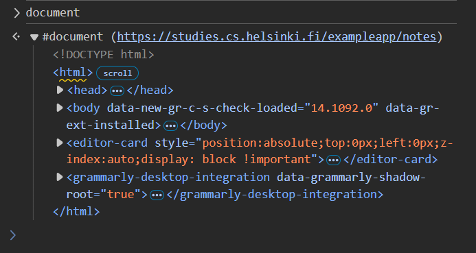
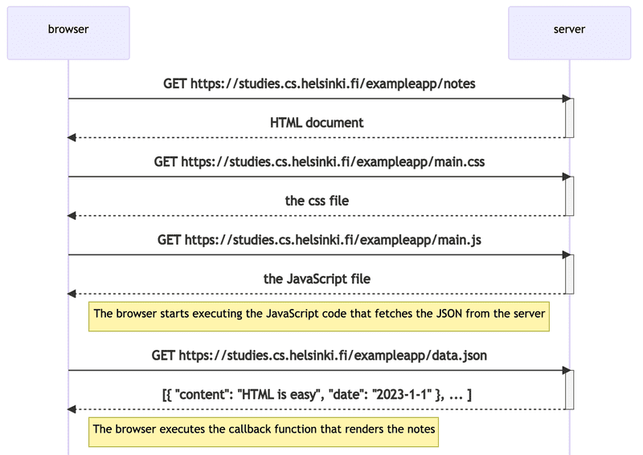
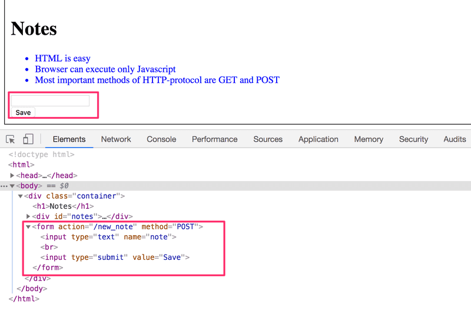
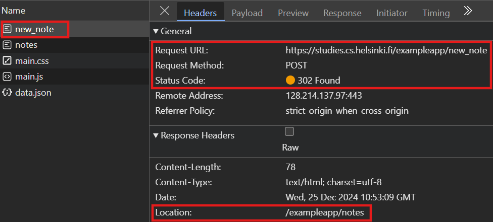

# Part 0: Fundamentals of Web apps

- [Part 0: Fundamentals of Web apps](#part-0-fundamentals-of-web-apps)
- [Using Chrome developer tools](#using-chrome-developer-tools)
- [HTTP GET request](#http-get-request)
- [Running application logic on the server vs. in the browser](#running-application-logic-on-the-server-vs-in-the-browser)
  - [Example: traditional web applications](#example-traditional-web-applications)
  - [Example: running application logic in the browser](#example-running-application-logic-in-the-browser)
- [Event handlers and Callback functions](#event-handlers-and-callback-functions)
- [Document Object Model (DOM)](#document-object-model-dom)
- [Manipulating the document object from console](#manipulating-the-document-object-from-console)
- [CSS](#css)
- [Loading a page containing JavaScript - review](#loading-a-page-containing-javascript---review)
- [Forms and HTTP POST](#forms-and-http-post)
- [AJAX](#ajax)
- [Single page app](#single-page-app)
- [JavaScript libraries](#javascript-libraries)
- [Full-stack web development](#full-stack-web-development)
- [Further reading](#further-reading)


# Using Chrome developer tools

- The server and the web browser communicate with each other using the HTTP protocol
- The `Network` tab shows how the browser and the server communicate

- To open Chrome developer tools: `F12` or `Ctrl+Shift+I`
- Open `Network` tab
- Check `Disable cache`
- Might be helpful:
  - Check `Preserve log`
  - Check `Hide extensions URLs` under `More filters`


# HTTP GET request

The browser sends GET requests to the server to fetch files. The server responds with the requested files.

Example

Go to the [example app](https://studies.cs.helsinki.fi/exampleapp/)
- Open Chrome developer tools
- Reload the page
- You should see two events in the `Network` tab: The browser has fetched two files
  - the page `studies.cs.helsinki.fi/exampleapp`
  - `kuva.png` 

To view the details of the request and response, click on the first event above.
- The `Headers` tab shows the request and response headers (i.e. metadata about the request or response)
  - e.g. `Request URL`, `Request Method`, `Status Code`, `Content-Type`
  - The headers tell the browser how to interpret the response. For example, if the `content-type` is `text/html`, the browser will render the response as a web page.
- The `Response` tab shows the content of the response
  - e.g. the HTML content of the page
- In this example, the first request gets an HTML file which contains an `` reference to `kuva.png`. This triggers a second request to fetch the image `kuva.png`:
  - Request URL: `https://studies.cs.helsinki.fi/exampleapp/kuva.png`
  - Request Method: `GET`

The chain of events triggered by the initial request (`GET /exampleapp`) is represented in the following sequence diagram:



- In the diagram, time flows from top to bottom.
- Note that although it is not shown in the diagram, the HTML page begins to render before the image has been fetched from the server.

# Running application logic on the server vs. in the browser

- The server can serve *static* files to the browser, or it can generate *dynamic* content
- Dynamic ontent can be generated
    - on the server: the browser only fetches HTML data from the server, and all application logic is on the server (traditional web applications)
    - in the browser: the browser fetches data from the server and runs application logic to render the content

## Example: traditional web applications

- The homepage of the example app here is generated dynamically by the server according to the app's logic: the HTML page displays the current number of notes
- A server can be implemented in any web framework, e.g. Java Spring, Python Flask, Ruby on Rails, or Node.js Express
- This course uses Node.js Express

## Example: running application logic in the browser

- The [notes](https://studies.cs.helsinki.fi/exampleapp/notes) page of the example app is generated by running JavaScript code in the browser
- In other words, the HTML file fetched from the server does not contain the complete content of the page, but rather instructions that instructs the browser how to fetch the content and render it 
- You can see the HTML file fetched from the server by inspecting the response in the `Network` tab
    - Go to the [notes](https://studies.cs.helsinki.fi/exampleapp/notes) page
    - Open the event 'notes' in the `Network` tab (you may need to clear the log and reload the page)
- The response is an HTML file with a `<script>` tag that triggers the browser to fetch a JavaScript file `main.js`:

    ```javascript
    var xhttp = new XMLHttpRequest()

    xhttp.onreadystatechange = function() {
    if (this.readyState == 4 && this.status == 200) {
        const data = JSON.parse(this.responseText)
        console.log(data)

        var ul = document.createElement('ul')
        ul.setAttribute('class', 'notes')

        data.forEach(function(note) {
        var li = document.createElement('li')

        ul.appendChild(li)
        li.appendChild(document.createTextNode(note.content))
        })

        document.getElementById('notes').appendChild(ul)
    }
    }

    xhttp.open('GET', '/data.json', true)
    xhttp.send()
    ```

- Right after fetching the script, the browser executes it
- The last two lines of the script tells the browser to send an HTTP GET request to `https://studies.cs.helsinki.fi/exampleapp/data.json`.

    ```javascript
    xhttp.open('GET', '/data.json', true)
    xhttp.send()
    ```

- The content of the json file is shown below:

    ```json
    [
    {
        "content": "new_note",
        "date": "2024-12-22T23:51:09.323Z"
    },
    {
        "content": "jj",
        "date": "2024-12-23T00:04:56.445Z"
    },
    {
        "content": "hello",
        "date": "2024-12-23T00:14:35.523Z"
    },
        ...
    ]
    ```

    (Note: You can download the chrome extension JSONViewer to view JSON files in a more readable format.)

- `main.js` downloads the JSON file containing the content of the page and renders it on the page as a list of notes (the code for rendering is not shown here)
- `main.js` also contains code to print the data received to the console:
  
    ```javascript
    console.log(data)
    ```

    - To view the console output, open the `Console` tab > In the list of messages, select `main.js`

# Event handlers and Callback functions

- Note that the request to the server is sent on the last line (`xhttp.send()`), but the code to handle the response can be found further up (`xhttp.onreadystatechange = function() {...}`):

    ```javascript
    var xhttp = new XMLHttpRequest()

    xhttp.onreadystatechange = function() {
        if (this.readyState == 4 && this.status == 200) {
            // code that takes care of the server response
        }
    }

    xhttp.open('GET', '/data.json', true)
    xhttp.send()
    ```
- This is an example of an **event handler**:
  - `xhttp` is an object that represents the request to the server
  - `onreadystatechange` represents the **event** when the state of an object changes
  - `xhttp.onreadystatechange = function() {...}` assigns a function (**event handler**) to handle the event when the state of `xhttp` changes:
    - Whenever the state changes, the browser calls the function
    - The function checks if the state of the request is `4` (request finished and response is ready) and the status is `200` (OK)
    - If the conditions are met, the function executes the subsequent code
- Event handlers are called "**callback functions**":  The app code does not call the functions, but the runtime environment (the browser) calls them when the event occurs

# Document Object Model (DOM)

- HTML content is represented as a *tree structure* with the **Document Object Model (DOM)**.
- HTML elements (e.g. `<head>`, `<p>`, etc.) are the "nodes" (objects) of the tree (the document)
-  For example:

    ```html
    <html>
    <head>
        <title>Example</title>
    </head>
    <body>
        <h1>Example</h1>
        <p>Hello, world!</p>
    </body>
    </html>
    ```

- DOM is an API (Application Programming Interface) that allows JavaScript (or other languages) to interact with the HTML elements
- In the previous example, JavaScript uses the DOM API to add a list of notes to the page:

    ```javascript
    var ul = document.createElement('ul') // create a new node <ul>

    data.forEach(function(note) {
        var li = document.createElement('li')

        ul.appendChild(li) // add child node <li> to <ul>
        li.appendChild(document.createTextNode(note.content))
    })

    // add <ul> as a branch to the node with id 'notes'
    document.getElementById('notes').appendChild(ul)
    ```

# Manipulating the document object from console

- `document` object is the topmost node of the DOM tree
- You can access the `document` object from the Chrome console by typing `document` and pressing `Enter`:

    

- For example, to add a new note to the list of notes using the DOM API, paste the following code into the console:

    ```javascript
    // get the list of notes
    list = document.getElementsByTagName('ul')[0]
    // Create a new li element
    newElement = document.createElement('li')
    newElement.textContent = 'Page manipulation from console is easy'
    // Add the new element to the list
    list.appendChild(newElement)
    ```
- The new note should appear at the bottom of the list of notes
- Note that the changes are only visible in the current session. If you reload the page, the changes will be lost.

# CSS

- CSS (Cascading Style Sheets) is used to style HTML elements
- Tell the browser to fetch a CSS file by adding a `<link>` tag in the `<head>` of the HTML file:
    ```html
    <link rel="stylesheet" type="text/css" href="main.css">
    ```
- In CSS, elements to be styled are selected using selectors, e.g. `h1`, `p`, `.notes`
  - `h1` selects all `<h1>` elements, and so on
  - Note that `.notes` is a class selector: it is preceded by a dot and selects all elements with the class name `notes`
  - You can check which elements belong to the class `notes` (i.e. class attribute set to `notes`) in the `Elements` tab of Chrome developer tools
  - Similarly, elements with the id `notes` can be selected using `#notes`

# Loading a page containing JavaScript - review



# Forms and HTTP POST

- Forms are used to send data to the server
- The [Notes page](https://studies.cs.helsinki.fi/exampleapp/notes) of the example app contains a simple form (a form element):
  
  

- In the HTML file, the form is defined with the `<form>` tag:
  - `action` attribute specifies the URL to which the form data is sent
  - `method` attribute specifies the HTTP method to use (`POST`)
  - `<input>` of type `text` defines a text field
  - `<input>` of type `submit` defines a submit button

- When the user types a note and clicks the Submit button, the browser sends the form data to the server using an `HTTP POST` request:
  - Clear the log in the `Network` tab and submit a new note 
  - In the `Network` tab, open the first event, `new_note`
  - you can see the request to `https://studies.cs.helsinki.fi/exampleapp/new_note` with the method `POST`
  - The status code is `302 Found`, which means that the server has redirected the browser to another page (i.e. the server tells the browser to perform a `GET` request to another URL (`/notes`), which is specified in the `Location` field under `Response Headers`)
  - The `GET` request to `/notes` triggers four events: `notes`, `main.css`, `main.js`, and `data.json`
  
    

  - In the `Payload` tab of the `new_note` event, you can see the data sent to the server
- On the server side, the `POST` request is handled by the following code (Note: this is not executed in the browser, but on the server):

    ```javascript
    app.post('/new_note', (req, res) => { // req: request object, res: response object
        notes.push({ // insert the new note to the 'notes' array
            content: req.body.note, // data is stored in the body of the request object
            date: new Date(),
        })

        return res.redirect('/notes')
    })
    ```
    - Note that the server does not save the updated `notes` array to a file or a database, so the new note will be lost if the server is restarted

# AJAX

- AJAX (Asynchronous JavaScript and XML) is an approach that allows the browser to fetch content using JavaScript embedded in the HTML without reloading the page
- Before AJAX, all web pages were like the traditional web applications described above: the server generated the entire content of the page

# Single page app

- Single-page application (SPA): comprises only a single HTML file that is fetched from the server
- Contents are rendered with JavaScript (executed by the browser)

Examples:
- The Notes page of the example app is similar to an SPA:   
  - the content is generated by JavaScript running in the browser
  - However, the page is not a true SPA when it comes to form submission: The input data is sent to the server, which updates the page content and instructs the browser to reload the page with the new content updated on the server side (see the code block in the previous section)
- The [SPA version of the example app](https://studies.cs.helsinki.fi/exampleapp/spa) is a true SPA:
  - The `form` element does not have `action` and `method` attributes
  - The input data (the note and the timestamp) is sent to the server with a `POST` request as JSON data (not as form data)
  - The `Content-Type` of the request is `application/json` (Without this, the server would not know how to parse the data)
  - The server responds with status code `201 Created`: the server does not ask for a redirect (i.e. the browser stays on the same page)
  - The JavaScript code that the browser fetches from the server adds the new note to the list of notes, updates the page without reloading it (i.e. no new `GET` request to the server), and sends the data to the server as JSON instead of form data

# JavaScript libraries

- Note that the example app here does not use any JavaScript libraries (it uses vanilla JavaScript, i.e. only DOM API JavaScript)
- jQuery is a JavaScript library that simplifies DOM manipulation
- The rise of single-page apps brought more modern ways of web development than jQuery, such as Google's AngularJS launched in 2012
- AngularJS became the de facto standard of modern web development but its popularity plummeted in 2014 (after support for version 1 ended with no backwards compatibility with version 2)
- The most popular browser-side logic library is Facebook's React
- React and Redux are frequently used together
- VueJS is another library that has gained popularity in recent years

# Full-stack web development

- The architecture of a web application can be considered as a stack of layers:
  - The **frontend** (client-side) layer: the browser
  - The **backend** (server-side) layer: the server
  - The **database** layer: the database
- The term "full-stack development" does not have a strict definition, but generally refers to the development of both the frontend and backend layers (sometimes the software and the OS are also included)
- Different languages can be used different layers, but we will use the same language, JavaScript, for both the frontend and backend layers in this course

# Further reading

- [HTML tutorial](https://developer.mozilla.org/en-US/docs/Learn/Getting_started_with_the_web/HTML_basics)
- [CSS tutorial](https://developer.mozilla.org/en-US/docs/Learn/Getting_started_with_the_web/CSS_basics)
- [HTML forms](https://developer.mozilla.org/en-US/docs/Learn/HTML/Forms/Your_first_HTML_form)