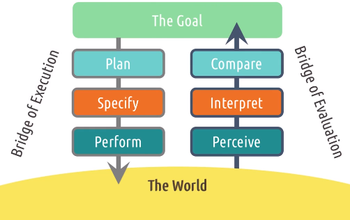
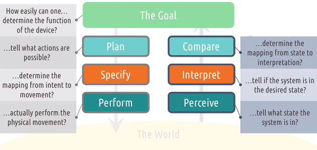
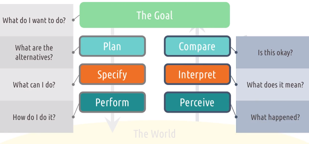

# L2.2 Feedback Cycles

# Reading

Norman, D. (2013). Chapter 2: The Psychology of Everyday Actions. In The Design of Everyday Things: Revised and Expanded Edition. (pp. 37-73). Arizona: Basic Books.

# Introduction

- Feedback cycles are ubiquitous in the world around us
- Inputs from the user to the system
- The system communicates some output back to the user via the interface
- Two challenges:
    - **Gulf of execution**
    - **Gulf of evaluation**

# Gulf of Execution

Gulf of execution: 
- "How do I know what I can do?"
- the distance between a user's goals and the actions required to realize those goals
- 3 stages:
    - identify intentions (in the context of the system; what the goal means in the system, e.g. Goal: "I want to heat my food" => Intention: "Set the microwave to 2 minutes")
    - identify actions
    - execute actions (in interface)

## 5 tips bridging gulfs of execution

1. Make functions **discoverable**
    - Does the user need to read the manual?
2. Let the user **mess around**
    - e.g. avoid functions that are irreversible
3. Be **consistent** with other tools
    - e.g. adopt same standards/ conventions as other tools
4. Know your **user**
    - e.g. provide command line tools for expert users
5. **Feedforward**
    - information on what will happen if you keep doing what you're doing
    - e.g. pull-to-refresh on mobile devices: a refresh icon appears when you pull down, telling you that you can release to refresh 

# Gulf of Evaluation

Gulf of evaluation:
- the distance between the effects of those actions and the user's understanding of the results
- user needs to evaluate the new state of the system in response to their actions
- 3 stages:
    - interface output
    - interpretation (can user interpret the output?)
    - evaluation (can user use the output to evaluate if goals were accomplished?)
- Wide gulf of evaluation: user finds it hard to understand/interpret the state of the system

## 5 tips bridging gulfs of evaluation

1. Give feedback **constantly**
2. Give feedback **immediately**
3. **Match** the feedback to the action
    - Subtle feedback for subtle actions
4. **Vary** your feedback
5. Leverage **direct manipulation**
    - Let the user feel like they are directly manipulating things in the system, e.g. drag and drop

# Norman's feedback cycle stages

What the user is doing at different stages of the feedback cycle:

- Bridge of execution: what user does to match the state of the world with their goals
- Bridge of evaluation: what user does to evaluate the state of the world

7 questions to ask yourself when designing feedback cycles:

What the user is thinking at different stages:

We can think of the execution and evaluation stages using different vocabularies. For example:
- Reflective (plan | compare)
- Behavioral (specify | interpret)
- Visceral (perform | perceive)

Or:
- Metacognition (plan | compare)
- Cognition (specify | interpret)
- Reaction (perform | perceive)