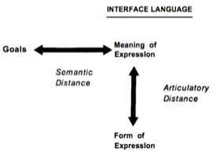

# L3.4 Design Alternatives

These are my personal lecture notes for Georgia Tech's Human-Computer Interaction course (CS 6750, Spring 2024) by David Joyner. All images are taken from the course's lectures unless stated otherwise.

# References and further readings

Hutchins, E. L., Hollan, J. D., & Norman, D. A. (1985). Direct manipulation interfaces. Human–Computer Interaction, 1(4), 311-338.

# Introduction

- **Direct manipulation**: the user should **interact directly** with their task (e.g. dragging an image with your fingers to enlarge it)
- **Invisible** interface: an interface that disappears between the user and their task (the user doesn't have to spend time thinking about the interface)

# Direct manipulation: The desktop metaphor

- Goal of direct manipulation: to narrow the gulfs of execution/ evaluation as much as possible
- The desktop metaphor: files and folders on a computer mimic physical files and folders on a physical desk -- also **mimic the real world action** of moving them (or other interactions)
- **Leveraging real world experience and expectations**

> Command-line vs. direct manipulation
>
> - Command-line interface:
>   - the user has to **remember** commands and syntax
>   - **no** **feedback** on whether the command was successful (e.g. no indication that a file was moved, user has to check manually)
>   - **unnatural** interaction
>
> - Direct manipulation:
>   - the user can use a mouse to drag and drop files
>   - instant feedback
>   - While using a mouse to click on a file is kind of like grabbing and closer to the real world than using command line, there is still a gap.
>   - A touchscreen makes direct manipulation even more direct.

# 'Direct manipulation interfaces' by Hutchins, Hollan, and Norman

- **Distance**: the distance between the user's goals and the system itself
- *'The **feeling of directness** is inversely proportional to the **amount of cognitive effort** it takes to manipulate and evaluate a system'*
    - i.e. The greater the cognitive load required to use the system, the less direct it feels
- Distance:
    - **Semantic distance**: the distance between the user's goals and their expression/ representation in the system
    (i.e. how hard it is to know what to do)
    - **Articulatory distance**: the distance between that expression and its execution
    (i.e. how hard it is to do what you know to do)

    
    Figure from Hutchins, E. L., Hollan, J. D., & Norman, D. A. (1985).

> - Semantic distance is related to the **intention and action stages** of the gulf of execution; articulatory distance is related to the **action stage**:
>    - The user starts with some goals, and translates them into intentions in the context of the interface; then they translate those intentions into actions (input); then they execute those actions.
>    - The system outputs some feedback, which the user interprets the form of that output to discern the meaning of the output; then they evaluate whether or not that meaning matches their goals.

- Distance is only one component of directness; it's possible to have little distance but still not feel direct

- The second component is **direct engagement**:

    *'The systems that best exemplify direct manipulation all give the **qualitative feeling that one is directly engaged with control of the objects** -- not with the programs, not with the computer, but with the semantic objects of our goals and intentions.'*

- There are many ways to shorten the gulfs without direct manipulation, but direct manipulation is a powerful method for shortening the distance

# Direct manipulation and VR

- VR leverages direct manipulation, though there are still challenges with feedback

# Making indirect manipulation direct

Example: Mac touchpad gestures

- If you swipe from the right edge of the touchpad to the left with two fingers, it pulls up the notification center over on the right of the screen:
This feel directs because the notification center is placed on the same side of the screen as the touchpad
- Animations also help to make the interaction feel direct: e.g. to clear all windows, you can kind of spread your fingers on the touchpad. The animation mimics the action of clearing your desk.
- Direct manipulation is **not just about the physical action, but also about the feedback** that makes the interaction **feel direct**
- Gesture-based interface: immediate feedback that maps directly to the interaction

# Invisible interfaces

- Our ultimate goal is to make the interface invisible
- Compare drawing with a mouse vs. drawing with a stylus
- Good design vs. Bad design
    - Good: interfaces that are "invisible" metaphorically
    - Bad: interfaces that are "invisible" literally (feedback is important)

## Invisibility by learning

- Consider driving: the steering wheel becomes invisible because you've learned how to use it

## Invisibility by design

- Learning takes time; our goal is to make the interface invisible from the moment the user starts using it

## 5 Tips: invisible interfaces

1. Use affordances
2. Know your user
    - invisible to a novice means the interactions are all natural
    - invisible to an expert means maximum efficiency
3. Differentiate your user
    - e.g. keep copy and paste in the menu for novice users, but also provide Ctrl+C and Ctrl+V for experts
4. Let your interface teach
    - e.g. when users select copy/paste from the menu, show them the keyboard shortcuts
5. Talk to your user
    - Are they talking about their tasks or the interface?

## Design challenge

Consider universal remote controls: voice control is more direct than using physical buttons, though we may not know all the voice commands
