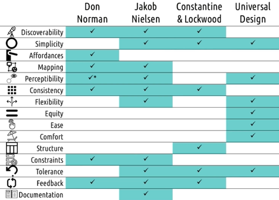

# L2.5 Design Principles and Heuristics

These are my personal lecture notes for Georgia Tech's Human-Computer Interaction course (CS 6750, Spring 2024) by David Joyner. All images are taken from the course's lectures unless stated otherwise.

# References and further readings

Norman, D. A. (2005). Human-centered design considered harmful. interactions, 12(4), 14-19.

# Introduction

## Four sets of principles

1. Don Norman's Six Principles
2. Constantine's and Lockwood's Six Principles
3. Nielsen's Ten Heuristics
4. Ronald Mace's Seven Principles of Universal Design

- The first three sets above mainly focus on **usability**, while the last one focuses on **accessibility** (interfaces that can be used by everyone regardless of age, disability, etc.)
- In this lecture, these principles are summarized in the following table:

# Discoverability

- Is it possible to even **figure out what actions are possible and where and how** to perform them? - Don Norman

- Minimize the user's memory load by **making objects, actions, and options visible**... **Instructions** for use of the system should be **visible or easily retrievable** whenever appropriate. - Jakob Nielsen

- The Visibility Principle: the design should make all needed options and materials for a given task visible **without distracting the user with extraneous or redundant information**. - Constantine and Lockwood

- Take-away:
    - relevant information should be **visible**. Functions can be discovered by users
    - **balancing visibility and simplicity**: we should not just throw everything on the screen

# Simplicity

- Dialogues should not contain information which is irrelevant or rarely needed. **Every extra unit of information... competes with the** **relevant units of information** and diminishes their relative visibility. - Jakob Nielsen

- The Simplicity Principle: the design should make simple, common tasks easy, communicating clearly and simply in the **user's own language**, and providing good **shortcuts**. - Constantine and Lockwood

- Simple and Intuitive Use: Use of the design is easy to understand, **regardless of the user's experience, knowledge, language skills, or current concentration level**. - Ronald Mace

# Affordances

- One way to keep design both simple and usable is to make use of affordances
    - The design itself suggests how it should be used

> Don Norman:
> - An affordance is a relationship between the properties of an object and the capabilities of the agent that determine just how the object could be possibly used.
> - The presence of an affordance is **jointly determined by the qualities of the object and the abilities of the agent** that is interacting with it.

- In some cases, there are actions in the virtual world that have no real-world analogy (e.g. pull-menu on a mobile site). In these cases, we might use **signifiers**.
- Signifiers are **in-context** instructions (e.g. arrows to indicate which way to swipe)

## Affordance vocabulary

According to Norman:
- Affordance is an **inherent** property of an object
    - e.g. a door handle moves into the crossbar and opens a latch
- **Perceived affordance** is a property attributed to an object by a human observer
    - e.g. pushability of a door bar. Pushing is a human behavior. Pushability relies on someone to do the pushing
- Perceived affordance can be inaccurate and be in conflict with the actual affordance
    - e.g. a door that looks like it should be pushed but should be pulled
- A signifier is a signal that communicates the affordance
    - e.g. a sign that says "pull"
- We **can't add affordances** to an object (they are inherent), but we **can add signifiers** that helps the perceived affordance match the actual affordance

# Mapping

- **Mapping between interfaces and their effects in the world**
- The system should speak the **users' language**, with words, phrases, and concepts familiar to the user, rather than system-oriented terms. Follow **real-world conventions**, making information appear in a **natural and logical order**. - Jakob Nielsen
    - using e.g. "cut", "copy", "paste" instead of "slice", "duplicate", etc.
- Strong mappings help make information appear in a natural and logical order
- Mapping vs. affordances
    - Affordances are designed into the interface and they tell you what you are supposed to do
    - Mapping refers to the **design of interfaces that makes it clear what the effects will be** when using them

## Example: light switches

- Bad: a set of light switches that are not mapped to the lights they control (e.g. not arranged in the same order as the lights)
- Good: stovetop dials that are mapped to the burners they control

# Perceptibility

- User's ability to perceive the state of the system 

- The system should keep users informed about what is going on, through appropriate **feedback within reasonable time**. - Jakob Nielsen

- The design communicates necessary information effectively to the user, regardless of ambient conditions or the user's sensory abilities. - Ronald Mace
    - i.e. **everyone should be able to perceive** the current state

- Feedback must be **immediate**... Feedback must also be **informative**... **Poor feedback can be worse** than no feedback at all, because it is **distracting**, uninformative, and in many cases irritating and anxiety-provoking. - Don Norman

## Example: ceiling fan

- No way to tell which chain controls the light and which controls the fan; the fan chain does not tell which speed it is set to

# Consistency

- using anything we use in our interface design consistently, **within the interface and across interfaces**

- Consistency in design is virtuous. It means that **lessons learned with one system transfer readily to others**... If a new way of doing things is only slightly better than the old, it is better to be consistent. - Don Norman

- Users should not have to wonder whether different words, situations, or actions mean the same thing. Follow platform **conventions**. - Jakob Nielsen

- The **Reuse Principle**: the design should reuse **internal and external components and behaviors,** maintaining consistency with purpose rather than merely arbitrary consistency, thus **reducing the need for users to rethink and remember**. - Constantine and Lockwood

- By convention, we create expectations for users, and then fulfill those expectations consistently
    - e.g. hyperlinks are blue (or having other contrasting color); there's no physical reason for this, but it's a convention that help users understand the interface
    - using conventions consistently helps to create invisible interfaces

# Flexibility

- Accelerators... may often speed up the interaction for the expert user such that the system can **cater to both inexperienced and experienced users**. Allow users to **tailor frequent actions**. - Jakob Nielsen
    - e.g. keyboard shortcuts for copy-paste

- The design accommodates a wide range of **individual preferences and abilities**. - Ronald Mace

# Equity

- The design is **useful and marketable to people with diverse abilities**.
    - 1a. Provide the **same means of use** for all users: identical whenever possible; equivalent when not.
    - 1b. **Avoid segregating or stigmatizing any users**. - Ronald Mace

- Equity may seem to be in conflict with flexibility (compare Ronald Mace's principle 1a), but the two actually complement each other
    - **Equity** is largely about helping all users have the **same user experience** while **flexibility** is about **means to achieve that**

# Ease and Comfort

- The design can be used **efficiently** and **comfortably** and with a minimum of fatigue. - Ronald Mace

- Appropriate size and space are provided for approach, reach, manipulation, and use regardless of **user's body size, posture, or mobility**. - Ronald Mace

- e.g. Buttons in mobile phone OS: consider size, sensitivity, spacing, etc. 

# Structure

- Overall organization of the interface
- Help **user's mental model** **match the actual content of the task**

- The **Structure Principle** (Constantine and Lockwood):
    - Design should organize the user interface purposefully, in meaningful and useful ways based on **clear, consistent models** that are apparent and recognizable to users,
    - putting **related things together** and **separating unrelated things**, 
    - **differentiating dissimilar things**, and making **similar things resemble one another**

# Constraints

- Usability (or safety) is enhanced by proper constraints
- system should be structured in a way to **prevent or recover from errors**
- One way is to prevent errors from happening in the first place by using constraints

- Don Norman:
    - Constraints are **powerful clues, limiting the set of possible actions**
    - The thoughtful use of constraints in design **lets people readily determine the proper course of action, even in a novel situation**
- Jakob Nielsen:
    - Even better than good error messages is a careful design which prevents a problem from occurring in the first place
    - Either **eliminate error-prone conditions or check for them** and present users with a **confirmation option** before they commit to the action

## Norman's four types of constraints

1. **Physical** constraints
    - e.g. a USB plug can only be inserted in one way
    - The constraints doesn't arise until you've already tried to do it incorrectly

2. **Cultural** constraints
    - e.g. facing forward on escalators

3. **Semantic** constraints
    - inherent to the **meaning of a situation** (**similar to affordances**)
    - a rear-view mirror is meant for viewing things behind you. So the mirror must reflect from behind (it's inherent to the idea of a rear-view mirror that it reflects from behind)
    - semantic constraints we have today **might change** in the future

4. **Logical** constraints
    - things that are **self-evident** based on a situation
    - e.g. Imagine building a furniture. There's only one hole left, and only one screw. Logically, the screw must go in the remaining hole.

# Tolerance

- Two ways to **deal with errors**:
    - **tolerance**
    - **feedback** (see next section)

- Tolerance: **users shouldn't be at risk** of causing too much damage accidentally

- Jakob Nielsen:
    - Users often choose system functions by mistake and will need a clearly marked "**emergency exit" to leave the unwanted state** without having to go through an extended dialogue.
    - Support **undo and redo**.

- Constantine and Lockwood (the Tolerance Principle):
    - The design should be **flexible and tolerant,**
    - **reducing the cost of mistakes** and misuse by allowing **undoing** and **redoing**, while
    - also **preventing errors** wherever possible.

- Ronald Mace:
    - The design **minimizes hazards** and the adverse consequences of accidental or unintended actions.

- Note that Nielsen's definition is more interested in supporting user experimentation
    - This also **enhances the discoverability** (because users **feel safe to try things out**)

# Feedback

- Feedback lets users know why the error happened and how to avoid it in the future

- Don Norman:
    - Feedback must be **immediate**... 
    - Feedback must also be **informative**... 
    - **Poor feedback** can be worse than no feedback at all, because it is **distracting**, uninformative, and in many cases irritating and anxiety-provoking

- Jakob Nielsen:
    - Error messages should be:
        - expressed in **plain language** (no codes), 
        - **precisely indicate** the problem, and 
        - constructively **suggest a solution**

- Constantine and Lockwood (the Feedback Principle):
    - The design should keep users informed of actions or interpretations, changes of state or condition, and errors or exceptions... through **clear, concise, and unambiguous language familiar to users**.

# Documentation

- One goal of good design is to **minimize the need for documentation**

- Jakob Nielsen:
    - Even though it is better if the system can be used without documentation, it may be necessary to provide help and documentation.
    - Any such information should be **easy to search**, **focused on the user's task**, list **concrete steps** to be carried out, and not be too large.

## Example

- **Good documentation: focuses on tasks**
- Bad documentation: just lists all the features

