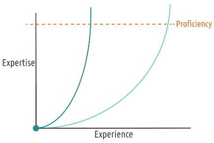
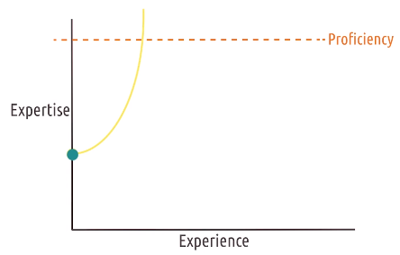

# L2.6 Mental Models and Representations

These are my personal lecture notes for Georgia Tech's Human-Computer Interaction course (CS 6750, Spring 2024) by David Joyner. All images are taken from the course's lectures unless stated otherwise.

# References and further readings

MacKenzie, I.S. (2013). Section 3.4: Mental Models & Metaphor. Human-Computer Interaction: An Empirical Research Perspective. (pp. 88-92). Waltham, MA: Elsevier.

MacKenzie, I.S. (2013). Section 3.8: Interaction errors. Human-Computer Interaction: An Empirical Research Perspective. (pp. 111-116). Waltham, MA: Elsevier.

Norman, D. (2013). Chapter 5: Human Error? No, Bad Design. In The Design of Everyday Things: Revised and Expanded Edition. (pp. 162-216). Arizona: Basic Books.

# Introduction

**Mental model**: an **internal**, simulatable **understanding** of **external reality** (a person's understanding of the external world)
**Representations**: **internal symbols** for an **external reality**

A good interface will help users develop a good mental model of the system: we need to give users good representations of the system

# Mental Models

Using our mental model of the world we generate expectations and predictions about the world, and then check whether the actual outcomes match our mental model

Frustration/ discomfort occurs when the actual outcomes do not match our mental model

To design a good interface:
- Design systems that act the way the user expects them to act
- Design systems that teach the user how they react

## Mental models and education

- An interface designer is like an educator, teaching the user how the system works
- Unlike a teacher, the interface designer has to teach through the interface while the user is using it (most people don't read the manual)
    - Use of good representations

Mental models in Action: see the example of a car's climate control system

## 5 tips for mental models for learnable interfaces

Principles of learnability by Dix, Finlay, Abowd, and Beale:
1. Predictability
    - e.g. greying out a button helps the user predict that the button is not available
2. Synthesizability
    - allow users to see the sequence of actions that led to the current state
    - e.g. log of actions in the undo menu; breadcrumbs in a file system; history of commands
3. Familiarity
    - leverage real-world experiences (e.g. red = bad, green = good)
    - similar to Norman's concept of "affordances"
4. Generalizability
    - similar to Norman's concept of "consistency"
5. Consistency
    - similar tasks or operations within the interface should behave the same way

# Representations

- help our mental models match with the real state of the system

## Characteristics of good representations

(See the "square-circle" problem in the lecture)

- make **relationships** **explicit** (e.g. visualize the problem)
- bring **objects and relationships** together (e.g. squares and circles = sheep and wolves)
- **exclude extraneous details**
- expose **natural constraints** (e.g. wolves may never outnumber sheep)

# Metaphors and analogies

- e.g. Layout of a newspaper's website matches the print version
- Downside: when you use analogies to other interfaces, users may not know where the analogy ends
    - e.g. describing Medium as "like a blog", but Medium doesn't have comments
- Analogies make the interface more learnable, but they may restrict the interface to outdated constraints
    - e.g. Keyboard on a touchscreen interface resembles a physical keyboard (it's easy for users to learn, though there are better ways to design a keyboard for a touchscreen)

## Design principles revisited

- Consistency: Be consistent with the analogies and metaphors
- Affordances: Just by looking at the interface, the user should be learning how to interact with it
- Mapping: represenations map the interface to the task (good representations help user map their actions in the interface to the outcomes in the world)

# New functionality meets old interfaces

For new functionality, there are no metaphors or analogies to use. We will need to teach the user without the use of metaphors or analogies eventually

# Learning curves

- Goal: to help users reach proficiency as quickly as possible
- Ideal: rapid learning curve (achieving expertise with relatively little experience; sometimes called "steep", though some people use "steep" to mean "difficult")
- In the figure below, the rapid learning curve is the one with darker color

- With good analogies and keep design consistent with conventions:
    - help users to learn faster
    - help users start with some expertise (learning curve starts at a higher point as show below):

# User error: slips and mistakes

- Slips: The user has the right mental model, but does the wrong thing
- Mistakes: The user has the wrong mental model, and does the wrong thing as a result

- Our goal is to help prevent routine errors by:
    - leveraging consistent practices
    - offloading some of the user's cognitive load/working memory to the interface (help prevent memory-based errors)
    - leveraging good representations to help users develop good mental models
- While errors are inevitable, we should make sure to leverage the tolerance principle (e.g. reducing penalties; help users recover from errors)

## Types of slips

- **Action-based** slips: perform a wrong action, or a right action but on the wrong object (e.g. clicking the wrong button)
- **Memory-based** slips: forget something you knew what to do (forgetting to do the right thing)

> An example to prevent memory-based slips: a confirmation dialog box

## Types of mistakes

- **Rule-based** mistakes: user correctly assesses the state of the world but makes the wrong decision based on it
- **Knowledge-based** mistakes: user incorrectly assesses the state of the world
- **Memory-lapse** mistakes: forgetting to fully execute a plan

> Example
> A dialog box that asks, "Would you like to revert to the previous version?"
> - Rule-based mistake: user knew they want to save their changes, but they clicked "Yes" instead of "No"
> - Knowledge-based mistake: user didn't know they want to save (perhaps they didn't know they made changes) and clicked "Yes" (They applied the right rule based on their knowledge, but their knowledge was wrong)
> - Memory-lapse mistake: user shut down the computer without saving the changes (they didn't fully execute the plan of closing down the application)

# Learned helplessness

- Learned helplessness - A user's sense that they are helpless to accomplish their goals in an interface:
    - They learn that there is no mapping between their input and the output they receive (i.e. the feedback cycle is broken)
    - Therefore, they believe that there is nothing they can do to accomplish their goals
    (Some people develop resistance to even trying to learn about the interface)

- In the context of education: students may develop learned helplessness if they believe that they are not capable of learning no matter how hard they try

# Expert blind spot

- When you are an expert, you may do something subconsciously without even thinking about it
- When you teach a user to use the interface (through the design of the interface), remember this: "I am not my user."

