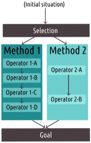
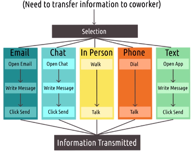
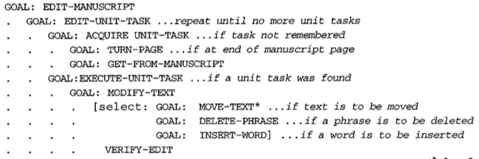
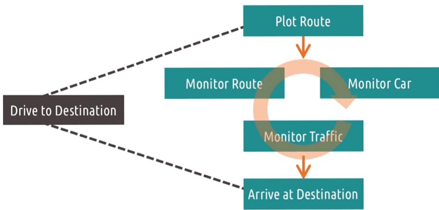
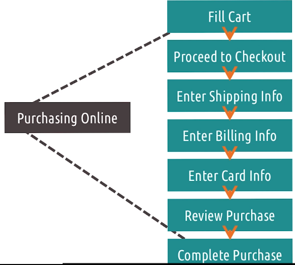
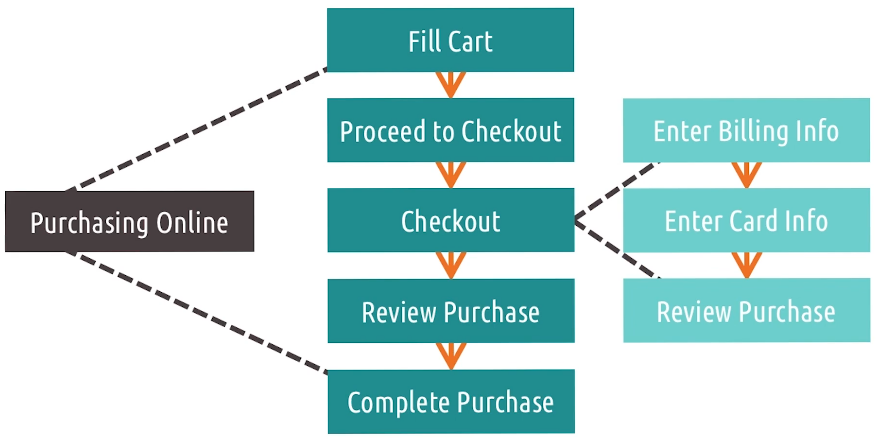

# L2.7 Task Analysis

These are my personal lecture notes for Georgia Tech's Human-Computer Interaction course (CS 6750, Spring 2024) by David Joyner. All images are taken from the course's lectures unless stated otherwise.

# References and further readings

West, R. L., Wong, A., & Vera, A. H. (2022, May). GOMS, distributed cognition, and the knowledge structures of organizations. In Proceedings of the Twentieth Annual Conference of the Cognitive Science Society (pp. 1124-1129). Routledge.

# Introduction

Two methods for task analysis:
- Human information processor models 
    - focus on the input to the user and the output from the user
    - similar to treating the user as a processor (L2.1)
- Cognitive task analysis
    - focus on the internal processes of the user
    - similar to treating the user as a predictor (L2.1)

# GOMS Model

- A human information processor model
- "GOMS" stands for:
    - Goals: user's goals in the system
    - Operators: operators the user can perform in the system
    - Methods: methods that the user can use to achieve goals
    - Selection rules: rules that the user uses to choose among different competing methods

- The user starts in some initial situation, and they have a goal in mind. They apply the selection rules to choose a method to achieve the goal. The method is a sequence of operators

## Example

- Communicate a message to a coworker
- Initial situation: need to transfer information to a coworker (this carries the goal implicitly)

## Strengths and weaknesses of GOMS

- Weaknesses
    - doesn't address complexity
    - assumes user is an expert (not accounting for novices or user errors)

- Strength
    - formalizes user interaction
        - breaks down interaction steps that we can use to make predictions (e.g. we can measure the time it takes to perform each operator, so we can predict the overall efficiency of a method/ an interface)

## Paper spotlight

- "The GOMS Family of User Interface Analysis Techniques: Comparison and Contrast" by John and Kieras (1996)
- Comparison of four GOMS models: the original GOMS, KLM-GOMS, CMN-GOMS, NGOMSL
- KLM-GOMS: Keystroke-Level Model
    - designer specifies the operators and execution times for an action and sums them to find the complexity of an interaction
    - proposed six types of operators
- CMN-GOMS: "Card, Moran, and Newell GOMS"
    - an extension of GOMS that features sub-methods and conditions in a strict goal hierarchy, as well as the ability to choose between multiple goals in different areas. For example:

    

    - Note that it contains very low-level goals (e.g. MOVE-TEXT, DELETE-PHRASE)
    - The model can be used to find places where a lot of complexity can be cut out (In the paper, they modeled how long each individual action takes, and looked at the number of interactions required and checked if the process could be simplified)

- NGOMSL: "Natural GMOS Language"
    - A natural language form of GOMS that lends itself to human interpretation

- These models allow us to focus on places where we might be asking too much of the user

## 5 tips for developing GOMS models

1. Focus on small goals
    - e.g. Navigate to the end of a document
    - You can abstract up from there
2. Nest goals, not operators
    - e.g. For navigation, sub-goals might be "changing lanes" and "planning a route"
    - Operators are "atoms" of the model; they don't break down further. They must be the actual actions that are performed
3. Differentiate descriptive and prescriptive
    - Are you buidling a model of what people do, or what they should do?
    - If your model is about what people should do, don't think that's what they will do
4. Assign costs to operators
    - GOMS was designed to let us make predictions about how long certain methods will take
    - Usually the cost is time
5. Use GOMS to trim waste
    - Identify places where number of operators can be simplified by the interface

# GOMS to Cognitive Task Analysis

- GOMS models are human information processor models (i.e. they assume humans are input-output machines)
- They don't get too much into the internal reasoning of the human

> Behaviorism: an approach to psychology that emphasizes behavior as a product of stimuli and the environment (behavior is observable)
> Cognitivism: an approach to psychology that emphasizes internal thought processes (e.g. memory, learning, perception)

# Cognitive Task Analysis

- It's about the underlying thougth process associated with performing a task
- What is the sequence of thoughts that a user has to go through to perform a task? What do they need to remember?

Most cognitive task analysis methods have the following steps:
1. Collecting preliminary knowledge
    - e.g. observing users performing the task
2. Identify knowledge representations
    - i.e. What kinds of things does a user need to know to complete the task?
    - note that we are not talking about the actual knowledge, but the types and structures of the knowledge that they have
    - e.g. For navigation, the structure of the knowledge is a sequence of actions and knowledge of things (the environment) to monitor as we go
    - e.g. does the task involves a series of steps to do in a certain order? Does it involve a lot of facts to remember?
3. Apply focused knowledge elicitation methods
    - we want to know the actual knowledge that the user has
    - e.g. For navigation, does the user know how to start the GPS, enter an address, obey the turns while monitoring traffic and speed, etc.?
    - Identify
        - all the specific actions the user takes and the knowledge they need to have to take those actions - the interruptions that can change their thought processes
        - the equipment involved
        - the sensory experience of the user
        - etc.
4. Analyze and verify data acquired
    - confirm with the people we observe that our understanding is correct (present the results to them and make sure they agree with our understanding of their task)
    - formalize it into structures that can be compared and summarized across multiple data gathering methods
5. Format results for intended application
    - make the results useful for interface design
    - e.g. develop models that show what the user is thinking, feeling and remembering at each step and make relationships explicit

Below is a cognitive model of driving.

Note that some elements in the figure above are highly cognitive, e.g. "monitor traffic". These elements are not observable, so we need to use techniques like think-aloud protocols

## Hierarchical Task Analysis

- A complex task can be broken down into smaller sub-tasks (e.g. see the driving model above)
- Multiple levels of abstraction and states can be used to represent the task
- Smaller sub-tasks can be used in other contexts. e.g. Online shopping:

We can treat the above online shopping model hierarchically:

- Hierarchical task analysis makes it easier to understand and reason about the task
    - e.g. helps us identify tools that already exist (e.g. Payment tools such as Paypal for the checkout sub-task)
- It modularizes tasks and sub-tasks: this helps us design things to transfer between different tasks and different contexts
- It abstracts out unnecessary details for certain levels of abstraction (e.g. not considering lower level subtasks such as entering billing info, etc. for the task of checkout): 
    - e.g. helps designers focus more on what might make their site unique

## Cognitive Task Analysis: strengths and weaknesses

- Strengths
    - Emphasizes mental processes
        - much better equipped to understand how experts think and work
    - Formal enough for interface design
- Weaknesses
    - Time-intensive
        - involves talking to multiple experts
        - needs systematic data analysis
    - May de-emphasize context
        - e.g. the role of physical capabilities, interactions with other people, etc.
    - ill-suited for novices
        - expert users have a strong models of the way they work and clearly understand their own thought processes, but novices may still be learning the interface

## Other task analysis frameworks

### Human Information Processor Models

- Keystroke-Level Model (KLM)
- Touch-Level Model (TLM)
- Model Human Processor (MHP)
- Extenions of GOMS: e.g.
    - CPM-GOMS
    - NGOMSL

### Cognitive Models

- Critical Decision Method (CDM): focuses on the critical decisions that a user makes
- Task-Knowledge Structures (TKS): focuses on the nature of humans' knowledge
- Cognitive Function Model (CFM): focuses on complexity
- Two methods to gather info needed to create a cognitive model:
    - Applied CTA (CTA: cogntive task analysis)
    - Skill-Based CTA
- Models in other desciplines: e.g. production systems in AI