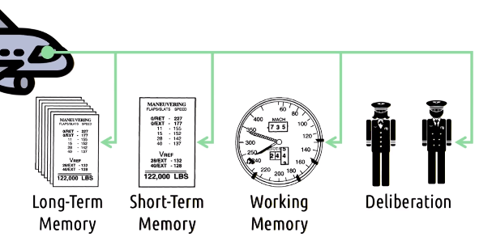
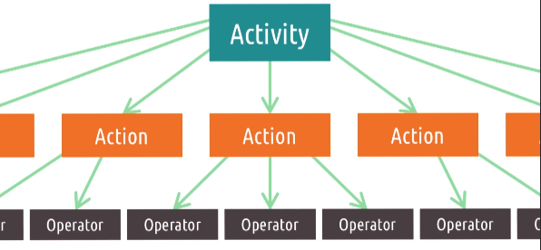

# L2.8 Distributed Cognition

# References and further readings

Hutchins, E. (1995). How a cockpit remembers its speeds. Cognitive Science, 19(3). (pp. 265-288).

Nardi, B. (1992). Studying context: A comparison of activity theory, situated action models and distributed cognition. In B. Nardi (Ed.) Context and Consciousness: Activity Theory and Human-Computer Interaction. (pp. 35-52). MIT Press.

# Overview

- Models/theories of cognition that emphasize the importance of **context** and **integrated systems**:
    - Distributed Cognition (the primary focus of the lesson)
    - Social cognition
    - Situated action
    - Activity theory

# Distributed Cognition

- Cognition: thought processes, experiences, etc. that happen in the mind
- "Distributed cognition suggests models of cognition should be **extended outside of the mind**"
- Example of distributed cognition:
    - Doing arithmetic in your head vs. using pen and paper

# Paper spotlight: How a cockpit remembers its speeds

The cognition involved in landing a plane is **distributed across the components** of the system.
(Different components of the system serve a **different role in the cognition**)

# Distributed cognition and cognitive load

- **Cognitive load**: your minds ability to only deal with a certain amount of information at a time
- **Distributed cognition**: Artifacts add **additional cognitive resources**
    - Same cognitive load is distributed across a greater number of resources
	- Every task you offload to an artifact, decreases your own personal cognitive load
- Exercise 6 in the lesson is a good example of distributed cognition
- Distributed cognition as a lens to look at interface design that focuses your attention on **what systems as a whole can accomplish** as opposed to individuals on their own
- We are not just interested in how distributed cognition makes our **lives easier**, but also how it makes us capable of **doing more**

# Social cognition

- **Social cognition** is concerned with 
    - how **social connections** create systems that can accomplish tasks together
        - Example: you and your friend sitting in the passenger seat together form a system capable of navigating to a new destination without a GPS
    - the **cognitive underpinning** of social interactions (how perception, memory, learning relate to social phenomena)
        - To design a system that integrate with social interactions, you need to understand how social interactions work 
          (e.g. systems like social media that tells you when your friends are nearby, video games that encourage you to share your achievements with friends, etc.)

# Situated action

- **Situated action** is concerned with the **context within which people interact**
- Unlike social cognition, situated action is **not interested in the long-term**, enduring, permanent interactions among these things
    - It focuses on **humans as improvisers** (not interested in the kinds of problems that people have solved before, but in the kinds of **novel situational problems** that arise all the time)
    - While we like to think we plan the tasks for our users, in reality **tasks may grow out of interaction**:
        - We must examine the interfaces we design within the **context** in which they are used
        - We must **understand the task** the user performs that **grows out of interaction** with the interface (i.e. we don't define it)
        - The **task doesn't exist** until the user gets started, and once they start, they define the task

## Situated action and memory

- Recognition is easier than recall (in part because memory is context-dependent)
- **Recognition** provides a **context**
- Things that are **situated in a context** are **easier to remember**
    - Example: your mom remembers all of your siblings' birthdays because she has a context for them, but you might only remember your own birthday

## Paper spotlight: Plans and situated actions: The problem of human-machine communication

Suchman, L. A. (1987). Plans and situated actions: The problem of human-machine communication. Cambridge University Press.

Two views of human action:
- First view: the **organization insignificance of action** as derived from plans
    - Users make plans and users carry out those plans
- Second view: people simply act in the world (**plans are what we derive from those action**)
    - Instead of plans dictating actions, **plans are interpretations of actions**

Takeaway for interface design:
- in addition to assuming that users have plans and they carry them out, we might consider **viewing only their immediate interactions with the current screen** instead
    - **ignore the history** of actions leading up to the current screen, instead, ask "once they are here, how do they know what to do next?"
- focus on the **resources available** to the user **at any given time**

# Activity theory

- Activity theory is concerned with the **interaction between pieces of an activity**
- Three main contributions of activity theory to HCI:
    - It generalizes our unit of analysis from the task to the **activity surrounding the task**
        - e.g. Why does the user need to do this task? What is the user trying to accomplish?
        - Similar to views in distributed cognition where we look at the system as a whole
    - It emphasizes that we can create **low level operations** from higher level actions
        - This helps us to **zoom out** from low level operations to general **user needs at the action or the activity levels**

        

    - It points out that actions by the user **can move up and down the hierarchy**
        - e.g. when actions become less conscious and become more automatic - they become more like operators
        - **invisible design** - users **focus more on the actions than the operators** for interacting with the interface

# Paper spotlight: Context and Consciousness

Nardi, B. A. (1996). Activity Theory and Human-Computer Interaction. Context and Consciousness: Activity Theory and Human-Computer Interaction.

Nardi, B. A. (1996). Studying context: A comparison of activity theory, situated action models, and distributed cognition. Context and Consciousness: Activity Theory and Human-Computer Interaction.

- **Activity theory** and **distributed cognition** are driven by **goals**
- **Situated action** **de-emphasizes goals** for a focus on improvisation
    - Goals are constructed retroactively to interpret our past actions
- **Permanent persistent structures**...
    - are important for activity theory and distributed cognition
    - but present a **tension for situated action**
- Activity theory: views **humans and artifacts** are **fundamentally different** (humans have consciousness)
- Distributed cognition: believes that **artifacts** can serve cognitive roles, and thus can be considered **conceptually equivalent to humans**