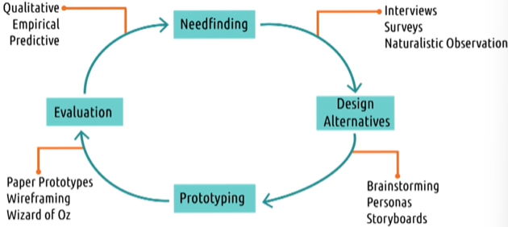

# L3.1 Introduction to Methods

# Readings

MacKenzie, I.S. (2013). Chapter 4: Scientific Foundations. Human-Computer Interaction: An Empirical Research Perspective. (pp. 121-152). Waltham, MA: Elsevier.

# User-centered design

Definition: design that considers the needs of the user throughout the entire design process

## Principles

1. **The design is based upon an explicit understanding of users, tasks, and environments.**
   - Needfinding: gathering data about users, tasks, and environments
2. **Users are involved throughout design and development.**
   - Participatory design: e.g. surveys or even working with designers
3. **The design is driven and refined by user-centered evaluation.**
    - Needfinding
4. **The process is iterative.**
    - Designs undergo constant revision even after deployment
5. **The design addresses the whole user experience**
6. **The design team includes multidisciplinary skills and perspectives.**
    - e.g. designers, developers, psychologists, etc.

## Stakeholders

- **Primary stakeholders**: users
- **Secondary stakeholders**: don't use the tool directly, but might interact with the output of the it
- **Tertiary stakeholders**: don't interact with the tool or its output, but are impacted by the existence of the tool
- **We need to consider the needs of all stakeholders**

> Example: new gradebook tool for teachers to send progress reports to parents
> - Primary: teachers
> - Secondary: parents
> - Tertiary: students

# The design life cycle

## Four phases

1. **Needfinding**
    - What are the users trying to perform?
    - Who are the users?
    - What is the context of the task?
    - Why are they doing the task?
    - etc...
2. **Design alternatives**
3. **Prototyping**
    - Take the most promising design alternatives and build a prototype
    - Early prototypes might be low-fidelity, e.g. describing using paper and pencil or just verbally
    - Refine and improve the prototype
4. **Evaluation**
    - Evaluate the prototype with users 
- Iterate through these phases with user feedback and improve prototypes
- The cycle doesn't end after deployment: it continues with live users

## Methods

Design life cycles meet feedback cycles:
- Like users who are constantly evaluating the feedback they get from interacting with an interface, designers are also evaluating the feedback they get from users through an interface, i.e. the tools we use in the design life cycle

## Qualitative vs. quantitative data

- **Quantitative** data: 
    - supports formal tests, comparisons, and conclusions
    - strong for a small class of things
- **Qualitative** data:
    - observations described/summarized non-numerically
    - covers a broader and more general picture of what we're examining
    - harder to draw formal conclusions
    - more prone to biases
    - some qualitative data can be quantified (e.g. counting the number of users who mention a certain problem)

### Qualitative and quantitative data answer different questions

- Quantitative data: 'what'
- Qualitative data: 'why', 'how'
- For needfinding and initial evaluations we are usually interested in qualitative data
- We are generally interested in quantitative data later to find improvements/changes
- **Mixed methods**: using both qualitative and quantitative data

### Types of quantitative data

- **Nominal**: categories
- **Ordinal**: categories with order 
    - e.g. highly agree, agree, neutral, disagree, highly disagree
    - the intervals between categories might not be equal
- **Interval**: numeric values with equal intervals
    - e.g. temperature in Celsius
    - there is no zero point, only intervals between data points, e.g. 0 degrees Celsius is not the absence of temperature
    - Intervals do not have the same ratio/scale e.g. 64 degrees is not twice as hot as 32 degrees
- **Ratio**: like interval data, but with a true zero point
    - e.g. how long is your average commute in minutes?

#### Subtypes of quantitative data

- **single** nominal and **multi**-nominal:
    - choose one or many categories
- **Binary** and **non-binary**
    - e.g. yes/no vs. multiple options (nominal), fail/pass vs. letter grades (ordinal)
- **discrete** and **continuous**

Different subtypes may require different statistical tests

### Types of qualitative data

- Closely related to how the data is generated/collected
    - **Transcripts**:
        - e.g. interviews, focus groups
    - **Field notes**:
        - e.g. naturalistic observations
    - **Artifacts**:
        - e.g. logs from real interfaces, reviews

- analyzing qualitative data may be costly, time-consuming, and prone to bias
- **Coding**: convert qualitative data into quantitative data (typically nominal)
    - helps us to say that our interpretations are not biased but are based on the data
    - Note that some data may be lost in the process
    - In HCI, we often use both types of data (Balance between data loss and bias)

