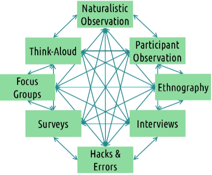

# L3.3 Needfinding and Requirements Gathering

# Reading

Müller, H., Sedley, A., & Ferrall-Nunge, E. (2014). Survey research in HCI. In J. Olson & W. Kellogg (Eds.) Ways of Knowing in HCI (pp. 229-266). New York: Springer.

# Needfinding

- Identify what the **user needs**
- Define questions about the user: **Who** is the user? **What** are they doing and what are their needs?
- Generate **answers** about the user
- **Formalize** models of the user

# Data inventory

Common data you can collect:
- **Who** are the users? (demographics)
- **Where** are the users? (environment)
- What is the **context** of task?
- What are the **users' goals**?
- What do they **need**? (e.g. information, physical objects, etc.)
- What are their **tasks**? (physical, cognitive, social, etc.)
- What are their **subtasks**?

# The problem space

- First step of needfinding: define the **problem space**
- Not just focus on the interaction between the user and a specific interface: consider the *whole context*, start with general observation, then move through progressively more targeted types of needfinding

# User types

- **Who** are we designing for?
    - e.g. kids vs adults, experts vs novices, etc.
- Different user types have different needs
- Define user types first, then design for each type

# Tips: Avoiding bias in needfinding

## Possible biases

1. **Confirmation bias**
    - We tend to notice the things that confirm our **prior beliefs**
    - Avoid this by
        - **specifically looking** for signs that disconfirm your beliefs by testing your belief empirically
        - involving people with **different backgrounds and beliefs** in your needfinding process
2. **Observer bias**
    - We may subconsciously influence the user's responses because we want to see a particular result, e.g. asking leading questions
    - Avoid this by: 
        - **separating experimenters** with motives from the participants
        - by **heavily scripting interactions** with users
        - by having **someone else to review** your interview scripts and your survey for leading questions
3. **Social desirability bias**
    - People may give answers that they think are socially desirable, e.g. if they know you are the designer of an interface, they may say nice things about it that make you happy!
    - Avoid this by:
        - conducting more **naturalistic** observations
        - recording **objective** data
4. **Voluntary response bias**
    - People who have **strong opinions** are more likely to respond to optional surveys
    - causes **oversampling of more extreme views**
    - Avoid this by:
        - limiting how much of the survey content is shown to users before they begin it
        - confirming conclusions with other methods
5. **Recall bias**
    - People may not remember things accurately (e.g. how they felt, what they thought, etc.)
    - Avoid this by:
        - studying tasks and contexts by having users think aloud during activities
        - conducting interviews during the activity itself

> Confirmation bias vs. observer bias: confirmation bias is about the researcher's beliefs, while observer bias is about the researcher's desires and actions.

# Methods for needfinding

## Naturalistic observation

- Observe people in their **natural environment**
- Useful for understanding the problem space and giving you ideas for things to investigate further
- Limitations:
    - ethics: you can't record people without their consent
    - you can't control the task and the environment
    - you don't know what people are thinking

### Tips for naturalistic observation

1. Take notes
    - gather targeted data
2. Start specific, then abstract
    - write down the individual actions you see, before trying to interpret/summarize them (helps avoid tunnel vision)
3. Spread out your sessions
    - e.g. you may see different things at different times of day
    - your growing understanding of past sessions will inform your future sessions
4. Find a partner
    - compare notes
5. Look for questions

## Participant observation

- you participate in the activity you are observing
- Remember: you are not your user! Don't over-represent your own experience

## Errors and hacks

### Hacks and workarounds

- One way to research is to look at how people employ hacks and workarounds when performing a task:
    - How do they use interfaces in non-intended ways?
    - How do they break out of the interface to accomplish a task that could have been done with an interface?
- If you're designing a task meant to be performed at a desk, look at the person's workspace

### Errors

- **Hacks** may uncover errors
- **Errors** are mistakes that users make when using an interface:
    - **Slips**: errors that occur when the user **knows what to do** (correct mental model), but **makes a mistake** in doing it
    - **Mistakes**: errors that occur when the user has a **weak mental model**
- Fix the errors to improve the design
- Use errors to understand the user's mental model

## Apprenticeship and ethnography

- Some tasks are too complex to be understood by observation alone. To design tools for these tasks, you may need to become an expert on the task yourself
- **Ethnography**: researching a culture, an activity etc. by becoming a participant in it
- **Apprenticeship**: learning a skill by working with an expert

## Interviews and focus groups

- **Focus group**:
    - a group of people talking about a topic
    - can elicit more ideas than individual interviews
    - risk: **overly convergent thinking**
    - should be used **in conjunction with other methods** e.g. interviews

### Tips for interviews

1. Focus on the six Ws
    - Who, What, Where, When, Why, and How
    - avoid yes/no or no answer questions (these can be asked in surveys)
    - ask open-ended semi-structured questions
2. Be aware of bias
    - not predisposing the participant to certain views
3. Listen
    - participants are the ones who do the majority of talking!
    - Don't reveal anything that might predispose them to agree with you
4. Organize the interview
    - **introduction phase**, some light questions to build trust
    - **summary** at the end (so they understand the purpose of the interview)
    - be ready to **improvise**
5. Practice
    - You want to get the most out of your interview!

## Think-aloud

- Ask the user to verbalize their perceptions when performing a task
- Useful to get user's thoughts before they forget
- Risk: users need to think deliberately about what they are doing, which may change their behavior
- We should pay attention to the **differences in what they do when they are thinking aloud**

Alternative to think-aloud method:
- **Post-event protocol**: ask the user to describe what they were thinking immediately after the task is done

## Surveys

- Useful for collecting data from a large number of people quickly
- allow quicker interpretation
- relatively low cost

### Tips for surveys

1. Less is more
    - keep it short
    - only ask questions that you will use
2. Be aware of bias
    - e.g. positive/negative connotations
    - implicit pressure to answer in a certain way
3. Tie them to the inventory
    - Make sure every question connects to some of the data you want to collect
    - Start with the goals of your survey, then write the questions from there
4. Test it out
5. Iterate
    - give participants a chance to give feedback on the survey itself
    - improve it for future use

### Writing good survey questions

- Be **clear**
    - easy to understand
    - avoid overlapping ranges (e.g. 1-5, 6-10)
    - when in doubt, provide extra detail
    - timebox frequency-based questions (e.g. "How often do you exercise?" vs. "How many times have you exercised in the past week?")
- Be **concise**
    - use plain language
- Be **specific**
    - avoid questions on super-big ideas
    - avoid double-barreled questions (e.g. "Do you like the color *and* the shape of this button?")
    - avoid questions that allow internal conflict
    - Break down complex questions into multiple questions
- Allow participants to be **expressive**
    - use ranges instead of yes/no questions
    - allow multiple answers
    - allow users to add nominal categories (e.g. "other (please specify)")
    - leave potentially open-ended questions open
- Be **unbiased**
    - avoid leading questions
    - avoid loaded questions
- Be **usable**
    - provide a progress bar
    - make page lengths consistent
    - order questions logically
    - use a consistent scale
    - alert users about unanswered questions
    - preview the survey yourself

> **Other data gathering methods**:
> 
> - Existing UI evaluation
> - Product reviews
> - Data logs

# Iterative needfinding

- Needfinding is a phase of the design lifecycle, but it is also **an iterative process in itself**
- e.g. use a needfinding method to identify questions to ask in another needfinding method
-  Revisiting the inventory

# Representing the need

- formalize the data you have collected into a model of the user
- e.g. using a **flowchart** to represent the user's task

# Defining the requirements

- Requirements should be specific and 
- Consider:
    - functionality
    - usability
    - learnability
    - Accessibility
    - Other general requirements e.g. compatibility, compliance, cost, etc.

