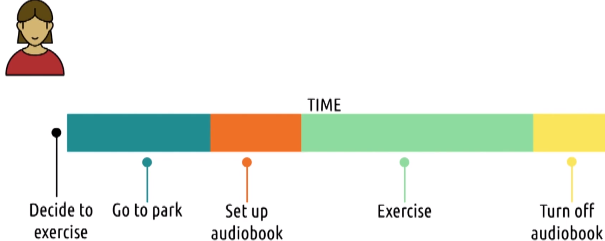

# L3.4 Design Alternatives

These are my personal lecture notes for Georgia Tech's Human-Computer Interaction course (CS 6750, Spring 2024) by David Joyner. All images are taken from the course's lectures unless stated otherwise.

# References and further readings

Faste, H., Rachmel, N., Essary, R., & Sheehan, E. (2013, April). Brainstorm, Chainstorm, Cheatstorm, Tweetstorm: new ideation strategies for distributed HCI design. In Proceedings of the SIGCHI Conference on Human Factors in Computing Systems (pp. 1343-1352). ACM.

Rogers, Y., Sharp, H., & Preece, J. (2011). Chapter 6: The Process of Interaction Design. In Interaction Design: Beyond Human-Computer Interaction. John Wiley & Sons.

# The second biggest mistake

- Biggest mistake: designing without understanding the task

- Second biggest mistake: settling on a single design or a single genre of design ideas too early

# Design space

- Design space: the area in which we design our interfaces
    - e.g., the space of all possible designs for a given task
- Design alternatives: different designs within the design space
- During the design alternative phase, we explore the design space as much as possible

# Individual brainstorming

- Goal: to generate lots of ideas
    - write down everything
    - each idea only needs to be a few words
    - don't worry about the quality of the ideas

- Better to start brainstorming individually before moving to group brainstorming
    - Avoids groupthink
    - Avoids the influence of others

## Tips

1. Write down the core problem
2. Constraint yourself (e.g. at least one idea in a number of different categories)
3. Aim for 20 ideas (avoid tunnel vision)
4. Take a break
5. Divide and conquer (e.g. divide the problem into subproblems and brainstorm each one separately)

# Group brainstorming

## Challenges in group brainstorming

- Social loafing: The tendency to exert less effort working in a group than working alone
- Conformity: The tendency to agree with or follow the group's reasoning and ideas
- Production blocking: The tendency of some individuals in discussions to block other individuals' participation
- Performance matching: The tendency to match one's level of performance to others' performance
- Power dynamics: The tendency to defer to more senior individuals, or to overpower less senior individuals

## Rules for group brainstorming

- Expressiveness: Everyone should express their ideas
- Non-evaluation: No criticism of ideas
- Quantity: The more ideas, the better
- Building: Build on others' ideas
- Stay focused: Keep the goal in mind
- No explaining ideas
- Revisit the problem often when you hit a rooadblock
- Encourage others

## Tips

1. Go through every individual idea: avoid converging ideas and make sure everyone is heard
2. Find the optimal group size
3. Set clear rules for communication: e.g. everyone gets 2 minutes to speak
4. Set clear expectations: e.g. "we are going to generate 50 ideas in 30 minutes"
5. End with ideas, not decisions

# Fishing out ideas

- Pick ideas from the brainstorming session and develop them further

## Personas

- Create personas, fictional characters that represent the different user types that might use your product
- Personas help us to reason about different ideas
- Define the personas' background, e.g. age, job, interests, skills, etc.
- You may need to create personas for different stakeholders

## User profiles

- We can also generate a large number of user profiles using formulas with different variables, e.g. expertise, tech literacy, usage frequency, etc.
- This makes sure we cover a wide range of users
- e.g. designs for frequency users may focus on efficiency, while for infrequent users we may focus on learnability/discoverability

## Timelines

- Create a timeline for each persona
- Imagine what they are thinking and doning at each stage of the timeline when interacting with the interface or with the task at hand
- Think about different stages of the task, e.g. how they go from one stage to the next

Example: Designing a audiobook interface

P.S. Journey maps are similar to timelines, but they cover a longer period of the persona's life.

## Scenarios and storyboards

- Think about scenarios users will encounter while using the interface
- Rather than outlining the whole timeline of interaction, scenarios focus on a specific kind of interactions and events
- Storyboards: sequences of drawings (or even videos) to outline what happens in a scenario
- Timeline is more abstract. It's about a routine interaction with the interface. Scenarios and storyboards are more specific: they are about a particular persona interacting with the interface in a particular way with particular events happening:
    - e.g. a user is jogging and listening to an audiobook, then a fire truck passes by and the user wants to pause the audiobook.

## User modeling

- With user models, we can reason about how different users will interact with the interface and we can compare efficiency, learnability, etc. for different designs

Model examples:

Cognitive task analysis:

Human information processor models:

# Comparing methods for exploring design alternatives

(You may have different views on the pros and cons of each method.)

# Exploring ideas

- Rule out ideas that are not feasible
- Explore ideas further with prototyping

