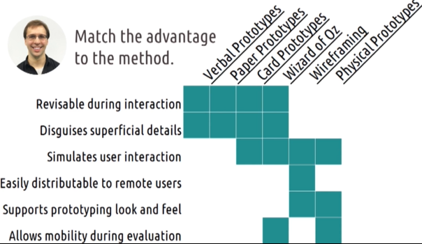

# L3.5 Prototyping

These are my personal lecture notes for Georgia Tech's Human-Computer Interaction course (CS 6750, Spring 2024) by David Joyner. All images are taken from the course's lectures unless stated otherwise.

# References and further readings

Houde, S., & Hill, C. (1997). What do prototypes prototype? In M. Helandar, T.K. Landaeur, & P. Prabhu (Eds). Handbook of Human-Computer Interaction, 2. (pp. 367-381). Elsevier Science.

Beaudouin-Lafon, M., & Mackay, W. (2003). Prototyping tools and techniques. Human Computer Interaction-Development Process. (pp. 101-142).

# Introduction

- **Start with low-fidelity prototypes**:
    - Goal: to get user feedback as quickly as possible
- Work up to high-fidelity prototypes
- Goal: to get user feedback on your ideas early

# Basics of prototyping

- Early prototyping
    - happens during first few iterations of design lifecycle
    - rapid **revision** 
- Late prototyping
    - final design or revising a design that's already live
- Different phases of prototyping vary in terms of:
    - representation
    - fidelity
    - evaluation
    - scope

## Representation

- "What is the prototype?"
- Examples (low to high fidelity):
    - verbal
    - paper
    - wizard of oz
    - wireframe
    - physical
    - functional
    - live

- Earlier phases tend to be some simple visuals, e.g. writeup or paper
- Later on we might want something more visual or interactive
    - only develop more complex prototypes once we vetted the ideas with simpler ones

## Fidelity

- **fidelity**: **completeness**/ maturity of the prototype
- Low-fidelity: simple, **easy to change**
- High-fidelity: something harder to create, e.g. wireframe, a functional interface

## Evaluation:

- different prototypes fit different evaluation structures
- evaluating **functionality**: 
    - Low-fidelity is fine for evaluating the relative **function** of an interface, **whether or not it can do what's it's designed to do** (If a user looks at it, can they tell what they're supposed to press? Can they physically do it?)
- evaluating the **interface**:
    - the prototype needs to **look** the way a final prototype would look. e.g. use wireframe to evaluate **readability**
- evaluating **performance**:
    - need a prototype that's **working or close to working** to evaluate certain tasks

## Scope

- **Horizontal** prototype: 
    - cover the design **as a whole**, but not in depth
- **Vertical** prototype:
    - cover a **small portion of the interaction**, and prototype it in **great detail**
- e.g. for Facebook, a vertical prototype might be the status-posting screen, and a horizontal prototype might be the site in general
- We **usually start with horizontal prototypes** and then move to vertical prototypes
- We may move back and forth between the two scopes

# Tradeoffs in prototyping

- Low-fidelity prototypes: easy to create and modify, but aren't as effective for detailed comprehensive evaluations
- High-fidelity prototypes: vice versa
- Goal: maximize the above tradeoffs:
    - Low-fidelity to get initial ideas
    - Move to high-fidelity when our initial ideas are sound
- Remember: we design prototypes to get **feedback**

# 5 tips for prototyping

1. Keep prototypes easy to change
2. Make it clear that it's a prototype 
    - so users don't focus on superficial details, but on what you want to evaluate
3. Be creative
    - do whatever it takes to get the feedback
4. Evaluate risks
    - how much would you lose if you found that users hate the parts of your design that you haven't prototyped yet?
5. Prototype for feedback

# Types of prototypes

- Verbal prototypes:
    - e.g. describing the design we have in mind to a user
    - consider social desirability bias: make sure to specific and critical feedback
    - consider "expert blindspot": make sure they understand the design we are describing. Analogies can help

- Paper prototypes:
    - draw the interface on paper
    - easy to revise

- Card prototypes:
    - similar to paper prototypes, but each screen is on a separate card
    - can be used to simulate interface interaction

- Wizard of Oz:
    - a human pretends to be the computer and responds to user input
    - can be used to simulate a functionalit that hasn't been implemented yet

- Wireframing:
    - mockups of the interface

- Physical prototypes:
    - it doesn't have to actually work

# Prototyping pros and cons

Notes:
- Revisable during interaction: experimenter can change the prototype during the interaction immediately
- Disguises superficial details (things that users don't care about in your prototype)
- Supports prototyping for look and feel (to evaluate things that users do care about/ that impact their experience, e.g. readability)

# Multi-level prototyping

- We can use prototypes at different levels of fidelity for different parts of the design