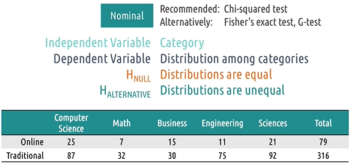
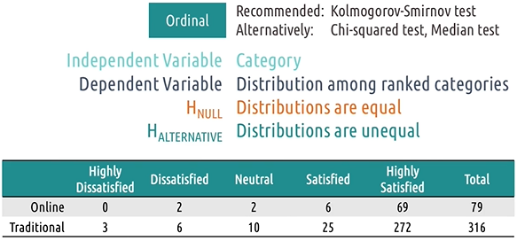
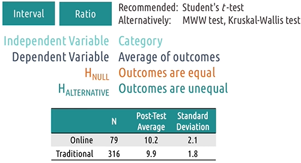
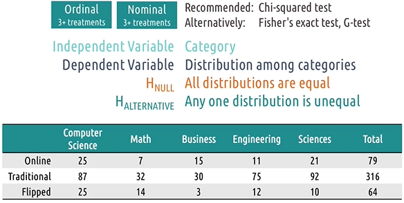
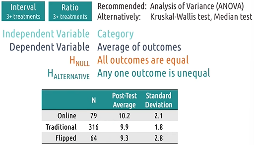
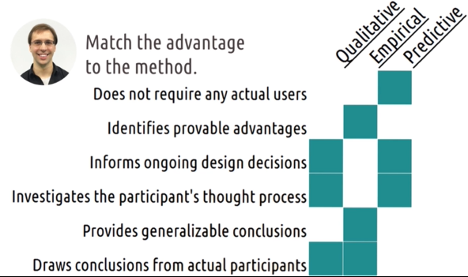

# L3.6 Evaluation

These are my personal lecture notes for Georgia Tech's Human-Computer Interaction course (CS 6750, Spring 2024) by David Joyner. All images are taken from the course's lectures unless stated otherwise.

# References and further readings

MacKenzie, I.S. (2013). Chapter 5: Designing HCI Experiments. Human-Computer Interaction: An Empirical Research Perspective. (pp. 157-188). Waltham, MA: Elsevier.

Nielsen, J., & Molich, R. (1990, March). Heuristic evaluation of user interfaces. In Proceedings of the SIGCHI Conference on Human Factors in Computing Systems (pp. 249-256). ACM.

Polson, P. G., Lewis, C., Rieman, J., & Wharton, C. (1992). Cognitive walkthroughs: a method for theory-based evaluation of user interfaces. International Journal of Man-Machine Studies, 36(5). (pp. 741-773).

# Three types of evaluation

- **Qualitative evaluation**: emphasizes the totality of a phenomenon
- **Empirical evaluation**: based on numeric summaries or observations of a phenomenon.
- **Predictive evaluation**: based on systematic application of pre-established principles and heuristics.

## Evaluation terminology

- **Reliability**: whether a measure consistently returns the same results for the same phenomenon
- **Validity**: whether a measure's results actually reflect the underlying phenomenon
- **Generalizability**: whether a measure's results can be used to predict other phenomena (e.g. results from one user group can be used to predict results for another user group)
- **Precision**: the level of detail a measure supplies

## 5 Tips: What to evaluate

1. **Efficiency**: how quickly can users complete tasks?
2. **Accuracy**: how many errors do users make?
3. **Learnability**: how quickly can users learn to use the interface?
4. **Memorability**: how easily can users remember how to use the interface?
5. **Satisfaction**: e.g. user experience, aesthetics, cognitive load, etc.

(For number 5: To avoid social desirability bias, we may look at e.g. how many participants actually download and use the app after the study.)

# Evaluation timeline

## Purpose:
- Early evaluations tend to be **Formative**: evaluations with the intention of improving the design/ understanding the problem better
- Later evaluations tend to be **Summative**: evaluations with the intention of conclusively saying at the end what the difference was. (In reality, we mostly do formative evaluations to improve the design continuously.)

## Approach:
- Early evaluations tend to be more qualitative, predictive and informal
- Later evaluations are often more quantitative, empirical and formal
- Qualitative evaluations are often helpful also in later stages

## Settings:
- Early evaluations: more lab testing (e.g. testing low-fidelity prototypes in a lab)
- Later evaluations: more field testing

# Evaluation design

1. Define the task
2. Define performance measures (helps us avoid confirmation bias)
3. Develop the experiment
    - how to measure performance, how to control for variables, etc.
    - consider reliability, validity, generalizability, precision
4. Recruit participants
5. Do the experiment
6. Analyze the data
7. Summarize the data

# Qualitative evaluation

- We often use techniques similar to those used in needfinding (e.g. interviews, observations, etc.), but instead of getting info for the task, we now focus getting feedback on how our prototype changes the task

## Designing a qualitative evaluation

1. Is it based on prior experience or a live demo?
    - Prior experience is often more like needfinding
2. Is the session going to be synchronous or asynchronous?
    - Synchronous: e.g. you watch users use your prototype
    - Synchronous session provides more info about the interaction; it allows control over the task and the environment; it allows getting user's thoughts in real time
3. How many interfaces will be evaluated?
    - One interface
    - Multiple Prototypes: make sure to vary the order of presentation
4. When do you want to get feedback?
    - Think-aloud protocol: 
        - might introduce new biases (e.g. users become more deliberate, more thoughtful, less intuitive about their interactions. Talking through the process helps themselves understand the process better, but it might not be the most natural interaction.)
        - might be good for early stages
        - be aware that some users might not be good at explaining their thoughts
    - Post-event protocol: users may forget earlier parts of the interaction
5. Individuals vs. groups
    - Focus groups:
        - lead to better explanations as users build on each other and expand on each other's ideas
        - might also be strongly biased towards the most vocal person
    - Individual interviews:
        - the user is the only source of knowledge (they won't be biaeased by others)

## Capturing qualitative evaluation

- Capture as much of the session as possible
- Video recording:
    - Pros: automated, comprehensive, passive
    - Cons: intrusive, non-analyzable, screenless (e.g. hard to see what the user is doing on the screen)
- Note-taking:
    - Pros: cheap, non-intrusive, analyzable
    - Cons: slow (e.g. can't keep up with the interaction), manual, limited (e.g. can't capture everything)
- Software logging:
    - Pros: automated, passive, analyzable
    - Cons: limited, narrow (e.g. not capturing the context of use), tech-sensitive (you need a working prototype first)

## 5 Tips: Qualitative evaluation

1. **Run pilot studies**
2. **Focus on feedback**
    - e.g. you don't need to explain your rationale for the design
3. **Use questions**
    - Use questions when user get stuck, so you get some info on why they're stuck and what they're thinking; quesitions also guide users and also make the session seem less instructional
4. **Instruct users what to do, not how**
    - there might be exceptions though
5. **Capture satisfaction**
    - whether users like the interface

# Empirical evaluation

- Something formal, e.g. something numeric
- results are varifiable and conclusive
- Most empirical evaluations are about comparisons
- Useful in comparing designs or demostrating improvement
- Helps us perform objective cpmparisons
- Helps build new theories of how people think when they're using the interface

## Designing empirical evaluations

- Treatment: what a participant does in an experiment
- Random assignment: using random chance to decide what treatment a participant gets
- Between-subjects design: 
    - comparison between two groups of subjects receiving different treatments
    - assign participants to different groups randomly
- Within-subjects design:
    - comparison within one group experiencing multiple treatments
    - assign random order of treatments to participants
    - pros: less participants needed; allows within-subject comparisons
    - cons: long experiment time

## Hypothesis testing

- Null hypothesis: there is no difference between the treatments
- Alternative hypothesis: there is a difference between the treatments

## Quantitative data and empirical tests

### Nominal data

### Ordinal data

- Chi-squared test is not sensitive to systematic changes across the categories, it assumes that the categories are independent
- However, there might be a shift in the order of the categories, e.g. a certain experimental condition might shift the distribution to the right or left
- KS test is sensitive to the order of the categories
- Averaging across categories does not work: We can't know the difference between 'highly dissatisfied' and 'dissatisfied' is the same as the difference between 'dissatisfied' and 'neutral'
    - alternative: use median, or assign a value to each category and multiply it by the frequency of the category

### Interval and ratio data

- we commonly use average and standard deviation
- t-test for normally distributed data, otherwise, use MWW test or Kruksal-Wallis test

## Special statistical tests

For data with more than two groups:
- repeated pairwise comparisons using the previous methods can lead to false positives
- If it's ordinal or nominal data, we can still use the chi-squared test, however the test only shows that there is a difference, but not where the difference is
    - we can do an overall chi-squared test on all of the groups. If there is a difference, we can do pairwise comparisons to see where the difference is. (This way we already know that there is a difference, so we don't need to worry about false positives.)
- If it's interval or ratio data, we can use ANOVA test (alternative: Kruskal-Wallis test or Median test)

- The problem with Chi-squared test is 

> - Type I error (false positive): false rejection of null hypothesis
> - Type II error (false negative): false retention of null hypothesis

## Summary of empirical tests

- IV: independent variable
- DV: dependent variable

| IV | DV | Treatment | Recommended test |
|----|----|-----------|------------------|
| Categorical | Nominal | 2 or more | Chi-squared test |
| Categorical | Ordinal | 2 | KS test |
| Categorical | Interval or ratio | 2 | t-test |
| Categorical | Ordinal | 3 or more | Chi-squared test |
| Categorical | Interval or ratio | 3 or more | ANOVA |
| Category | Binomial | 1 or 2 | Binomial test |
| Interval or ratio | Interval or ratio | 2 | Linear regression |

## 5 Tips: Empirical evaluation

1. Control what you can, document what you can't
2. Limit your variables
3. Work backwards
4. Script your analyses in advance 
    - We can also find something if we analyze the data enough times, so it's important to have an analysis plan in advance and stick to it instead of re-analyzing the data with another test
5. Pay attention to power

# Predictive evaluation

- No users are involved, can be more efficient and accessible than actual user evaluations
- Keep user in mind even though there are no users involved
- Should not be used if we can do empirical or qualitative evaluations

## Types of predictive evaluations

- Heuristic evaluation
    - e.g. give the interface to experts and let them evaluate it
- Model-based evaluation
    - trace through a model of performing a task (see needfinding) in the context of our interface
    - Check how our interface changes the task and evaluate whether there's a deficiency
    - we can also use user profiles to evaluate the interface
- Simulation-based evaluation
    - e.g. construct an AI agent to interact with the interface
    - 'The State of the Art in Automating Usability Evaluation of User Interfaces' by Ivory and Hearst
    - 'The HUMAN project' virtual testers aka CASCaS (Human-Centered Design Group at the Institute for Information Technology, Germany)

## Cognitive walkthrough

- The most common predictive evaluation
- Step through the process of interacting with the interface, mentally simulating in each stage what the user is seeing, thinking, and doing
- We begin with constructing tasks that can be completed within our prototype
- In every step, we investigate from the perspective of the gulfs of execution and evaluation
- Weakness: we're the designers, so we might be biased

# Evaluation pros and cons

Notes:

- Empirical evaluations are often performed in the later stages but it could be used to inform ongoing design decisions.
- Predictive evaluations involve experts' thought process
