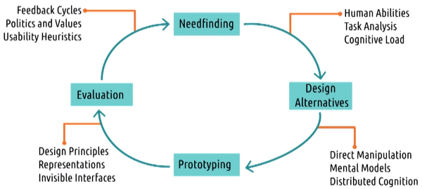

# L3.8 Conclusion to Methods

These are my personal lecture notes for Georgia Tech's Human-Computer Interaction course (CS 6750, Spring 2024) by David Joyner. All images are taken from the course's lectures unless stated otherwise.

# References and further readings

Liu, Z., Nersessian, N., & Stasko, J. (2008). Distributed cognition as a theoretical framework for information visualization. IEEE Transactions on Visualization and Computer Graphics, 14(6). (pp. 1173-1180).

Kidd, C., Orr, R., Abowd, G., Atkeson, C., Essa, I., MacIntyre, B., Mynatt, E., Starner, T. & Newstetter, W. (1999). The aware home: A living laboratory for ubiquitous computing research. In N. Streitz, S. Konomi, & H. Burkhardt (Eds.) Cooperative Buildings: Integrating Information, Organizations, and Architecture (pp. 191-198).

Hu, A., Chancellor, S., & De Choudhury, M. (2019). Characterizing Homelessness Discourse on Social Media. In Extended Abstracts of the 2019 CHI Conference on Human Factors in Computing Systems (pp. 1-6).

Kozubaev, S., Rochaix, F., DiSalvo, C., & Le Dantec, C. (2019). Spaces and Traces: Implications of Smart Technology in Public Housing. In Proceedings of the 2019 CHI Conference on Human Factors in Computing Systems. ACM.

Shahmiri, F., Chen, C., Waghmare, A., Zhang, D., Mittal, S., Zhang, S., Wang, Y., Wang, Z., Starner, T., & Abowd, G. (2019). Serpentine: A Self-Powered Reversibly Deformable Cord Sensor for Human Input. In Proceedings of the 2019 CHI Conference on Human Factors in Computing Systems. ACM.

# Designing audiobooks for exercisers

(See the example of audiobook app in the lecture video.)

- At the end of the first iteration of the design life cycle, we have three low-fidelity prototypes, each with some feedback on how well they work.
    - We have an increased **understanding of the problem**
    - We also know what **questions to ask next**
- Iteration 2
    - Needfinding: Use the evaluation results from the first iteration to **inform the next iteration**
    - Design alternatives: **expand** on our current ideas and explore new ones
    - Prototyping: may **increase the fidelity** of our prototypes (depending on how feasible it is)
    - Evaluation: **a bit more objective** this time, though qualitative feedback may still be needed
- After two iterations, we have a better understanding of the task and the solution space. We now need another iteration to **get something that we can implement and deploy**.
- Iteration 3
    - Needfinding: what we know from the previous iterations will **inform the this iteration**
    - Design alternatives: e.g. **consider pros and cons/feasibility/usability** of the previous designs, **refine** the design
    - Prototyping: e.g. **merging** the best parts of the previous prototypes (still low-fidelity because we've never had such a prototype before, so we want to make sure it works before we invest in a high-fidelity prototype)
    - Evaluation
- More iterations
    - The cycle continues even after first deployment
    - Needfinding with live users: e.g. data logging, user tracking, user reviews etc.

# Research methods meet design principles

# Approaches to user-centered design

- **Participatory design**:
    - **users** are involved in the **design team**
    - need to **be careful not to overrepresent** that one user's view
- **Action research**:
    - addresses an **immediate problem** and researches it by trying to **simultaneously solve it**
    - e.g. a teacher trying a new teaching method and observes its effectiveness in the classroom
    - data is gathered on the success of the approaches and is used to inform the understanding of the problem and future approaches
    - Undertaken by the **actual users**
- **Design-based research**:
    - **similar to action research**, but it can be done by **outside practitioners** as well
    - especially common in learning sciences
    - designers design **interventions based on their current understanding** of the theory and the problem, and they **use the success of those interventions to improve** our understanding of the theory or the problem
	    - e.g. if we believe a certain intersection had a lot of jaywalkers because the signs have poor visibility, we might interview people at the intersection for their thoughts, or create a solution that assumes that we're right and evaluate it
- All of these approaches are **iterative**