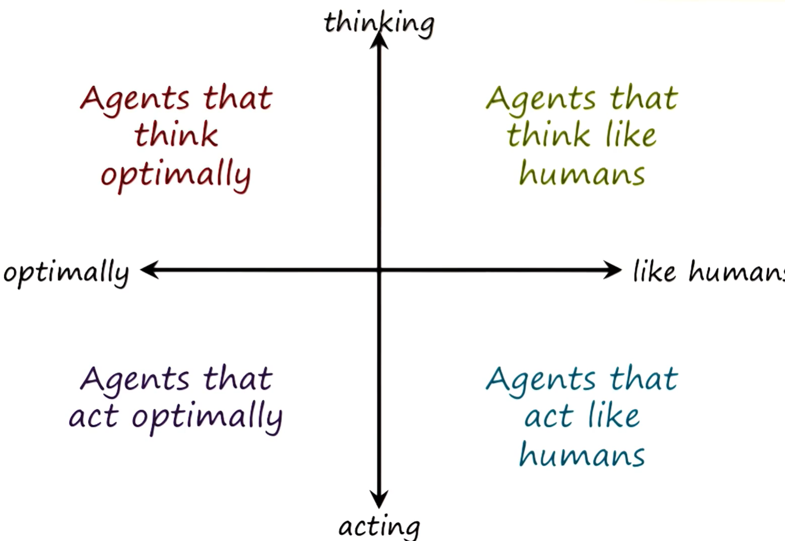
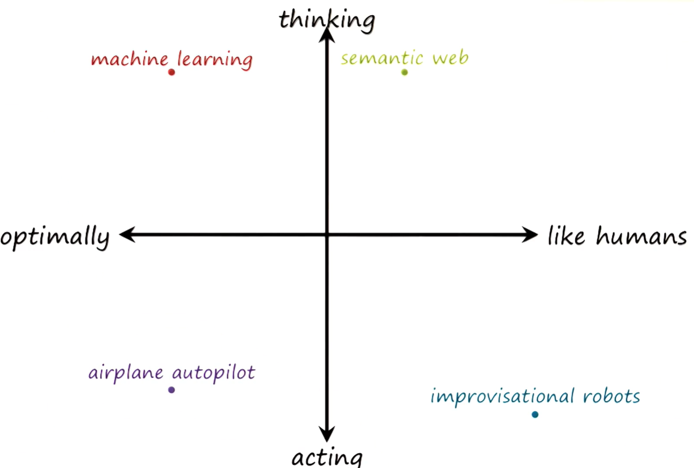
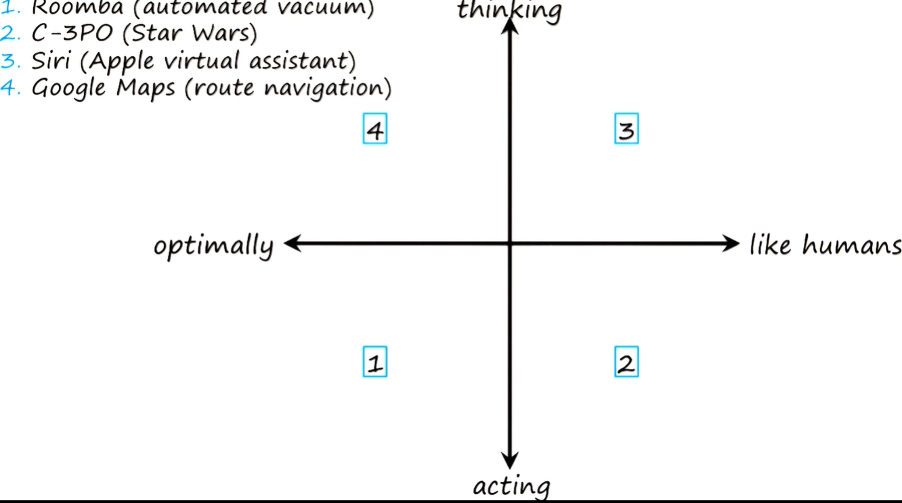
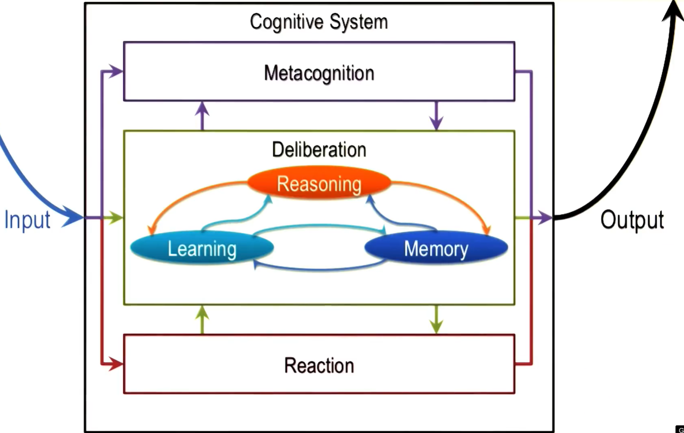

## Learning goals of the course

- Core methods of KBAI
- Tasks addressed by KBAI
- How KBAI agents use these methods to address these tasks
- Relationship between AI and human cognition

## What is AI and what are the limitations/challenges

### Conundrums in AI  

1. AI agents have *limited resources*
2. *Local* computation to solve problems with *global* constraints
3. Logic is *deductive* but problems are not
4. *Dynamic* world but *limited* knowledge
5. Difficult to *explain/ justify* AI agent's decisions  

### Characteristics of AI problems

e.g. Think about how an AI predicts the traffic  

1. Knowledge arrives *incrementally*
2. *Recurring* patterns
3. Many levels of *abstraction*
4. Computationally *intractable*
5. World is *dynamic* but knowledge of the world is static
6. World is *open-ended* but knowledge of the world is limited

## Major components of knowledge-based AI

- "Deliberation": Reasoning, learning and memory
 
## Four schools of AI

Examples:

- ... and of course, boundaries are flexible...

## Cognitive system

- Knowledge-based AI: cognitive system(s) (can be more than one system) that interact with the world (input: perception / output: actions)

### Three-layered architecture:

    - Metacognition: reasons about deliberation
    - Deliberation: reasons about reaction
    - Reaction: inteactions with the external world

An agent can be:
- Reactive: output is the direct reaction to the input
- Deliberative: involves deliberation: e.g. think and act to achieve a goal