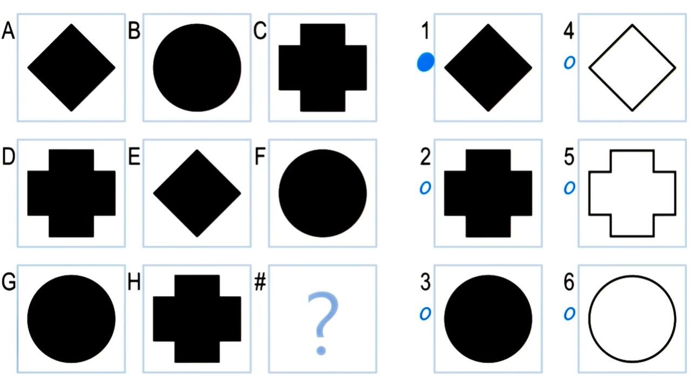

## Computational psychometrics

- the study of human intelligence
- our goal: to design an agent that can take the same kind of intelligence tests as in computational psychometrics; compare the performance of the agent to that of human in these tests

## Raven's Progressive Matrices

- examine general intelligence
- MC questions, visual analogy problems (no texts)
- Types of problems: 2x2, 3x3 or 2x1 matrix problems (type depends on whether the solution involves horizontal, vertical and/or diagonal relationships between elements presented in the problem)

- Example of a 3x3 problem:

- More examples: see lecture quizes

## Principles of CS7637

1. KBAI agents represent and organize knowledge into knowledge structures to guide and support reasoning.
2. Learning in KBAI agents is often incremental.
3. Reasoning in KBAI agents is top-down as well as bottom-up.
4. KBAI agents match methods to tasks.
5. KBAI agents use heuristics to find solutions that are good enough, though not necessarily optimal.
6. KBAI agents make use of recurring patterns in the problems they solve.
7. The architecture of KBAI agents enables reasoning, learning, and memory to support and constrain each other.

## The cognitive connection

- What does an AI agent's performance on psychometric problems tell us about human cognition? Do humans have same errors as AI agents?

