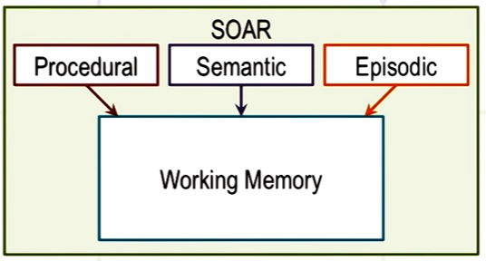

## Cognitive agent

- A function for cognitive architectures
- Maps perceptual history to action  
	f: P* -> A (P = percepts, * means history)
- Tell us what to do next based on P*

## KBAI by level of abstraction

- 3 levels (Low to high)  
	- **Hardware/ implementation level** (e.g. brain, transistor)
	- **Algorithm/symbol level** (e.g. means-end analysis, semantic networks)
	- **Task/Knowledge level** (e.g. selecting a pitch, playing baseball) (i.e. computational theory)
- Hardware level ← → algorithm ← → task level  
> → = "provides architecture for the implementation of"  
> ← = "provides content for (e.g. what needs to be represented or manipulated)"

Example: 3 layers of Watson (AI agent)  
- the physical computer
- searching and decision-making
- answering the inputted clue

## Assumptions of a cognitive architecture

- Goal-oriented
- rich, complex environment
- significant knowledge
- symbols and abstractions
- flexible and a function of the environment
- learning

## Production systems enable action selection

- Architecture + content = behavior
- Keep the architecture constant, change the content -> gives you different behaviors
- **Production systems**: map any kind antecedent into any kind of consequent
- Example of a production system: **SOAR**
	- **SOAR**: the component of a production system that provides a cognitive architecture for deliberation (e.g. Lecture 1 \& 2)

### SOAR

- **Content memory** stored in **working memory**
- **Procedural memory** brought into working memory from long-term memory (the source)
- Memory represented as some kind of rules:
	- **Production rules** (where the name of production system comes from)
	- Map content memory to procedural memory
	- -> some rules got activated ('fired')
- **Long term memory changes very slowly**
**- Content memory changes constantly**

### Impasse

- **Impasse** occurs when the decision maker cannot make a decision (e.g. knowledge not available; there are no one corresponding action for a particular percept; or multiple actions are selected)
- SOAR will attempt to learn a rule to **break the impasse** by looking for percepts in similar past event in **episodic memory**
	- e.g. learn from a previous event which has similar situation (episodic memory)
	- SOAR encapsulates knowledge from a previous event into a form of production rule  
		- -> **Chunking**: a technique that SOAR uses to learn rules that can break impasse
		- Chunking is triggered when impasse occurs
		- (impasse basically sets the goal for chunking)
	- This shows that learning and memory are closed related

### Learning and memory

- We start by establishing a theory of reasoning, which tells us what to learn and when to learn
- How to learn? reasoning first, then backwards to learning: e.g. production systems encounter impasse, then start to learn -> impasse tells us when to learn
- Demands of reasoning and memory constrain the process of learning

## Cognitive connection

- Working memory in humans: short term memory
- Similarities between human cognition and SOAR when addressing problems in arithmetic and algebra