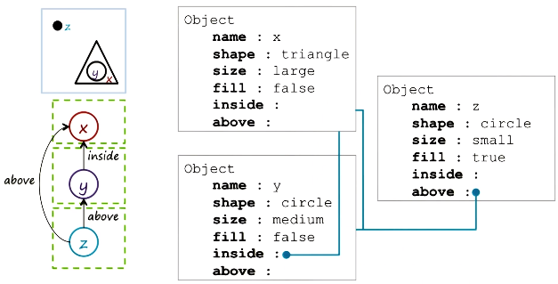
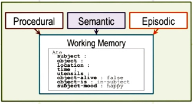

Frames are used for:
- inference
- common sense reasoning

## Make sense of a sentence using frames
  
- Frame is a **knowledge structure**:  
`e.g. Ashok ate a frog.`

Frame of the word "ate":

```
Ate
    Subject: Ashok
    Object: a frog
    object-alive: false  
    ...etc.
```

(Left: "**slots**"; Right "**fillers**", i.e. values of slots)

## Complex frame systems

- Frame slots can branch out to more frames
- e.g. For the frame of the word "ate": Slot "subject" can point to another frame like the one below:  

```
Person
    name: Angela
    surname: Smith
    gender: female
```

- As we have more and more sentences/phrases, we can organize the knowledge by adding frames and connected them to other frames.  

## Properties of frames  

- Represent **stereotypes**
- Provide **default** values
- Exhibit **inheritance**  

e.g. For the frame `Animal`: 

```
Animal
    #-of-legs:
    #-of-arms:
```

The frame `Human`**inherits** slots of `Animal`:  

```
Human
    #-of-legs: 2
    #-of-arms: 2
    job:
    name:
```

In OOP, `Human` is like a `class` which has instances like:  

```
Human
    #-of-legs: 2
    #-of-arms: 2
    job: Professor
    name: Ashok
```

## Frame and semantic networks

Rewrite a semantic network as frames:



## Frame and production systems



- Conceptual Memory is stored in **Semantic Memory**.

For the input "Ashok ate a frog.":  
1. The word "ate" is written into the Working Memory.
2. The frame for "ate" is pulled out from the Semantic Memory.
3. The frame tells the system what info to look for (e.g. subject, object, etc.). In other words, information processing is not just bottom-up (from input to the system), but also **top-down**.

## Cognitive connection  

- Frames are *structured* knowledge representation, enabling capturing and organizing large amount of knowledge.
- Frames enable *top-down* information processing: frames can be built by info stored in the memory. Frames organize knowledge and generate expectations in the world.
- Frames capture the notion of *stereotypes* (default values). Stereotypes are cognitive efficient, though it may need to incorrect inference.  
