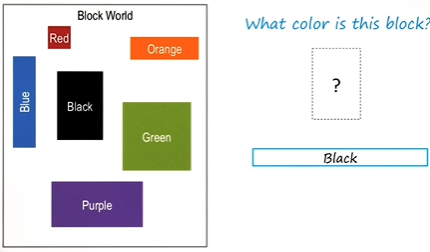
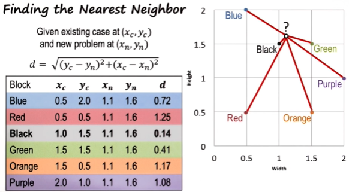

Given new problem A:  
- Retrieve most similar prior problem B, from memory
- Apply B's solution to problem A  

## Nearest neighbor  

e.g. To solve the following problem using the **Nearest Neighbor** method:

To calculate the nearest neighbor, find the **Euclidean distance**:  
$d = \\sqrt{(y_c-y_n)^2+(x_c-x_n)^2}$,  
where ($x_c, y_c$) are the parameters for the existing case and ($x_n, y_n$) for the new problem.

## K Nearest Neighbor (KNN)  

For problems that have k dimensions, the Euclidean distance is:  
$\displaystyle d=\sqrt{\sum_{i=1}^k (c_i-p_i)^2}$  ,  
where ($c_1, c_2...c_k$) are the parameters for the existing case, and ($p_1, p_2...p_k$) for the new problem.

## Cognitive connection  

- The connections between reasoning, learning and memory: we are able to learn from the past to solve problems, not having to reason every problem and generate new solution every time