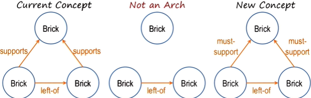

- **Incremental**: show the agent **one example at a time** and the agent learns incrementally (instead of learning from a large set of examples at once)
	- Learning is often incremental: We learn from one example at a time
- Examples are often **labeled**. e.g. Teacher tells us this a positive example or a negative example (supervised learning in machine learning)
- Examples can come in a particular order: first example is typically a positive example. 
- In case based reasoning, we store examples in their raw form in memory and reuse them. In incremental concept learning, we abstract **concepts** 
- Number of examples from which we’re extracting concepts is very small

We are trying to abstract concepts from examples, but what exactly to abstract? What exactly, to learn? What exactly to generalize? (tendency to often overgeneralize, or overspecialize)

## Generalization or specialization

## Variabilization

- If we want to teach an AI agent to recognize arches, we can tell it about the definition of an arch (i.e. 4 bricks with a relationships shown in the right figure)
- If the agent sees the example in the left, it is able to **variabilize** the bricks (mapping objects to variables, e.g. top brick is an instance of Brick A, left brick is an instance of Brick C, etc.)
	- right pic shows the **variabilization** of the example
- If the agent sees a new example **AND** the current concept does not include or exclude the example:
	- it sees a positive example: **generalizes** if the positive example is not covered by the current concept
	- it sees a negative example: **specializes** current definition to exclude the negative example
- A concept that an agent has depends on the agent's **background knowledge** (i.e. the definition and examples we gave to the agent)

## Heuristics for specializing and generalizing

- A concept can be characterized with many, many features... **heuristics** help to reduce the dimensions of the learning space

### "Drop-link" heuristic
- Generalization to ignore features
- If we show the picture below and tell the agent it's a positive example:
	- it updates the current concept to accommodate the example:
	- update may be done using heuristics, e.g. **drop-link heuristic** (link indicated in the picture below is *dropped*)
	- the new concept can accommodate both the example and the previous concept
	- drop-link heuristic: useful when the new and old concepts *overlap* except an extra link

### Require-link heuristic
- Specialization to require features
- e.g. show the agent the *negative* example below
- links not in common between the example and the current concept must be required

### Forbid-link heuristic
- Specialization to exclude features
- e.g. show the agent the *negative* example below

### Enlarge-set heuristic
- Generalization to abstract features
- e.g. show the agent the *positive* example below

### Climb-tree heuristic
- Generalization with background knowledge
- Update concept with background knowledge: brick wedge are both "blocks"
	- i.e. it "climbs" the "knowledge tree" (see the tree in the figure below)
- **Advantage: the more we know the more we can learn**

### Close-interval heuristic
- expand range of values to be a positive example of the concept
	- e.g. update the concept of a dog to include large dogs by increasing the range of body length

## Cognitive connection

-  Incremental concept learning (learning from one example at a time) is much closer to human's learning than e.g. machine learning with a large set of example
