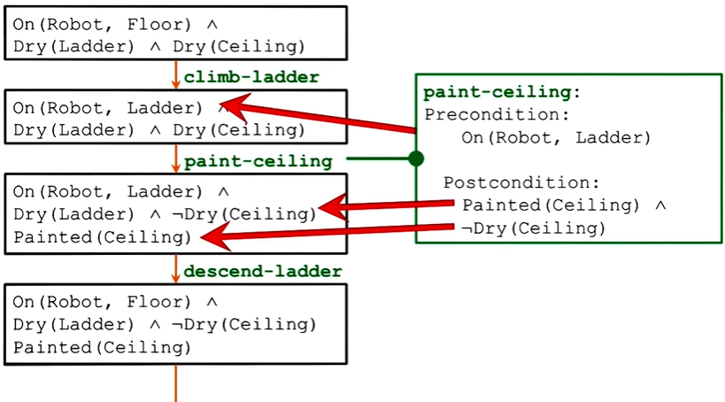
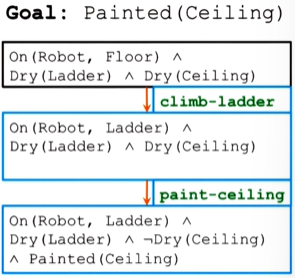
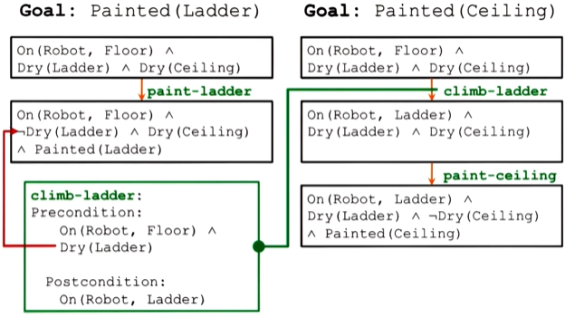
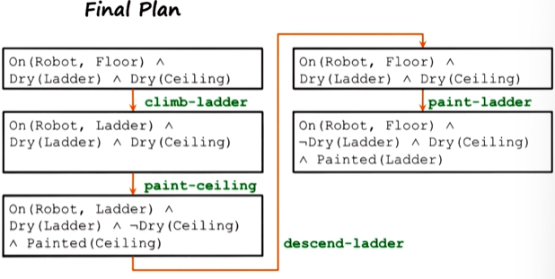
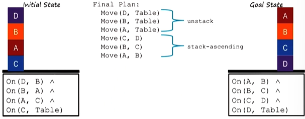

## Introduction

- Knowledge is not just above the world, there's also tacit knowledge derived from the goal (**control knowledge**)
- This chapter is about how to select actions (and plan the order of actions) using control knowledge, and how to solve conflicts between actions
### Example
If a robot's goals are to paint the ladder and the ceiling:
- The robot should paint the ceiling first and then the ladder (so it can use the ladder to paint the ceiling).
- Using propositional logic to represent the initial state and the goal state:
	- Initial state: `On(Robot, Floor)` $\wedge$ `Dry(Ladder)` $\wedge$ `Dry(Ceiling)`
	- Goal state: `Painted(Ceiling)`$\wedge$ `Painted(Ladder)`

### Operator
- **Operator**: representation of an action in the world
- Example: the operator `climb-ladder`
	```
	climb-ladder:
		Precondition:
			On(Robot, Floor) ∧ Dry(Ladder)
		Postcondition:
			On(Robot, Ladder)
	```
- *Syntax* of an operator: an operator contains precondition and postcondition
	- **Preconditions**: assertions that are true in the world before the operator can be applied
	- **Postconditions**: assertions that are true in the world after applying the operator
- The operator can only be applied if and only if the preconditions are true in the world
- **By convention, all literals in precondition are positive literals.** (Postcondition may have negative literals.) 
- Example 2: `Paint-ceiling`
```
paint-ceiling:
	Precondition:
		On(Robot, Ladder)
	Postcondition:
		Painted(Celing) ∧ ¬Dry(Ceiling)
```
- Note that `¬Dry(Ceiling)` is needed here because we need to explicitly negate things that were true in the world before: the ceiling was dry but now it isn't.

## Planning and state spaces

Planning vs search:
- Search: search through all possible successor states and all successor states downstream
	- Computationally expensive and inefficient
	- Not all states bring us closer to our goal state
- Planning: use the knowledge of the goal
	- goals provide us the **control knowledge** (tacit knowledge about how to select operators)
	- e.g. in means-ends analysis, goals are used to select operators that reduce the distance to the final goal
	- Planning: more systematic method for selecting operators (i.e. action selection)

In the following figure, boxes on the left indicate states and the green texts are the operators.
- Note that an operator have pre- and postconditions matching the corresponding states. (Recall that an agent is able to map percepts to actions.)



## Partial order planning

- How does an agent know in what order should it solves its sub-goals?
### Partial planning
- Agent uses sub-goals as control knowledge to select operators
- E.g. A robot's goal is to paint the ceiling and the ladder, i.e. two **partial goals**: `Painted(Ceiling)` and `Painted(Ladder)`
- The robot plans for each partial goal independently (one plan for each partial goal)
- For example, for the goal `Painted(Ceiling)`:
	- The robot *first looks for an operator* that has the postcondition that matches the goal state - `Painted(Ceiling)`. In this case, it is the operator `paint-ceiling`
	- Then, the robot *works backward* to look for an operator that has the postcondition that matches the precondition of `paint-ceiling`



### Detecting conflicts
- For each precondition in current plan: 
	- If precondition for an operator in the current plan is clobbered by a state in another plan:
		- Promote current plan's goal above other plan's goal
	- Example: The red arrow in the following figure indicates a conflict between `climb-ladder`'s precondition and a state in another plan
		- Result: promote `Painted(Ceiling)` above `Painted(Ladder)`



### Open-condition problem:
- For example:
	- After completing the plan for the goal `Painted(Ceiling)`, the robot is on the ladder
	- In order to apply the `paint-ladder` operator in another plan, the robot has to be on the floor, but the robot is still on the ladder
	- This create an **open precondition**: the precondition of `paint-ladder`,  i.e. `on(Robot, Floor)` is not satisfied
	- To solve this, the robot selects an operator to fulfill the open precondition: `descend-ladder`



- We can view partial order planning as an interaction between several different kinds of agents/ abilities - each agent represents a small micro ability:
	- an agent that generates plans for each of the partial goals
	- an agent that detects conflicts between plans
	- an agent that resolves conflicts

> [!info] Society of mind
> Minsky proposed a society of mind: a society of simple agents inside an intelligent agent's mind to create complex behaviors

## Hierarchical Task Network (HTN)

- For some tasks, we have need a large number of operations in the final plan
- Abstract operations at a higher level:
	- i.e. Instead of thinking in terms of low-level operations, we can think in terms of high-level macro operations
	- **Macro operations** will make the problem space much smaller and simpler
	- We can then expand those **macro operators** into the low-level operations

For example: 



- In the above figure, `unstack` and `stack-ascending` are the macro operators.

### Hierarchical decomposition
- These macro operators can then be expanded into lower level operators `move` (see the `methods` section below):
```
unstack:
Precondition:
On (w, x) ∧ 
On (x, y) ∧ 
On (y, z) ∧ 
On (z, Table)
Postcondition:
On (w, Table) ∧ 
On (x, Table) ∧ 
On (y, Table) ∧ 
On (z, Table)
Method:
Move (w, Table)
Move (x, Table)
Move (y, Table)
```
```
stack-ascending:
Precondition:
On (a, Table) ∧ 
On (b, Table) ∧ 
On (c, Table) ∧ 
On (d, Table)
Postcondition:
On (a, b) ∧ 
On (b, c) ∧ 
On (c, d) ∧ 
On (d, Table)
Method:
Move (c, d)
Move (b, c)
Move (a, b)
```
### Hierarchical planning

- Intelligent agents think about complex problems by thinking at multiple levels of abstraction
	- At each level of abstraction, the problem appears small and simple
	- To address each level of abstraction, we need knowledge at each level
	- e.g. in the block world problem. we need knowledge at the level of `move` operation and at the level of macro operations (e.g. `unstack`)

## Cognitive connection

- Action selection is central to cognition
- Cognitive agents also have multiple goals - planning is central to achieving multiple goals at the same time