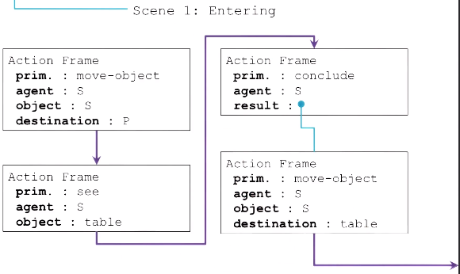
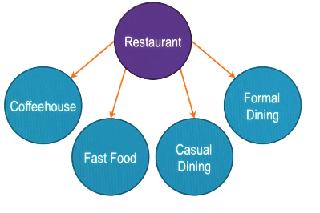

- A **knowledge representation** representing stories
- it captures a **causally coherent set of events**:
	1. Each *event* sets off, or causes the next event
	2. The causal connections between events make sense
- Most events are observable
- Script is the culmination of frames, understanding, common sense reasoning

How can an AI agent connect sentences in a story? How can it make inferences from these sentences?

### Example: Visiting a coffeehouse
- you have a "script" of things that you would do at a coffeehouse (e.g. first wait at the line, then order, then pay, etc.)
- the script is initiated whenever you visit a coffeehouse; it generates expectations (e.g. cashier giving you the change)
- if expectations are not met -> something is wrong

## Story understanding for AI agents

- Stories and events don't come to AI agents one by one orderly
- How can an AI agent make causal connections between events?
- Stories help you to make sense of the world, help you to generate expectations

## Parts of a script

1. **Entry conditions:** Conditions necessary to execute the script.
2. **Result**: Conditions that will be true after the script has taken place.
3. **Props**: Objects involved in the execution of the script.
4. **Roles**: Agents involved in the execution of the script.
5. **Track**: Variations or "subclasses" of the particular script.
6. **Scenes**: The *sequence of events* that occurs during execution of the script.

## Constructing a script
```
script: restaurant
track: formal dining
props: tables, menu, check, money, F = food, P = place
roles: S = customer, W = waiter, C = cook, M = cashier, O = owner
entry: S is hungry, S has money
result: S has less money, O has more money, S is not hungry, S is pleased
scenes :  -----> See below
```



(prim.: privative action)

### Form vs. content
- The form of a general script tell us the overall prototype of the situation
- A specific instantiation of script specifies the *content*
- The above entering scene illustrate how S (the customer) enters the restaurant through a series of actions (e.g. `move-object` = moving S themselves, walking to into the restaurant.)
- Note that each action has its own knowledge structure, and a script is composed out of these frame-like knowledge structures
- The above script is a Python class, we can instantiate a script with other values for the variables in the script
- A robot can have multiple scripts for different scenarios, e.g. a restaurant script like above; such a script could be involved when the robot enters a restaurant

### Using a script to generate expectations
- scripts not only help us to make sense of the world, but also help us to know what to expect (and not to expect)
- surprises, humors, amusements etc. are related to unexpected events (i.e. events violating the script)

## Tracks

A script may have different tracks for different situations:



- You may use a specific track for certain situations.
- A classification problem: what track should be used for which type of activities?
- A script is like a plan in compiled form: it help the agent to decide what to do to achieve a goal without the need of planning, allowing the agent to address complex problems in real time

## Cognitive connection

- Scripts: strongly connected to theories of cognition, e.g. brain is a predictive machine
- We generate expectations and act on those expectations
- Question: Do we generate scripts at run time?
- We have mental models or scripts, and they can be cultural specific.