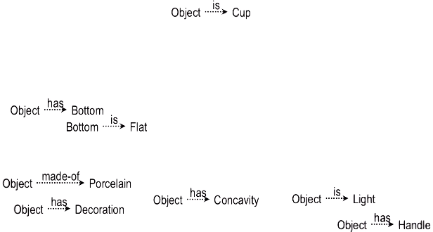
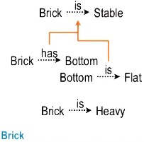
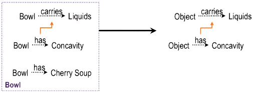
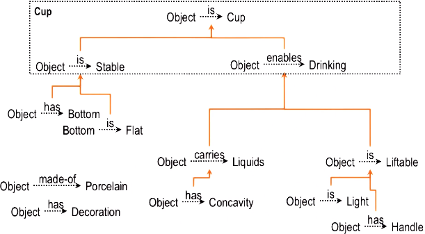

- Learn from existing concepts to build new concepts
- Provide novel solutions (creativity)
## Concept space

Example: How to prove an object is a cup
- Definition of a cup: an object that is stable and enables drinking
- Description of the object: The object is light and made of porcelain. It has a decoration, a concavity, and a handle. The bottom is flat.
- Concept space for the object: 

## Prior knowledge

Concepts that the robot already knows:
- A Glass: The glass enables drinking *because* it carries liquids and is liftable. It is pretty.
- A Brick: The brick is stable *because* its bottom is flat. A brick is heavy.
- A Briefcase: The briefcase is liftable *because* it has a handle and is light. It is useful *because* it is a portable container for papers.
- A Bowl: The bowl carries liquids *because* it has a concavity. The bowl contains cherry soup.

In the above knowledge representation of a brick, orange arrows indicate **causal relationships.**

## Abstraction

- An AI agent abstracts knowledge from the concepts it already knows
- the knowledge abstracted that are *causally related*
- The agent is trying to build a **causal explanation** that will connect the instance (the object bowl) to the cup.
- The agent creates an **abstraction** of the bowl (so the bowl is replaced by the object)

## Transfer

- Example: The agent wants to prove that an object is an instance of a cup.
- The agent construct a causal explanation with causal relationships it abstracted from its prior knowledge.

 

- In practice, when building the above explanation, the agent goes backward:
	- It starts from the definition of the cup: a cup must be stable and it enables drinking (Planning - \[Lesson 13\]): two open preconditions that the agent needs to fulfill)
	- Then, it sends a goal of proving the object is stable into its memory. (Problem reduction)
	- Memory returns the brick example because it's stable.
	- It then abstracts from the brick the causal relationship that" "a brick is stable because it has a bottom and the bottom is flat".
	- It applies the above causal relationship to the object to fulfill the first precondition: a cup must be stable
	- Repeat the above steps to build a causal chain to fulfill the second precondition

- What is the minimum knowledge that an AI agent needs to know?

## Cognitive connection

- Limitations/considerations in both humans and AI:
	- Humans can only explain things that are consciously accessible (e.g. we can't explain memory processes)
	- Explanation can be post-hoc: Process we use to generate explanation is not necessarily the same as the process we use to arrive at the decision in the first place
	- The process of generating explanation may interfere with the reasoning process

- Generating explanation helps us/ AI agent to learn and understand deeper
- Ability to explain things helps society to accept AI 