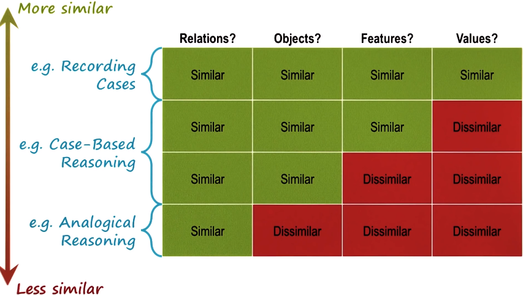
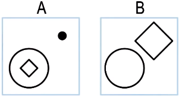
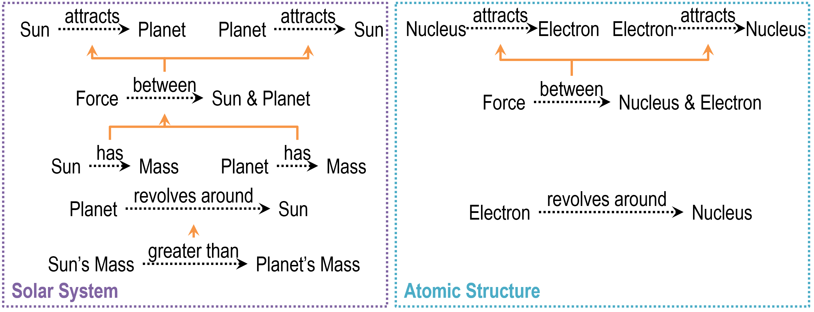
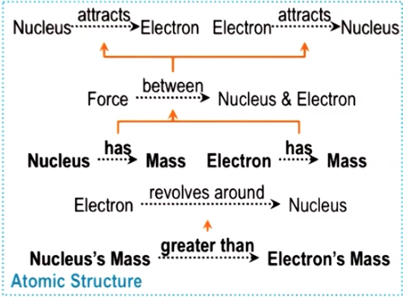
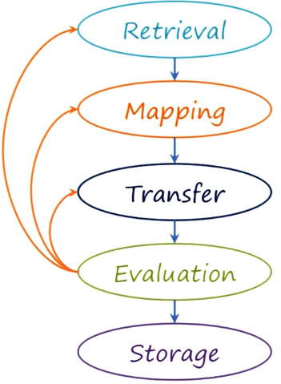

- Understanding new problems with *familiar problems*
- addressing new problems by *transferring* knowledge of relationships from known problems *across domains*

Comparison with case-based reasoning:
- See Lesson 9 for how to compare cases: metrics for similarity e.g. Euclidean distance, case storage by indexing or discrimination tree.
- What happens if a new case is in a different domain than the previous cases? (e.g. A woman climbing a ladder vs. An ant climbing up a wall.) How do we find similarities between cases of different domains?

### Need for cross-domain analogy
- In different cases objects, and their features and values can be different, but the similarity is based on the **relationships**
- *Relationship* is what get *abstracted and transferred* from a target problem and a source case in different domains

## Spectrum of Similarity

- Similarity between two cases in terms of different dimensions:

For case-based reasoning, objects in the target case and the source case are the same. Therefore, both cases are in the same domain.
## Process of analogical reasoning

1. Retrieval
2. Mapping (what problem corresponds to what in the source case)
3. Transfer
4. Evaluation
5. Storage

- Compare the above process with that of case-based reasoning:
	- In case-based reasoning, since cases are in the same domain, adaptation is enough (instead of mapping and transfer shown here)
- In some other theories, mapping is part of the retrieval phase: you do mapping in order to do retrieval

### Analogical retrieval
What criteria should we use to decide similarities between cases?

Example Raven's problems:

- **Superficial Similarity** (**unitary relationships**):
	- Features
	- Counts
	- Objects
- **Deep Similarity**:
	- Relationships between objects (**binary relationships**)
	- Relationships between relationships (**tertiary/ higher order relationships**)

#### Types of similarity
- **Semantic**: Conceptual similarity between the target problem and the source case. (e.g. climbing a ladder and climbing a stairs)
- **Pragmatic**: Similarity of external factors, such as goals.
- **Structural**: Similarity  between representational structures.
- One may apply different weights on different types of similarity

### Analogical mapping
- **Corresponding problem**: what in the target problem, corresponding to what in the source case
- **M to N mapping**: any of the objects in the target problem can correspond to any of the objects in the source case
	-  Computationally inefficient
	- Therefore, we map by *higher-order relationships whenever possible*
- Higher-order relationships also help us to map objects accurately. Consider the cancer treatment and the King-capturing task in this lesson:
	- Superficially, the patient and the king are similar because they are both humans
	- *Deeply*, the king should correspond to the tumor because they are both the target of a goal in both cases (to remove the tumor and to capture the king)
### Analogical transfer
- Strategy: Look for a pattern of relationships in the source case
	- Example: 
		- goal: to capture the king
		- resource: the army
		- obstacle between the goal and the resource: mines on the road
		- strategy: decompose the resource (army) and send them to the goal at the same time
- Abstract the pattern of relationships and transfer it to the target problem:
	- Example:
		- goal: tumor
		- resource: laser
		- obstacle: healthy tissue
	- We can find the solution to the target problem by transferring the strategy used in the source problem: decompose the resource (laser) into multiple less intense laser beams and shine at the tumor at the same time
- **Pragmatic similarity**: the above cases have similar goals

Another example: What would be transferred into the atomic structure model?

**Bold words**: Things that are transferred from the source case to the target case

### Evaluation and storage
- Similar to the same steps in case-based reasoning:
	- e.g. perform a simulation to evaluate the solution
	- encapsulate the target problem and the solution as a new case and store it in memory

## Design by analogy

- e.g. Biologically-inspired design (biomimicry)
- Retrieval: Requires a deep understanding of the source case for mapping and transfer
- Mapping and transfer:
	- Example: 
		- design a robot that can walk on water (target problem) based on the basilisk lizard (source case)
		- we need to understand the lizard at multiple levels, e.g. we need a structure model, behavior model and a function model
		- align two cases at different levels by relationships
		- e.g. at structural level, after mapping the corresponding objects, we can transfer features of a lizard to the robot (e.g. shape of its feet)
	- **Compositional analogy**: 
		- map at the level of structure first
		- structural mapping enables transfer of info which in turn helps us to transfer info at the behavioral level
		- lastly, we can climb up the hierarchy and transfer info at functional levels
	- **Compound analogy:**
		- getting info (partial solutions) from multiple source cases
		- problem evolves and transforms during the process
	- Analogical reasoning is not always linear: 
		- e.g. loops between mapping and transfer
		- info transferred may lead to new mapping  (e.g. in compositional analogy)
		- info transferred may also lead to additional retrieval (e.g. in compound analogy, retrieve info from another case)
- Evaluation and storage: 
	- e.g. evaluation by simulation or building a prototype
	- If evaluation fails, we may transfer different info, or try different mapping, or retrieve another source case
	- If evaluation is successful, store the problem and the solution as a new case

## Advanced and open issues in analogy

- Common vocabulary across different domains
- Abstraction and transformation (agents need to abstract the problem first)
- Compound and compositional analogies
- Visuospatial analogies
- Conceptual combination (analogical learning is an example)
- 
## Cognitive connection

- Analogy is central to cognition
- e.g. spatial metaphors we use in daily language
- Raven's test of intelligence is based entirely on analogies