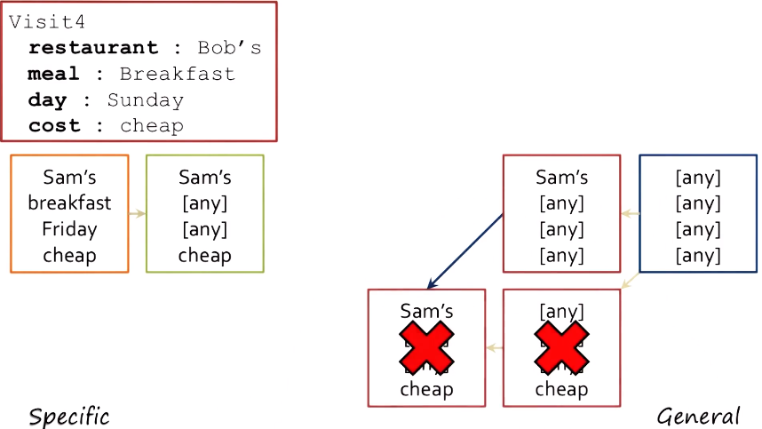

## Revisiting incremental concept learning

- Like incremental concept learning, version spaces involves a small set of examples arriving one at a time
- In incremental concept learning
	- we make use of background knowledge
	- the order in which the examples arrive is very important
	- a intelligent "teacher" is needed to get the order of examples effective
	- What if the order is incorrect? It may lead to over- or undergeneralization
	- **version spaces is a technique that helps learning to converge to the right generalization**
- Version space learning **does not need background knowledge or an intelligent teacher**

## Abstract version spaces

- This technique involves two models: a specific one and a general one

The figure below:
- Red square: a specific model
- Blue square: a general model
- As we provide positive and negative samples to the agent, it generalizes the specific model and specializes the general model.
- As the models are being updated during the process, some of the data no longer fit some versions of these models
- Finally, different versions of models converge

## Version spaces algorithm

For each example:
- If the example is **positive**:
	- **Generalize** all **specific models** to include it
	- **Prune** away any models that cannot include it
- If the example is **negative**:
	- **Specialize** all **general models** to include it
	- **Prune** away any models that cannot include it
- **Prune** away any **models subsumed by other models**

### Example
How can an AI agent tell what causes an allergy?

Negative and positive examples:

First example: Visit 1 (positive)

Second example: Visit 2 (negative)
- Specialize general models
- Prune away model that doesn't fit the example (marked by red cross)

Third example: Visit 3 (positive)
- **Note**: during the process, constantly check if any models (BOTH specific and general models) are still valid

More examples:

## Identification trees

- Discrimination tree learning (see Lesson 9 Case-Based Learning):
	- we learn the tree incrementally
	- it doesn't guarantee the optimality of the discrimination tree for the cases being studied: i.e. at retrieval phase when a new problem arrives, traverse in the tree might take a long time
- Alternative: **decision tree learning**
	- *all examples* need to be given right at the beginning
	- it classifies the examples and helps the agent to find the closest example to the new problem

### Example (same as the restaurant one above):
- each category/feature (restaurant, meal, day, cost, allergic reaction) only contains either positive or negative instances for that category
- In the figure below: 
	- The feature "cost" separates examples into two classes: positive (causing allergic reaction, marked green) and negative examples (red).
	- Similarly, the feature 'restaurant' has two classes: "Sam's" (branch out to "cost") and "Not Sam's" (includes only negative examples).
	- When a new problem comes, simply walk through the tree to decide if it will cause an allergic reaction

### Optimal identification trees
- good trees contain categories that separate examples into only positive or negative instances
- optimal trees: fewer branches
## Cognitive connection

- Cognitive agents also face the issues of over- or undergeneralization
- Related to cognitive flexibility: agent has multiple prospectuses on the same thing. 
	- Agent has several definitions for a concept that converge over time
	- Agent comes up with one generalization. If this fails in the real world, the agent learns from mistakes and correct itself.