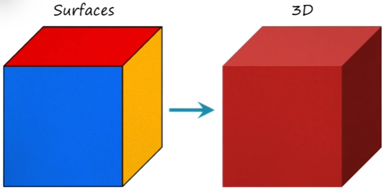
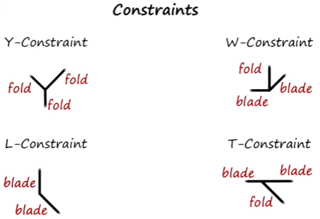
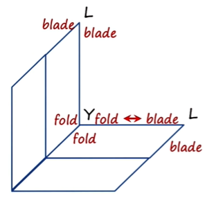
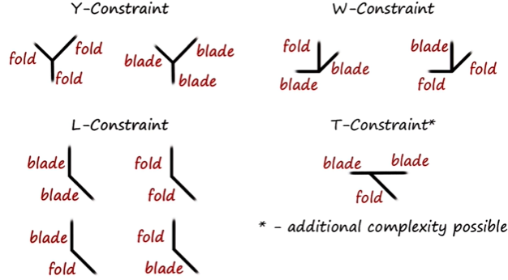

## Introduction

**Constraint propagation:** a *method of inference* that assigns values to variables characterizing a problem in such a way that some conditions (called constraints) are satisfied.

> e.g. How can we tell if this sentence grammatically correct?
> "Colorless green ideas sleep furiously."
> 
> Apply various grammatical constraints (e.g. prepositional constraints in Lesson 14) and check if the sentence satisfies all constraints.
```
Constraints:
Sentence = Noun Phrase + Verb Phrase  
Noun Phrase = [Adjectives] + (Noun or Pronoun)  
Verb Phrase = Verb + [Adverb]
```
- A problem may have more than one way to satisfy all the constraints, e.g. puns; visual illusion, etc.
- "Propagation" in the sense that one satisfied constraint propagates to another 

## Example: 3D object recognition

> [!info]
> - Trihedral object: three surfaces join at a particular point (e.g. a cube)
> - Polyhedral object: multiple surfaces join at one point (e.g. a pyramid; a soccer ball)
### 3D object recognition in multiple subtasks:
1. Detection of edges/lines
2. Grouping lines into surfaces with orientations (e.g. 4 lines grouped as one square surface)
3. Grouping surfaces into a 3D object



- The above algorithm for 3D object recognition is an example of **task decomposition** (task -> subtasks)
- The agent probes into memory with surface-level cues to retrieve a *frame*
- Slots of a frame generate *expectations* (*constraints*)
	-  The agent uses various algorithms for different subtasks to satisfy these expectations/ constraints

### Subtask example: Line labeling
- Line labeling: classifying types of lines
- Constraints: see illustration below

- Lines of a cube join at a point in 4 ways (above)
- We can define the constraints for different types of junctions for a trihedral object as follows:
	- Y-constraint: contains 3 folds (fold: a line where two surfaces meet)
	- L-constraint: contains 2 blades (blade: a line where we can't infer that two surfaces are connected with each other )
	- W-constraint: contains blade-fold-blade
	- T-constraint: ...
- The constraints here: like a "spatial grammar" for the world of trihedral objects (c.f. grammar of sentences)

### More complex images
- If an image doesn't fit the constraints available in memory, it is not seen as a 3D shape:



- In the example above, the lines in the Y-junction are all folds according to the constraints defined previously, but the neighboring L-junctions have only blades, this creates *conflicts* between constraints
- We can use a more complex ontology (i.e. defining more constraints) to solve cases like this:


- Note that a more complex ontology may introduce *ambiguity*
	- e.g. To disambiguate between two types of Y-constraints, try different combinations of constraints to see which fits the data the best  
	  (Abduction: try to come up with the best explanation for the data conflict (see next lesson))

## Cognitive connection

- Constraint propagation is a general purpose method like means-ends analysis
- It allows us to use our knowledge of the world to make sense of it
- Constraints can be symbolic (like in this lesson) or numeric
- Related to planning, understanding and scripts

