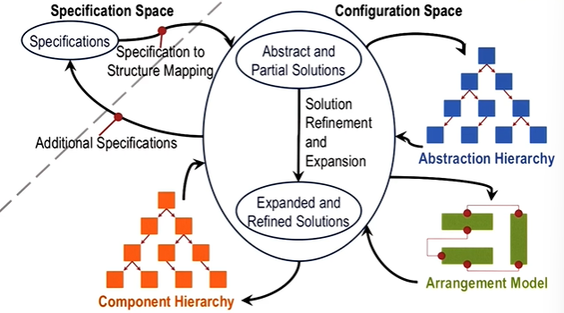
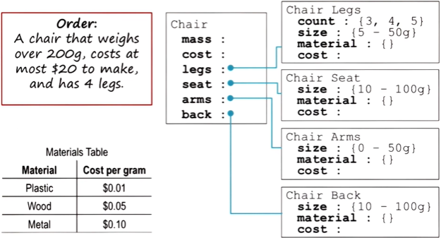
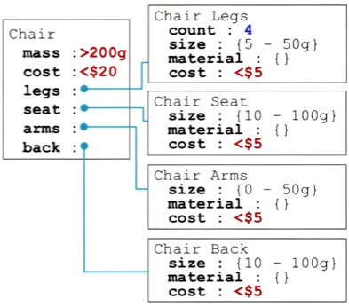

## Definitions

### Design
- Design: 
	- input can be a need/goal/function
	- output: specification/structure of some artifact that satisfies the input
	- can be open-ended or well-defined
- Design vs problem-solving
	- Problem-solving: typically, the problem remains fixed (even the solution evolves)
	- Design: ***the problem and the solution co-evolve***

### Configuration
- Configuration: 
	- an arrangement of all **components**
	- a problem-solving activity that assigns values to variables to satisfy constraints
	- Which variables should we set first? Different heuristics for the *ordering of variables*:
		- set the most restricted variables first
		- set the variables that restrict others the most first
		- set the most important variables first
- Configuration vs design
	- Configuration: a type of design that is routine. All components are known. You simply arrange the components
	- Design: *components not known*

- Example: arranging furniture in a living room
	- Constraints: e.g. TV must be placed in front of couch; distance between TV and couch, etc.
	- Most important: location of TV, then location of couch
		- Therefore, set the TV first, then the couch, then other items

## The configuration process

- Start with **specifications** of all the constraints
- Output: an **arrangement model**
- As shown below, one may begin with some abstract/partial solutions: a design plan
	- assign values to variables in the plan
	- **refine and expand** the plan
		- the plan specifies more variables at lower-level
		- assign values to variables in the plan
- repeat the above steps until we have a complete arrangement model (solution)
- Assess the arrangement model. If needed, repeat the process
- e.g. the runtime of the configuration comes out to be slower than the specifications. Two solutions: 
	- change the specifications of the problem (i.e. solution and problem co-evolve)
	- repeat the process until the constraints (e.g. runtime) are satisfied

- Abstraction hierarchy: plans arranged at different levels of abstraction
- Component hierarchy: In configuration, all components are known, but a component can belong to a specific kind or a general kind. Sometimes you can select the kind you want in configuration.

## Example: representing a chair

- Figure above: a chair represented with frames (prototype of a chair)
- Configuration design: figure out the arrangement of all the components of a chair by filling out the slots of the frames
- Values of slots (variables) must satisfy global constraints (see red box) and the range of values that a slot can take
- Different designers use different design plans. In the following example:
	- the abstract plan has a cost range for each component (<$5) (may change later)
	- the count of chair legs is assigned first before other variables
	- Expand the plan after defining the count of chair legs (e.g. deal with more detailed constraints such as the size and material of chair legs; this is an example of constraint propagation(Lesson 20))

## Comparisons with classification/ case-based reasoning/ planning
### Connection to classification
- Classification and configuration are both hierarchical
	- Classification: "establish and refine" (Lesson 11)
	- Configuration: initiate a plan, than refine and expand the plan
- Configuration leverages classification's notion of prototype concepts
	- e.g. in the chair example above, configuration starts with a plan representing the prototype of a chair (which provides all the components of a chair)
	- (In other words, classification helps us to make sense of the world, configuration helps us to create a world)

### Contrast with case-based reasoning
- Configuration: starting with a prototype concept and assigning values to variables
- Case-based reasoning: starting from a specific chair and tweaking it as needed
- (We will learn how an AI agent decides which of the above methods to use)

### Connection to planning
- The result of a planning task can lead to a prototype that can subsequently be configured for similar problems with differing constraints.

## Cognitive connection

- Daily routines, e.g. cooking
- Separation of tasks and methods: configuration is a task that can be addressed by many methods (e.g. planning, case-based reasoning, etc.)