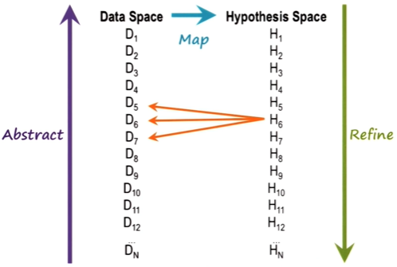

## Defining diagnosis

- **Diagnosis** as an *explanation task*: we want a set of hypotheses that would explain the input data
- To determine what faults are responsible for malfunctioning
- Discrepancy between *expected* behavior and *observed* behavior -> malfunctioning
- Diagnostic tasks may use rule-based reasoning, case-based reasoning, model-based reasoning, etc.

## Data space and hypothesis space

- Diagnosis ~ Mapping of a **data space** into a **hypothesis space**
- Such mapping can be a complicated task:
	- M-to-N mapping of data and hypothesis
	- Interactions between hypothesis
- To reduce data space, we can abstract data from raw data first (e.g. abstract "high fever" from the symptom "104 degree fever")
- We can also abstract hypotheses: e.g. "viral infection", instead of the specific type of infection such as "flu from X strain of virus"
- First **map** abstract data to abstract hypothesis, then **refine** abstract hypothesis into more specific hypothesis (e.g. the specific type of flu)
- Goal is to **find the most refined hypothesis that can explain all the input data**

## Diagnosis as classification

- **Heuristic classification**: diagnosis involves a *bottom-up* classification (abstract from raw data) and a *top-down* classification (establish a high-level, abstract hypothesis first and then refine it)

### Problems with diagnosis as classification

1. One data point, multiple hypotheses
   - Several hypotheses can explain the same input data
2. One hypothesis, multiple sets of data
	- The hypothesis is not specific to one set of data. We may need to collect additional data to get a precise mapping of data to hypothesis (In other words, diagnosis is also a mapping from hypothesis to data, which generates the expectation of additional data that we need to collect)
3. Multiple hypotheses, multiple sets of data
	- i.e. M-to-N mapping
4. Mutually exclusive hypotheses
5. Interacting data points
	- e.g. effects of data points cancel out each other, removing an expected symptom

## Diagnosis as abduction

- **Deduction**: Given the rule and the cause, deduce the effect.
- **Induction**: Given a cause and an effect, induce a rule.
- **Abduction**: Given a rule and an effect, abduce a cause.
- Diagnosis is an instance of abduction
- Deduction is **truth preserving** (if rule and cause are true, the effect is guaranteed to be true), while induction and abduction are not
	- **non-truth preserving** is what makes diagnosis difficult
- The three types of reasoning may be combined 

## Criteria for choosing a hypothesis

1. **Principle of coverage**: Hypotheses must cover as much of the data as possible.
2. **Principle of parsimony**: The smallest number of hypotheses ought to be used.
3. Some hypotheses may be more likely than others.
- An explanation task (e.g. diagnosis_ involves balancing between the above three criteria, choosing a hypothesis from a set of competing hypotheses.

## From diagnosis to actions

- Goal: map percepts (input data) to equivalent classes (disease categories) first, and then to actions (treatments)
	- index actions (treatments) over the equivalence classes instead of indexing the actions directly over the data space
- Depending on the results of treatments, we may need to collect additional data
- Mapping of hypothesis space to the treatment space is also a type of configuration (we configure a set of treatments that best address the faults we found)

## Cognitive connection

- Diagnosis is a common task that happens whenever our expectations are violated
