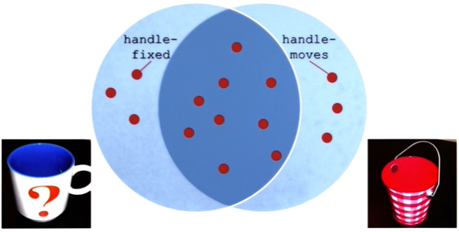
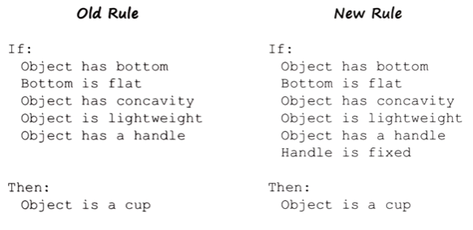
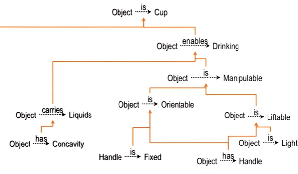

## Introduction

- Errors can occur in one's knowledge, reasoning or architecture
- AI agent lives in a dynamic world: even built with perfect knowledge, agent will start failing when the world starts changing. So it must has the ability to correct itself -> i.e. **meta-cognition** (self-diagnosing)
- Here we focus on errors in classification knowledge
- General steps:
	- Isolating mistakes
	- Explaining mistakes
	- Correcting mistakes
- Explanation is a key characteristic of KBAI
- Learning by correcting mistakes involves:
	- incrementatal concept learning
	- explanation-based learning
- Error/gap that lead to a failure: **credit assignment**

## Error detection

### Visualization
This section refers to the following figure:

The agent's goal here is to decide if an object it sees in the world is a cup. 
- The left image shows a positive experience, i.e. the agent sees a cup
- The right image shows a negative example where the agent sees it as a cup but get a feedback telling the agent that it is not a cup

### Error types
**False suspicious features** (e.g. "handle-moves"):
- Suspicious: they characterize only the negative experiences (note: we know it is negative but the agent doesn't)
- False: features that cause the agent to classify a negative experience as a positive example

Similarly, **true suspicious features** (e.g. "handle-fixed"):
- characterize only the positive experiences
- prevent the agent from classifying a positive experience as a positive example

How does the agent know what feature to focus on?
- One way is to use incremental concept learning (try one feature at a time, get feedback, and see if it will work)
- Alternatively, agent may receive many experiences. The features that do not appear in positive experiences are then tested to check if these features are false or true

### Error detection algorithm:
- To find suspicious false-success relations:
	- Intersect all false successes ($\cap F$)
	- Union all true successes ($\cup T$)
	- Remove all assertions in union from intersection ($\cap F - \cup T$)
- To find suspicious true-success relations:
	- Intersect all true successes ($\cap T$)
	- Union all false successes ($\cup F$)
	- Remove assertions in union from intersection ($\cap T - \cup F$)

## Explaining the mistake

- We can fix errors without explaining them, but explanation lead to deeper learning
- In the following example, the error is fixed by adding a new condition in the new rule: "Handle is fixed". How can the agent explain this?

- An agent can use explanation-based learning to explain how the new condition above can be included in the old rule to correct the mistake (figure below)

## Correcting the mistake

## Cognitive connection

- During learning, we actively use knowledge and reasoning to make sense of what we are learning
	- We generate expectations and check if they are violated
	- If they are violated, we try to figure out the mistakes in knowledge and reasoning, and generate explanation. (i.e. meta-reasoning)

 