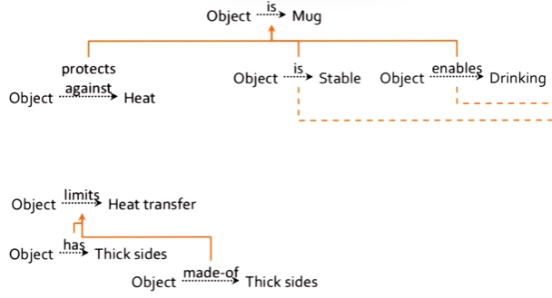
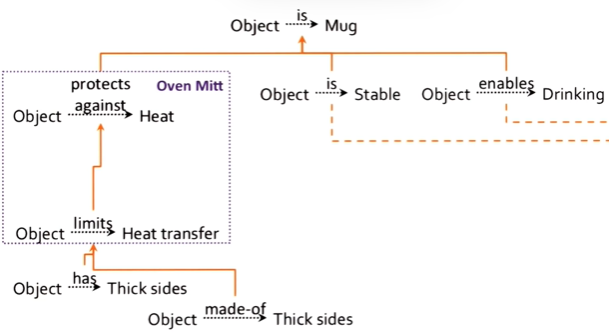
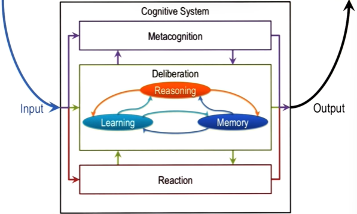
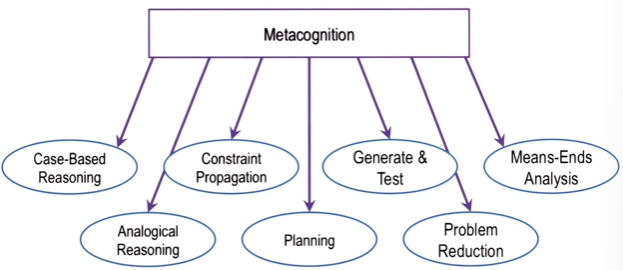
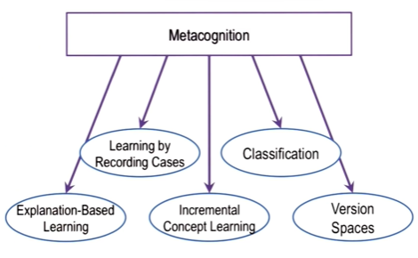
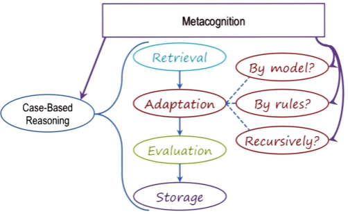
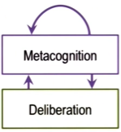

## Introduction

- Meta-reasoning over knowledge
	- e.g. In L23, the agent corrects its mistake by reflecting on its knowledge and finds errors in it
- Meta-reasoning over reasoning
	- e.g. In the block world problem, agent finds errors in its strategy to move blocks (e.g. it leads to a cul-de-sac)
- Meta-reasoning over learning
	- e.g. In L23, the agent adds a new condition ("Handle is fixed") and relates it to the existing relationships: the agent reflects on it's process of explanation-based learning (it finds that it has built a wrong explanation -> it then corrects the explanation)

## Knowledge gaps

### Knowledge gaps
- The agent cannot connect two pieces of knowledge/ explanations because there is a gap between them (see figure below)

- Once the agent detects the gap, it can set up a learning goal: acquire new info that will connect the two pieces of knowledge
	- such new knowledge may come from memory or external world

### Reasoning gaps
- e.g. The agent reaches a cul-de-sac in reasoning, it could form a reasoning goal and ask itself: how can I resolve the cul-de-sac?
	- The agent then sets up a new reasoning goal
	- It picks a different reasoning strategy to achieve the new goal

## The blurred line between cognition and metacognition

- In the following figure, the Metacognition space and the Deliberation space actually overlap
- We should focus on content instead of being overly concerned about whether something should go into which space

## Strategy selection

- Metacognition helps with selecting strategies for a specific input problem:
	- Different strategies require different knowledge of the world
		- select strategies based on what knowledge is available for a specific input problem
	- Select strategies based on computational efficiency
	- Select strategies based on the quality of solution (e.g. some methods guarantee best solution, e.g. logic)
	

- Metacognition also helps with selecting learning methods based on:
	- the nature of the problem
	- how examples arrive (one at time or all together)
	- computational efficiency
	

## Strategy integration

## Process of meta-reasoning

- Metacognition may use the same techniques as the reasoning strategies at the deliberative level (i.e. case-based reasoning, generate and test, planning, etc.)
- Metacognition can be recursive:
		- Therefore, we don't need multiple levels of metacognitions ("meta-meta-cognition", "meta-meta-meta-cognition"... etc. are not needed)
	

## Goal-based autonomy

- In addition to correcting mistakes, metacognition also helps with goal-based autonomy:
	- When an agent is given a new goal, the agent can use metacognition to adapt their reasoning and learning methods to achieve the new goal
- Metacognition provides a way to achieve robustness and flexibility

## Cognitive connection

- Learning how to learn
- Connection to creativity
