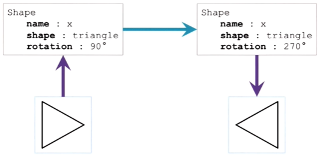
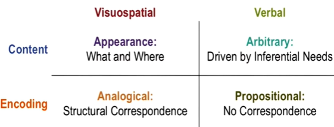
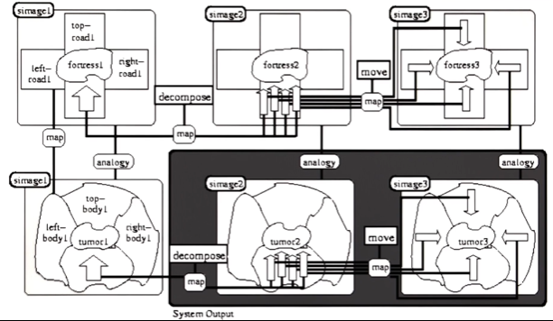

## Visuospatial reasoning

- **visual** - deals with the "what" part
- **spatial** - deals with the "where" part
- Example: Line labeling in 2D images in L20 Constraint Propagation
- **Visuospatial knowledge**: knowledge wherein causality is, at most, implicit (e.g. we can infer the causality depicted in a picture)

### Two views of reasoning

#### Propositional representation
- An AI agent extracts **propositional representations** from images. (Figure below)
- The agent can produce a new propositional representation from the a propositional representation using e.g. production rule (e.g. rotate the triangle by 180 degrees)

#### Analogical representation
- An agent may also extract the **analogical representations** instead (figure below)
- In analogical representation, there is a *structural correspondence* between the representation and the figure in the external world (e.g. the triangle it sees)
- The agent can produce a new representation through a transformation of an analogical representation (e.g. rotation)

- Propositional representations are separated from the perceptual modality, while analogical representations are very close to the perceptual modality
- In humans, mental imagery appears to use analogical representations
- Computers use propositional representations, we don't how to do analogical representations in computers

### Symbol grounding problem

- Verbal knowledge: e.g. a script about a restaurant visit
- Verbal knowledge can be encoded by analogical or propositional representations
	- Analogical: e.g. a movie representing the verbal knowledge

### An example of visuospatial reasoning

- Galatia: an AI system that can do visuospatial reasoning
- Duncker radiation problem:
	- Most AI models solve the problem using propositional representation (see L18 Analogical Reasoning)
	- Galatia can solve the problem using visuospatial reasoning (figure below)
		- The system map corresponding parts in two images

## Systems thinking

### Introduction
- A system contains heterogeneous interacting components
- **Systems thinking**: Reasoning about systems with numerous components and processes at multiple, *potentially invisible*, levels of abstraction
	- e.g. ecosystem: physical, biological, chemical processes
- AI agents must be able to reason about the external world -- must be capable of systems thinking
- systems thinking helps us to understand some invisible levels of abstraction (e.g. interaction between components; function of a component)

### Connections to systems thinking
- e.g. using frames to understand stories (one can identify the components, processes and relationships in a story)
- e.g. using scripts to represent a dining experience at a restaurant (components can be roles, props, scenes, etc.)
- e.g. diagnosis of a fault in a system (contain multiple components; interactions between components)

### Structure-Behavior-Function Models
- models that capture visible (structural) and invisible (behavioral/functional) levels of abstraction 
- See flashlight example in lecture

## Design thinking

- **Design Thinking**: Reasoning about ill-defined, unconstrained, open problems that are situated in the world.
	- e.g. design a sustainable house (Open problem: What does it mean to be sustainable?)
- Dealing with *problem-solution co-evolution*
- Also see L21 Configuration
- Agents can learn from design patterns and transfer patterns to new design
## Creativity

Something is creative if it is ...
- Novel
- Valuable
- Unexpected (e.g. not something we expect to see with the current processes even it's novel)
- Creativity is difficult to define (see lecture exercises)

Some other processes of creativity:
- Emergence
- Re-representation
- Serendipity

