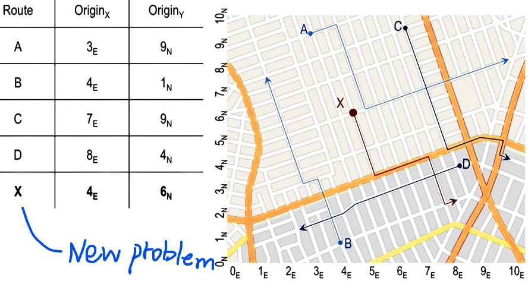
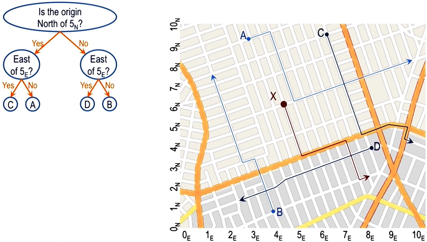

- A case contains a problem and a solution
- When new problem is not identical to any of the old problems, then we have to do some reasoning:  
	Once you've extracted an old case from memory, how to you reason it and adapt it to fit the new problem?

### General steps

1. **Retrieval** (Retrieving a case from memory similar to the current problem)
2. **Adaptation** (Adapting the solution to that case to fit the current problem)
3. **Evaluation** (Evaluating how well the adapted solution addresses the current problem)
4. **Storage** (Storing the new problem and solution as a case)

Steps 2 and 3 are where reasoning takes place; Step 4 is akin to learning.

### Assumptions of Case-Based Reasoning

1. **Patterns** exist in the world
2. **Similar** problems have similar solutions

## Case Adaptation

Adaptation help to lower computational cost: retrieve an old case from memory, so you only need to tweak a bit (adaptation) to fit it to the current problem.

### Case Adaptation by Model of the World

Using **models** to adapt a case.

e.g. How to go from my office to restaurant?  
- Old case: my office to doctor's office (very close to restaurant)
- Adaptation: 
	- use the map (a "model of the world") to search how to go from doctor's office to restaurant (i.e. what adaptation is needed to tweak the old case). 
	- Adapt the old case with the route info for going from doctor's office to restaurant

### Case Adaptation by Recursive Reasoning

**Recursive reasoning**: Get partial solutions from multiple cases, then combine them to get the complete solution.

> e.g. How to go from home to restaurant?  
> - Old cases: home to office
> - office to restaurant
> 
> Combine solutions to the two old cases to get the solution.

A type of recursive reasoning: **compound analogy** (see reference below)
1. decompose problems into sub-goals
2. retrieve a case that can provide a partial solution
3. set up a new sub-goal: to complete the solution
4. new sub-goal finds another case that give the rest of the solution
5. combine the two parts of the solution to get the complete solution

Reference:
[Vattam, S. S., Helms, M. E., & Goel, A. K. (2008). Compound analogical design: interaction between problem decomposition and analogical transfer in biologically inspired design. In _Design Computing and Cognition'08_ (pp. 377-396). Springer Netherlands.](https://gatech.instructure.com/courses/193244/files/22632609/download?verifier=aDf0Kv421SHEOL42vc6idRD4iz7F6ZetcZ04yDCR)

### Case Adaptation by Rules

Use **heuristics** (rules of thumb; often work but not always tho) 

e.g. How to go from restaurant to home?  
- Old case: home to restaurant
- Heuristic: to revert a route, flip the direction of each step
- Adaption: reverse the old case using the heuristic

## Case Evaluation

Evaluate the candidate solution(s).

- **Execute** the candidate solution to check if it works  
	- Accept the candidate solution if it works
	- If it fails, go back to the case retrieval and/or adaptation steps
- If the cost of executing the candidate solution is high, we **simulate** it before we decide to execute it (e.g. create **prototypes**)

## Case Storage

### Case storage by index

- Index each case with "tags" that describe the case
- Proper indexical structure makes case retrieval effective and efficient

Example:

### Case storage by discrimination tree

- If there are many cases stored in the memory, it may be computationally costly to search for the right cases. 
- To find cases efficiently, we can use discrimination tree

**Discrimination tree**:
- a knowledge structure in which cases are the "leaf nodes" of the tree
- All nodes are questions; they pertain the indexical structures of the cases
- Each answer leads to another node (or the solution)
- Example:

*Note that answers don't need to be binary (yes or no)!*

#### Incremental learning
- a new knowledge structure is learned each time when there is a new case
- e.g. Each time we add a new case into memory, the organization of the case and memory changes (i.e. the tree changes as well)  
- Example: adding X as a new case by **adding a new question** (i.e. a new intermediate node):

## Advanced Case-Based Reasoning

- The reasoning process is not necessarily linear:
	- e.g. if a candidate solution fails the evaluation, we may go back and change the adaption, or retrieve a different case
	- Failed cases could be informational too. Therefore, after an evaluation failed, one may also store the failed case, which may help us to identify problems that may occur in solving the new problem
	- It may not be necessary to store all the successful cases, as it could make the memory large and the retrieval step less efficient ("utility problem")
		- Better to just store those successful cases that cover a larger span of problems

## Cognitive Connection

- Analogical reasoning in humans