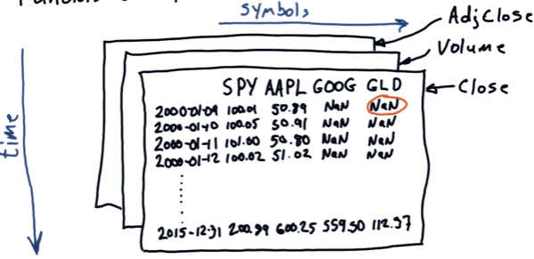

# Lesson 1.01 - 1.03

- [Lesson 1.01 - 1.03](#lesson-101---103)
- [1.01 Reading and plotting stock data](#101-reading-and-plotting-stock-data)
  - [Pandas](#pandas)
    - [Slicing](#slicing)
    - [Plotting](#plotting)
- [1.02 Working with multiple stocks](#102-working-with-multiple-stocks)
  - [Useful Pandas commands](#useful-pandas-commands)
- [1.03 Numpy](#103-numpy)


# 1.01 Reading and plotting stock data

- We will demonstrate how to read stock data from a CSV file
- Example: you have the following data in a CSV file called `AAPL.csv`:

```csv
Date,Open,High,Low,Close,Volume,Adj Close
2024-01-04,33.77,34.80,33.51,34.70,3800000,34.70
...
```
- `Date`: the date of the stock price
- `Open`: the opening price of the stock
- `High`: the highest price of the stock
- `Low`: the lowest price of the stock
- `Close`: the closing price of the stock
- `Volume`: the trading volume of the stock
- `Adj Close`: the adjusted closing price of the stock

## Pandas

To read a csv file into a Pandas DataFrame:

```python
import pandas as pd
df = pd.read_csv('data/AAPL.csv')
print(df.head()) # print first 5 rows
```

### Slicing

To select rows:

```
df[10:21] # select rows 10 to 20
```

To select columns:

```
df['Close'] # select the 'Close' column
```

### Plotting

Pandas has built-in plotting capabilities:

```
df['Close'].plot()
```

To print two columns on the same plot:

```python
df[['Close', 'Adj Close']].plot() # the input is a list of column names
```

# 1.02 Working with multiple stocks

We will turn the data into this format:


1. Create a new dataframe (`df1`) with dates in the first column
  - Note that not all dates are trading days
  - e.g. **number of trading days/year** for NYSE is **252 days** (usually)
  - To get the dates for the trading days, we can use the data for **SPDR S&P 500 ETF Trust (SPY)** as a reference
  - S&P 500: a stock market index based on 500 large American companies listed on the NYSE or NASDAQ
    - mean stock price of the companies, weighted by the number of shares (adjusted for events that may affect apparent stock value, e.g. splits)
    - ETF (exchange-traded fund) tracks the S&P 500 index; listed on NYSE under the **ticker symbol** `SPY`
2. Join `df1` with the SPY data (`dfSPY`) on the date column
  - only rows with the same date will be joined
  - if a date is missing in one of the dataframes (i.e. not a trading day), the row will be removed ("inner join")
3. Populate `df1` by joining it with the data of other stocks

After completing the above steps, we will get a dataframe with dates in the first column and each stock's price in each subsequent column.

```python
import pandas as pd

# create a DatetimeIndex object
start_date = '2024-01-04'
end_date = '2024-12-31'
dates = pd.date_range(start_date, end_date) 

# create a DataFrame with dates as the index
df1 = pd.DataFrame(index=dates)

# read SPY data
# Remember to specify the index column (Date) and parse dates. We will need this to join with df1
dfSPY = pd.read_csv('data/SPY.csv', 
                    index_col='Date', parse_dates=True,
                    usecols=['Date', 'Adj Close'], # only read these columns
                    na_values=['nan']) # specify the NA values

# join df1 with dfSPY (left join: keep all rows in the left dataframe, i.e. df1)
df1 = df1.join(dfSPY)

# drop rows with NaN values
df1 = df1.dropna()

# Alternatively, we can also use inner join to replace the above two steps (left join and dropna)
# df1 = df1.join(dfSPY, how='inner')
```

## Useful Pandas commands

Create a DatetimeIndex (a list of dates):
- Syntax: `pd.date_range(start_date, end_date)`, where `start_date` and `end_date` are strings in the format 'YYYY-MM-DD'

Create a DataFrame with a custom index:
- Syntax: `pd.DataFrame(index=some_index)`, where `some_index` is a list of index values

Read a CSV file into a DataFrame:
- Syntax: `pd.read_csv('filename.csv', index_col='column_name', parse_dates=True, usecols=['column1', 'column2', ...], na_values=['nan'])`
  - `index_col`: specify the column to use as the index
  - `parse_dates`: parse the dates
  - `usecols`: read only the specified columns
  - `na_values`: specify the values to treat as missing values

Drop rows with NaN values:
- Syntax: `df.dropna()`

Join two DataFrames:
- Syntax: `df1.join(df2)`
- By default, it performs a left join (keep all rows in the left dataframe)
- To perform an inner join (keep only rows with matching keys), use `how='inner'`

Dataframe slicing:
- Syntax: `df[start_index:end_index, [column1, column2, ...]]`
- Example - row slicing: `df['2014-01-01':'2014-01-31']`
- Example - select rows from 2014-01-01 to 2014-01-31, include only `GOOG` and `GLD` columns: `df['2014-01-01':'2014-01-31', ['GOOG', 'GLD']]`

Copy a dataframe:
- Syntax: `df_new = df.copy()`
- This is useful when you want to create a new dataframe with the same labels and dimensions as the original dataframe

Plotting a dataframe quickly:
- Syntax: `df.plot()`
- To set title and labels:
    ```python
    import matplotlib.pyplot as plt
    df.plot(title='Title', xlabel='Date', ylabel='Price')
    plt.show()
    ```
Normalize the data:
- To compare the stock prices of different companies, we can normalize the data by dividing each price by the first price in the series: `df / df.iloc[0]`

# 1.03 Numpy

- `ndarray`: N-dimensional array object in Numpy
- Pandas is built on top of Numpy
  - a Pandas dataframe is essentially an `ndarray` with labels
  - You can pull out the underlying `ndarray` using the `.values` attribute (e.g. `df.values`)

Create a Numpy array:
- 1D array: `np.array([1, 2, 3])`
- 2D array: `np.array([[1, 2], [3, 4]])`
- Specify data type: `np.array([1, 2, 3], dtype=np.float64)
- Zeros array: `np.zeros((3, 3))` (3x3 array of zeros)
- Ones array: `np.ones((2, 2))` (2x2 array of ones)
- Identity matrix: `np.eye(3)` (3x3 identity matrix)
- Array of random integers: 
  - `np.random.randint(0, 10)` (random integer in the range [0, 10))
  - `np.random.randint(0, 10, (2, 2))` (2x2 array of random integers in the range [0, 10))
  - `np.random.randint(0, 10, size=(2, 2))` (same as above)
  - `np.random.randint(0, 10, 5)` (5 random integers as a 1D array)
- Array of random numbers: `np.random.rand(2, 2)` (similar syntax to `randint`)
- Array of random numbers from a normal distribution: `np.random.randn(2, 2)` (similar syntax to `randint`)
- Note that you can also create arrays from lists, tuples, etc.

Indexing:
- Note that Numpy arrays are 0-indexed
- One element: `array[row, column]`
- One row: `array[row, :]`
- One column: `array[:, column]`
- Slicing: `array[start_row:end_row, start_column:end_column]` (If you omit the start or end index, it will start slicing from the beginning or end)
- Last row: `array[-1, :]`
- Second-to-last row: `array[-2, :]`
- Slicing with steps:
  - Syntax: `array[start:end:step, start:end:step]`
  - `array[:, 0:10:3]` (every 3rd element from columns 0 to 9)
  - `array[::2, ::2]` (every other row and column)
- To select elements based on a list of indices:
  ```python
    indices = [0, 2, 4]
    array[indices, :]
    ```
- To select elements based on a condition: `array[array > 5]`

Assign/ replace values:
- Note that any changes made to the slice will affect the original array
- `array[row, column] = new_value`
- Assign a scalar to a slice: `array[1:3, :] = 5`
- Assign an array to a slice: `array[1:3, :] = np.array([[1, 2], [3, 4]])`

Array attributes:
- Shape: `array.shape` (returns a tuple with the dimensions of the array: (rows, columns))
- Size: `array.size` (total number of elements)
- Number of dimensions: `array.ndim`
- Data type: `array.dtype`

Math operations:
- Element-wise operations: `array1 + array2`, `array1 - array2`, `array1 * array2`, `array1 / array2`
- Matrix multiplication: `np.dot(array1, array2)`
- Sum:
  - Sum of all elements: `array.sum()`
  - Sum of each column: `array.sum(axis=0)` (Iterate over *rows*, i.e. the first dimension (index 0))
  - Sum of each row: `array.sum(axis=1)` (Iterate over *columns*, i.e. the second dimension (index 1))
- Min, max, mean, std: `array.min()`, `array.max()`, `array.mean()`, `array.std()` (similar to sum, you can specify the axis) 