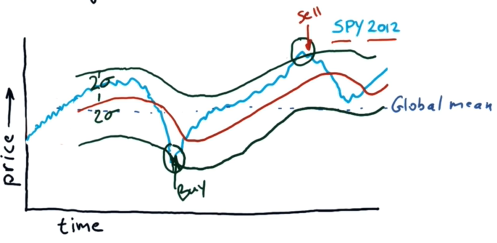
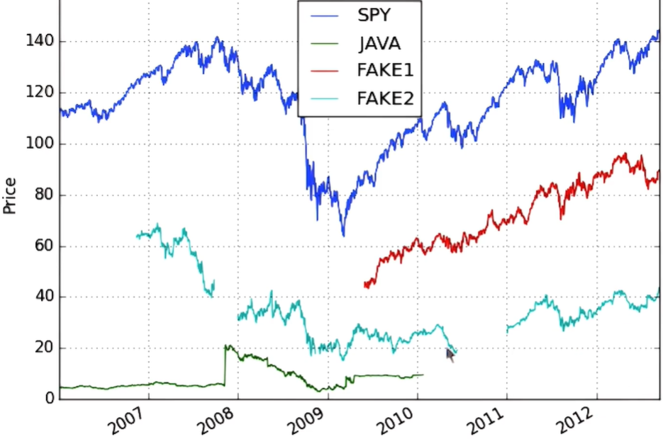
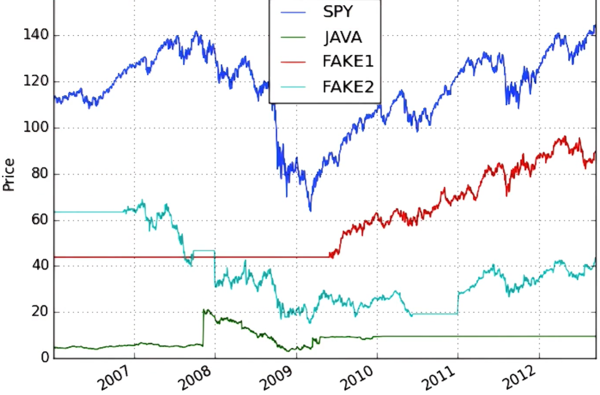
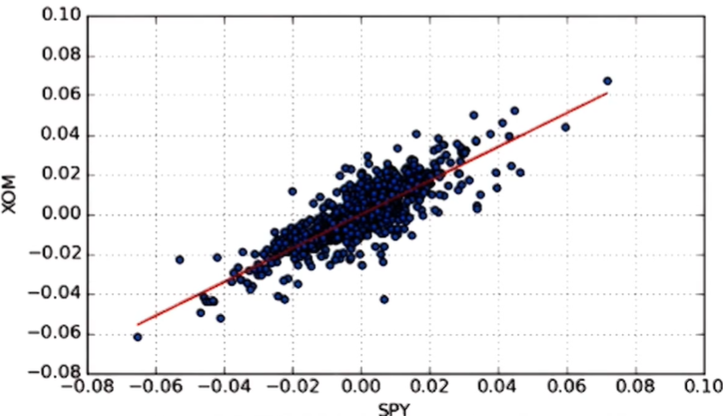
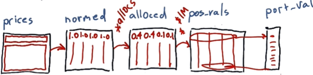

# Lesson 1.04 - 1.07

- [Lesson 1.04 - 1.07](#lesson-104---107)
- [1.04 Statistical analysis](#104-statistical-analysis)
  - [Basics](#basics)
  - [Bollinger Bands](#bollinger-bands)
  - [Daily returns](#daily-returns)
  - [Cumulative returns](#cumulative-returns)
- [1.05 Incomplete data](#105-incomplete-data)
- [1.06 Histograms and scatter plots](#106-histograms-and-scatter-plots)
  - [Histogram](#histogram)
  - [Scatter plot](#scatter-plot)
- [1.07 Sharpe ratio and other portfolio statistics](#107-sharpe-ratio-and-other-portfolio-statistics)
  - [Daily portfolio value](#daily-portfolio-value)
  - [Sharpe ratio](#sharpe-ratio)
    - [Risk-free rate of return ($R\_f$)](#risk-free-rate-of-return-r_f)
    - [Sharpe ratio calculation](#sharpe-ratio-calculation)
    - [Annualized Sharpe ratio](#annualized-sharpe-ratio)

# 1.04 Statistical analysis

## Basics

- Global statistics: mean, median, standard deviation, etc.
  ```python
    df.mean()
  ```
- Rolling statistics:
  - rolling mean: average of the last `n` days (i.e. a moving window of size `n`)
  ```python
    df['SPY'].rolling(window=20).mean()
  ```
- Rolling standard deviation: standard deviation of the last `n` days
  ```python
    df['SPY'].rolling(window=20).std()
  ``` 

## Bollinger Bands

- Standard deviation tells us how much the stock price deviates from the mean
- If the stock price deviates too much, this may signal a buying or selling opportunity
- Bollinger Bands help us visualize this:
  - Upper band: rolling mean + 2 * rolling standard deviation
  - Lower band: rolling mean - 2 * rolling standard deviation
  - Hypotheticallly, if the stock price is below the lower band, it may be a good time to buy; if it is above the upper band, it may be a good time to sell
  
    

## Daily returns

- **Daily return**: percentage change in the stock price from one day to the next:  

  $\frac{P_t}{P_{t-1}} - 1$, where $P_t$ and $P_{t-1}$ are the stock prices at time $t$ and $t-1$. Substract 1 from the result to get the percentage return.

- In Pandas, daily returns for a column can be calculated as follows:
    ```python
    daily_returns = df['SPY'].pct_change()
    ```
    Alternatively:
    ```python
    daily_returns = (df['SPY'] / df['SPY'].shift(1)) - 1
    ```
    You can do it manually without using the `shift` method. For example, to calculate daily returns for the entire dataframe:
    ```python
    # Create a dataframe with the same labels and dimensions using the copy method
    daily_returns = df.copy()

    # Calculate daily returns
    daily_returns[1:] = (df[1:] / df[:-1].values) - 1
    daily_returns.iloc[0] = 0 # set the first row to 0
    ```
    - Note that you should skip the first row (`df[0]`) because there is no return for the first day.
    - Also, you can't just do `df[1:] / df[:-1] - 1` because Pandas will try to align the two slices based on the index. To avoid this, use the `values` attribute to get the underlying Numpy array for the second slice: `df[:-1].values`.

## Cumulative returns

- **Cumulative return**: the return of an investment over a certain period of time:
  
  $\frac{P_t}{P_0} - 1$, where $P_t$ is the stock price at time $t$ and $P_0$ is the stock price at the beginning of the period. Substract 1 to get the percentage return.

# 1.05 Incomplete data

- Not all stocks are traded on the same days. This can lead to gaps in the data:

    

- If there are gaps in the data, we can't analyze the data directly (e.g. we can't calculate the rolling mean)
- We should not interpolate the data because it would introduce artificial data
- Instead, we can fill the gaps with the last available value or the next available value:
  - To handle missing data in the middle of a time period, we can use forward fill to fill the gaps with the last available value: `df.fillna(method='ffill')`
  - To handle missing data at the beginning of a time period, we can use backward fill to fill the gaps with the next available value: `df.fillna(method='bfill')`
  - We should apply forward fill first, then backward fill
  
    Example: 
    
    In the figure below, the missing data for symbol `FAKE1` is filled using backward fill, and the missing data for symbol `FAKE2` is filled using both forward fill and backward fill

    

# 1.06 Histograms and scatter plots

- Histogram: shows the distribution of statistics (e.g. daily returns)
- Scatter plot: shows the correlation between two quantities (e.g. daily returns of two stocks)

## Histogram

- We can use histograms to compare the distribution of daily returns for different stocks. Stocks with a wider distribution of returns are considered riskier (higher volatility)
- A distribution can be characterized by, e.g. mean, standard deviation, and kurtosis
- In Python, we can plot histograms using the `hist` method:

    ```python
    daily_returns['SPY'].hist(bins=20, label='SPY')
    daily_returns['XOM'].hist(bins=20, label='XOM')
    ```
- **Kurtosis**: 
  - a measure of how much the distribution deviates from a normal distribution
  - positive values indicate a "fat-tailed" distribution, i.e. more extreme values
  - Can be computed using the `dataframe.kurtosis()` method


## Scatter plot

- To check the correlation of daily returns between two stocks, we can look at their daily return plots over time. However, it is difficult to quantify the correlation.
- Instead, we can look at the scatter plot of daily returns for two stocks
- The figure below shows the scatter plot of daily returns for `XOM` and `SPY`:

    

- We usually fit a linear model to the scatter plot to quantify the relationship between the two stocks (red line in the figure):

    $y = \beta x + \alpha$

- The slope $\beta$ indicates how much the return of one stock changes with the return of the other stock (e.g. if $\beta = 1$, `XOM` performs the same as the market represented by `SPY`)
- **Note that the slope is not the correlation coefficient! (e.g. Two stocks can have a high correlation but a low slope)**
- The intercept $\alpha$ indicates the relative performance of the two stocks (e.g. if $\alpha > 0$, `XOM` outperforms `SPY`)
- In Python, we can fit a linear model using Numpy:

    ```python
    beta_XOM, alpha_XOM = np.polyfit(daily_returns['SPY'], daily_returns['XOM'], 1) # 1 indicates a degree 1 polynomial (i.e. linear)

    # Plot the linear model
    plt.plot(daily_returns['SPY'], beta_XOM * daily_returns['SPY'] + alpha_XOM, '-', color='r')
    ```

# 1.07 Sharpe ratio and other portfolio statistics

- **Portfolio**: a collection of financial assets (e.g. stocks, bonds)
- Portfolio statistics evaluate the performance of a portfolio (instead of individual stocks as in the previous sections)
  - **Daily portfolio value** (the total value of the portfolio on a given day during a period)
  - **Cumulative return**
  - **Average daily return**
  - **Standard deviation of daily return** (i.e. risk)
  - **Sharpe ratio**

## Daily portfolio value

- To calculate this, we need:
  - Starting value of the portfolio (e.g. $1,000,000)
  - Starting date
  - Ending date
  - Allocation of the portfolio (e.g. 40% `SPY`, 40% `XOM`, 10% `GOOG`, 10% `GLD`)
  - In Python:
    ```python
    start_val = 1000000
    start_date = '2024-01-04'
    end_date = '2024-12-31'
    symbols = ['SPY', 'XOM', 'GOOG', 'GLD']
    allocs = [0.4, 0.4, 0.1, 0.1]

    # Read the data
    prices = get_data(symbols, pd.date_range(start_date, end_date))
    
    # Normalize the data
    normed = prices / prices.iloc[0]

    # Apply the allocation
    alloced = normed * allocs

    # Calculate daily values for each stock
    pos_vals = alloced * start_val

    # Calculate the daily portfolio values
    port_val = pos_vals.sum(axis=1)

    # Remove the first row (no return for the first day)
    port_val = port_val[1:]

    ```

    

- We can calculate the cumulative return, average daily return, and standard deviation of daily return using the `port_val` array:
    - Cumulative return: `port_val[-1] / port_val[0] - 1`
    - Average daily return: `port_val.mean()`
    - Standard deviation of daily return: `port_val.std()`

## Sharpe ratio

- A portfolio with a high return may not be the best choice if it is very risky (high volatility)
- A good portfolio should have a high return and low volatility
- To measure if a portfolio is worth the risk, we can use the Sharpe ratio (a measure of *risk-adjusted* return)
- $\text{Sharpe ratio} = \frac{R_p - R_f}{\sigma_p}$

  where:
  - $R_p$: average portfolio daily return
  - $R_f$: **risk-free rate of return** (e.g. 0%)
  - $\sigma_p$: standard deviation of portfolio daily return

### Risk-free rate of return ($R_f$)

- The return on an investment with no risk of financial loss (e.g. saving in a bank)
- There are multiple sources for the risk-free rate of return:
  - LIBOR (London Interbank Offered Rate)
  - 3-month T-bill (U.S. Treasury bill)
  - 0% (for simplicity)
- The rate changes a little bit every day, so we can use the average rate over a period of time. For example, if the annual risk-free rate is 1%, the daily risk-free rate is $\sqrt[252]{1+0.01} - 1$

### Sharpe ratio calculation

The basic formula for the Sharpe ratio is:

$S = \frac{E[R_p - R_f]}{std(R_p - R_f)}$

where:

- $E[R_p - R_f]$: expected value (we can calculate this using the average daily return)
- $std(R_p- R_f)$: standard deviation. Since $R_f$ is a constant, it can be ignored in the calculation.

The formula can be simplified to: 
  
$S = \frac{mean(R_p - R_f)}{std(R_p)}$
  
(Same as what we have in the previous section)

### Annualized Sharpe ratio

- When we say Sharpe ratio, we usually mean the **annualized Sharpe ratio**
- Sharpe ratio can vary widely depending on how frequently the prices are sampled (e.g. daily, weekly or monthly return)
- To calculate the annualized Sharpe ratio, we need to adjust for the sampling frequency:

  $S_{\text{annualized}} = K \times S$

  where $K$ is the square root of the number of samples per year (e.g. 252 for daily samples, 52 for weekly samples, 12 for monthly samples)

  For example, if we sample daily, the annualized Sharpe ratio is:

    $S_{\text{annualized}} = \sqrt{252} \times S$