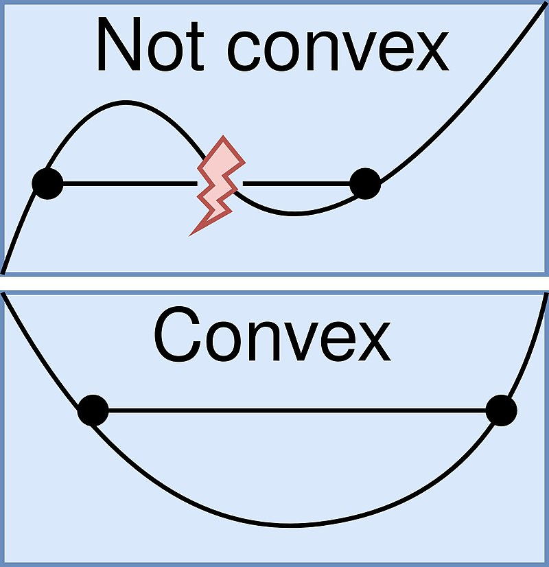

# Lesson 1.08 - 1.09
- [Lesson 1.08 - 1.09](#lesson-108---109)
- [1.08 Optimizers: Building a parameterized model](#108-optimizers-building-a-parameterized-model)
  - [Minimizer in Python](#minimizer-in-python)
    - [Building a parameterized model](#building-a-parameterized-model)
- [1.09 Optimizers: How to optimize a portfolio](#109-optimizers-how-to-optimize-a-portfolio)

# 1.08 Optimizers: Building a parameterized model

- **Optimizers**:
    - find the best parameters for a model by minimizing the loss function (minimizer)
    - build parameterized models based on data
    - refine allocations to stocks in portfolios
- **Convex function**: a function where the line segment between any two points on the graph lies above the graph
    
    
- A convex function has only one minimum
- Convex optimization problems are easier to solve

## Minimizer in Python

- To build an optimizer, you need to:
    - define a function to minimize (loss function)
    - provide an initial guess for the parameters
    - choose an minimizer algorithm/ method

Example:
```python
import numpy as np
import scipy.optimize as spo

# Define a function to minimize
def f(X):
    Y = (X - 1.5)**2 + 0.5
    print("X = {}, Y = {}".format(X, Y))
    return Y

# Initial guess
Xguess = 2.0

# Call the minimizer
min_result = spo.minimize(f, Xguess, method='SLSQP', options={'disp': True})
```

### Building a parameterized model

- Example: Linear regression
- We want to fit a line to a set of data points
- Consider the following linear model:
    - $f(x) = c_0 x + c_1$
- This can be expressed as a problem of minimizing the errors between the model and the data points (i.e. minimizing the **loss function**)
- A common loss function is the sum of squared errors:
    - $\displaystyle L(c_0, c_1) = \sum_{i=1}^{N} (y_i - f(x_i))^2$
  
  Example code:
    ```python
    # For linear models
    def error(line, data):
        err = np.sum((data[:, 1] - (line[0] * data[:, 0] + line[1]))**2)
        return err

    # For polynomial models
    def error_poly(C, data):
        err = np.sum((data[:, 1] - np.polyval(C, data[:, 0]))**2) # C is a list of coefficients
        return err
    ```

# 1.09 Optimizers: How to optimize a portfolio

- Portfolio optimization:
    - find the best allocation of funds given a period of time 
    - maximize return and minimize risk
- Performance metrics: e.g. cumulative return, volatility (risk), Sharpe ratio
    - It is the easiest to optimize a portfolio based on only cumulative return (because you don't need to consider multiple stocks at once)
- Portfolio optimization can be framed as a minimization problem:
    - $f(X) = -\text{Sharpe ratio}$
    - $f(X)$ is the objective function of the optimizer
    - This allows the optimizer to maximize the Sharpe ratio by minimizing $f(X)$
    - $X$ is the allocation of funds (e.g. $X = [0.2, 0.3, 0.5]$)
    - i.e. we want to find the best $X$ that minimizes $f(X)$
    - To find the best $X$ efficiently, we can limit the range of $X$ and add constraints:
        - Range of $X$: $0 \leq X_i \leq 1$ for all $i$
        - Constraints: $\sum_{i} X_i = 1$ (the sum of all allocations must be 1)