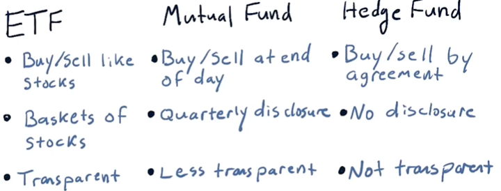
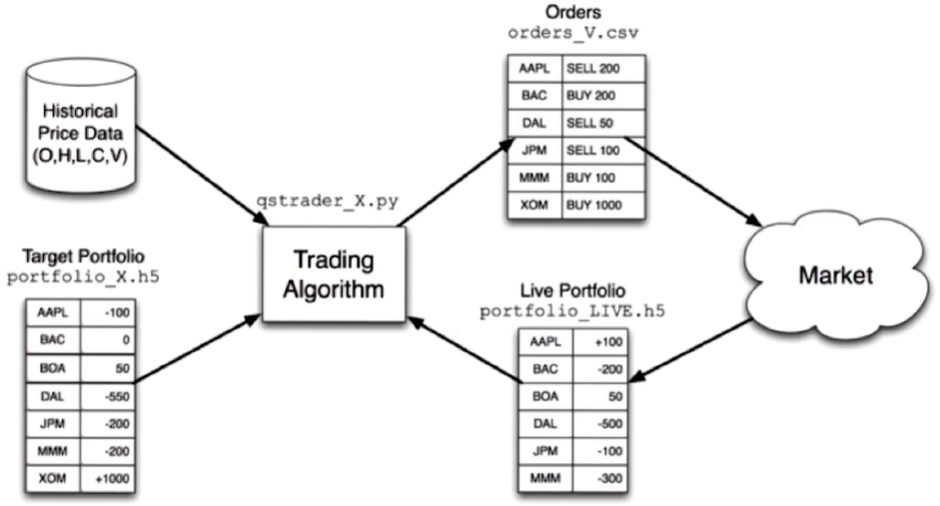
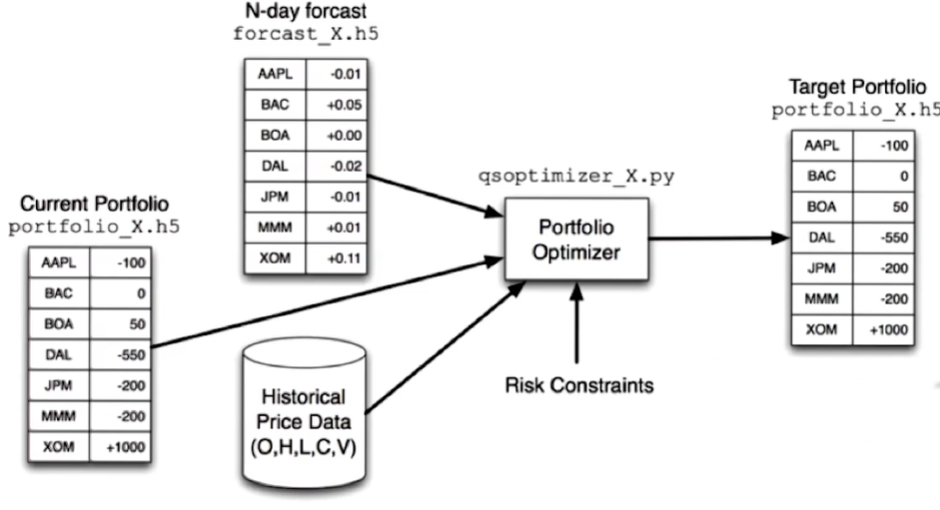
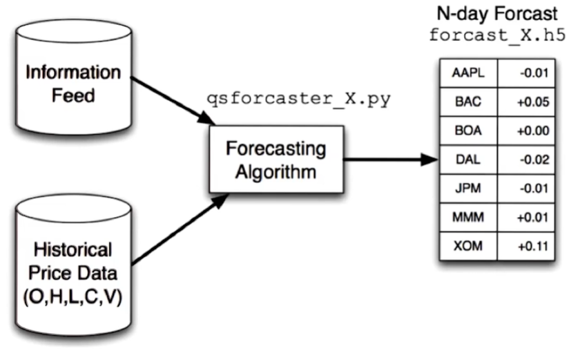

# Lesson 2.01 - 2.02

- [Lesson 2.01 - 2.02](#lesson-201---202)
- [2.01 So you want to be a hedge fund manager?](#201-so-you-want-to-be-a-hedge-fund-manager)
  - [ETFs, mutual funds, and hedge funds](#etfs-mutual-funds-and-hedge-funds)
  - [How are fund managers paid?](#how-are-fund-managers-paid)
  - [How funds attract investors?](#how-funds-attract-investors)
  - [Hedge fund goals and metrics](#hedge-fund-goals-and-metrics)
  - [The computing inside a hedge fund](#the-computing-inside-a-hedge-fund)
- [2.02 Market mechanics](#202-market-mechanics)
  - [What is in an order?](#what-is-in-an-order)
  - [The order book](#the-order-book)
  - [Up or down?](#up-or-down)
  - [How orders get to the exchange](#how-orders-get-to-the-exchange)
  - [How hedge funds exploit market mechanics](#how-hedge-funds-exploit-market-mechanics)
  - [Additional order types](#additional-order-types)
  - [Mechanics of short selling](#mechanics-of-short-selling)

# 2.01 So you want to be a hedge fund manager?

## ETFs, mutual funds, and hedge funds

- **Liquid**: the ease with which an asset can be converted into cash (stocks are extremely liquid, ETFs are liquid in the same way. ETFs with high volume are more liquid than those with low volume)
- **Large cap**: large market capitalization (market cap = price per share * number of shares outstanding) (company worth)
- ETF and mutual fund - clear goals, disclosure of holdings
- ETF names usually have four letters; Mutual funds have five letters: hedge funds don't have a symbol

## How are fund managers paid?

- **AUM**: **assets under management** (how much money is being managed by the fund)
- ETFs: **expense ratio** (e.g. 0.01% to 1.00% of AUM)
- Mutual funds: 0.5 to 3% expense ratio (higher than ETFs because it requires more skills to manage. e.g. For ETF such as SPY, the manager doesn't have to do much work because it's just tracking the S&P 500 - they just need to make sure they are holding all the stocks in the S&P 500)
- Hedge funds: "**Two and twenty**" (2% of AUM plus 20% of profits). Example:
    - Initial AUM: $100M
    - Return: 15% (Profit: $15M)
    - 2% of AUM: $2M
        - the AUM used in the calculation could be the initial AUM, the average AUM, or the ending AUM
   - 20% of profits: $3M (20% of $15M)
   - Total: $5M
   
    > Two and twenty is not common anymore because it's too expensive. Nowadays, it's more like one and ten

- Expense ratio motivates AUM accumulation (more AUM -> more fees)
- Two and twenty motivates risk taking and profit seeking (more risk -> more profit)

## How funds attract investors?

- Who? Individuals, institutions (e.g. pension funds, endowments, etc.), funds of funds (funds that invest in other funds, e.g. a group of individuals who pool their money together to invest in a hedge fund)
- Why? Track record, simulation + story, good portfolio fit with investor's goals

## Hedge fund goals and metrics

- Goals:
   - Beat a benchmark (e.g. S&P 500)
   - Absolute return (Long/short)
- Metrics:
   - See later lessons
  
## The computing inside a hedge fund

- **Target portfolio**: the portfolio that the fund manager wants to have
- **Live portfolio**: the portfolio that the fund manager actually has
- **Orders**: the trades that the fund manager wants to make to move from the live portfolio to the target portfolio

    

    

    

# 2.02 Market mechanics

## What is in an order?

1. **Buy/sell**
2. **Symbol**
3. **Quantity**: the number of shares to trade
4. **Price**: the price at which to trade
5. **Time**: when to trade
    - **Market order**: trade at the best price available
    - **Limit order**: trade at a specific price or better 

## The order book

- Each exchange keeps an order book for each stock
- Order book is public
- **Bid**: the highest price at which someone is willing to **buy**
- **Ask**: the lowest price at which someone is willing to **sell**
- Placing orders: Start with the *best bid and ask* (match the highest bid and the lowest ask)
    - Example:

## Up or down?

- The current status of the order book tells you if the stock is going up or down
- **Up**: more people are willing to buy than sell
- **Down**: more people are willing to sell than buy
- Orders affect the order book and the order book affects the price

## How orders get to the exchange

- You order -> Broker -> Exchange
- **Broker**: 
    - a person or firm that executes orders on behalf of others
    - connected to multiple exchanges
    - has a computer located at each exchange
- **Exchange**: 
    - a place where buyers and sellers meet to trade
    - e.g. NYSE, NASDAQ, etc.
    - Each has its own order book
- Brokers query all exchanges to find the best price
    - Given that many people are trading between exchanges, the price is usually the same across all exchanges
- Case 1: ...

- Case 2:
    - You want to buy some stock
    - Another person wants to sell the stock
    - Both orders are sent to the same broker
    - The broker matches the orders internally - no need to go to the exchange (save fees involved in going to the exchange)
    - According to law, the broker must give you the best price available (at least as good as the exchange)
    - At the end of the day, the trade still goes to the exchange (usually recorded in the exchange where the stock is listed)
- Case 3:
      - You want to buy some stock
      - Another person wants to sell the stock
      - Both orders are sent to different brokers
      - The orders go through an intermediary (a **dark pool**) to match the orders
    - Dark pools 
        - monitor the exchange closely and try to predict the price movement
        - They pay the brokers to see the orders before they go to the exchanges
- These days 80-90\% of retail traders orders never make it to the exchanges

## How hedge funds exploit market mechanics

- Market is not perfectly efficient, this allows hedge funds to make money
- **Order book exploit**:
    1. Hedge fund observes the order book
    2. Hedge fund buys stock
    3. You click "buy"
    4. Meanwhile price goes up
    5. Hedge fund sells you the stock at a higher price
- Hedge funds can observe the order book earlier than they have quicker access to the order book at the exchange
- **Geographic arbitrage**: 
    - Hedge funds place their servers closer to the exchange to get the information faster

## Additional order types

Exchanges:
- Buy, sell
- Market limit

Brokers:
- **Stop loss**: sell if the price goes below a certain level
- **Stop gain**: sell if the price goes above a certain level
- **Trailing stop**: like stop loss but the price moves with the stock price instead of being fixed (e.g. 10% below the highest price)
- **Selling short**: sell stock you don't own (borrow from the broker)

## Mechanics of short selling

**Entry**:
- You want to short sell a stock
- You borrow the stock from the broker
- You sell the stock to someone else (i.e. You "**sell short**")
- You get the cash from the sale
- You now owe the broker the stock

**Exit**:
- You buy the same stock when the price is lower
- You give the stock back to the broker
- You get the cash from the sale

**Risk**: 
- If the stock price goes up, you lose money
- If the stock price goes down, you make money