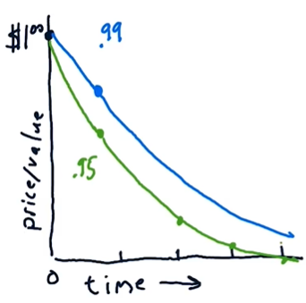
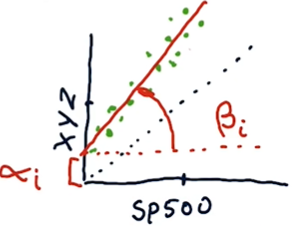

# Lesson 2.03 to 2.05
- [Lesson 2.03 to 2.05](#lesson-203-to-205)
- [2.03 What is a company worth?](#203-what-is-a-company-worth)
  - [Intrinsic value](#intrinsic-value)
    - [Intuition behind intrinsic value](#intuition-behind-intrinsic-value)
    - [Calculating present value](#calculating-present-value)
    - [Calculating dividends and intrinsic value](#calculating-dividends-and-intrinsic-value)
      - [Discount rate (DR)](#discount-rate-dr)
  - [Book value](#book-value)
  - [Market capitalization](#market-capitalization)
  - [Example: Would you buy this stock?](#example-would-you-buy-this-stock)
- [2.04 The Capital Assets Pricing Model (CAPM)](#204-the-capital-assets-pricing-model-capm)
  - [Portfolio](#portfolio)
    - [Market portfolio](#market-portfolio)
  - [The CAPM equation](#the-capm-equation)
  - [Implications of CAPM](#implications-of-capm)
    - [CAPM for portfolios](#capm-for-portfolios)
- [2.05 How hedge funds use the CAPM](#205-how-hedge-funds-use-the-capm)
  - [Market risk for hedge funds](#market-risk-for-hedge-funds)
  - [Removing market risk with the right allocations](#removing-market-risk-with-the-right-allocations)

# 2.03 What is a company worth?

Why company value matters:
- We want to buy low and sell high
- need to know if a company is overvalued or undervalued. For example: 
    - buy when the stock price is lower than the company's "true" value (see below), sell otherwise

Three ways to value a company:
    - **Intrinsic value**: the true value of a company (How much money will the company generate in the future?)
    - **Book value**: the value of a company's assets
    - **Market cap**: the value of a company's outstanding shares (What does the market think the company is worth?)

## Intrinsic value

### Intuition behind intrinsic value

- Intrinsic value is about the future - so how much does a dollar today worth in the future?
- Consider the following assets:
    - $1 in cash today
    - $1 US Government bond paid in a year
    - $1 stock in a company paid in a year
- Which one is worth the most today?
    - \$1 in cash is worth the most today (it's worth \$1)
    - \$1 US Government bond in a year is worth slightly less than \$1 today
    - \$1 stock in a company in a year is worth the least today (less than $1 US Government bond because it's less certain that you'll get the \$1 in a year)

### Calculating present value

- **Future value** (FV): the value of an asset in the future
- **Present value** (PV): the value of an asset today

    $PV = \frac{FV}{(1 + IR)^i}$

    where $IR$ is the **interest rate** and $i$ is the number of years in the future.

> e.g. For \$1 US Government bond in a year with an interest rate of 1\%: $PV = \frac{1}{(1 + 0.01)^1} = 0.99$
>
> 
> - Blue line: the present value of $1 Government bond
> - Green line: the present value of $1 stock in a company
> - The further in the future the asset will pay off, the less it's worth today

### Calculating dividends and intrinsic value

#### Discount rate (DR)

- The interest rate is associated with the risk of the asset:
    - Government bonds have lower interest rates than stocks because they don't have as much risk (worth more today), so a low interest rate can still attract investors
- **Discount rate (DR)**: the rate at which you discount the future value based on the risk (same as interest rate)
- **Dividends**: the money a company pays to its shareholders regularly (quarterly, annually, etc.)
- The sum of all future dividends, discounted to the present, is the intrinsic value of the company:

  $\text{Intrinsic value} = \displaystyle \sum_{i=1}^{\infty} \frac{FV}{n^i}$

  where $FV$ is the future value of the *annual dividend*, $n$ is $(1 + IR)$, $i$ is the number of years in the future (assuming you are paid *annually*)

  This is a geometric series, which converges to $\frac{FV}{1 - n}$

  $(1 - n)$ is just $IR$ (i.e. $DR$):
  
  $\displaystyle \text{Intrinsic value} = \frac{FV}{DR}$

## Book value

- **Book value**: Total assets minus intangible assets and liabilities
- **Intangible assets**: patents, brand name, etc. (things that are hard to put a value on)
- **Liabilities**: loans, etc.

*e.g. If a company has \$100 in assets (\$90 equipment, \$10 brand name) and \$50 in liabilities, the book value is \$100 - \$10 - \$50 = \$40*

## Market capitalization

market cap = stock price * number of shares

- Stock price is based on the market's perception (which is affected by information we have)
- Information may affect one specific company, a sector, or the entire market
- e.g. "CEO is ill" -> stock price of the company will drop
- e.g. "Demand for oil is increasing" -> stock price of oil companies will increase

## Example: Would you buy this stock?

Let's say a company has the following values:
- Book value: \$80M
- Intrinsic value: \$20M
- Market cap: \$75M

You should buy this stock because:
- The market cap is less than the book value, suggesting that the company is undervalued
- Even if you just buy the company and sell it off immediately, you'll make a profit (the difference between the book value and the market cap)
- The intrinsic value doesn't matter in this case because you're not planning to hold onto the stock for a long time

# 2.04 The Capital Assets Pricing Model (CAPM)

## Portfolio

- **Portfolio**: a weighted combination of assets
$$\text{Portfolio} = \sum_i w_i \cdot \text{Asset}_i$$

- Weights add up to 1: $\sum_i abs(w_i) = 1$ (except for leverage)

    **Note: The absolute value of the weights is used because weights can be negative! (short selling)**

- Return of a portfolio:
    
    $$r_p(t) = \sum_i w_i \cdot r_i(t)$$

    where $r_i(t)$ is the return of asset $i$ at time $t$

e.g. Assume that you have the following portfolio:
- Stock A:
    - Return: $+1\%$
    - Weight: $0.75$
- Stock B:
    - Return: $-2\%$
    - Weight: $-0.25$ (negative weight because you're short selling)

The return of the portfolio is:
$r_p = (0.75)(0.01) + (-0.25)(-0.02) = 1.25\%$

### Market portfolio

- **Market portfolio**: a portfolio that represents the entire market
    - e.g. an index like S&P 500 (500 largest companies traded on the NYSE)
    - Other markets have their own indices
- Market portfolio is **cap weighted** (weight of each stock is proportional to its market cap):
    $w_i = \frac{\text{Market cap}_i}{\sum_i \text{Market cap}_i}$ 

## The CAPM equation

$$r_i(t) = \beta_i \cdot r_m(t) + \alpha_i(t)$$
where:
- $r_i(t)$: return of the asset at time $t$
- $\beta_i$: **beta**, how much the asset moves with the market (the relative performance of the asset compared to the market)
- $r_m(t)$: **market return** at time $t$
- $\alpha_i(t)$: **alpha**, the **residual return** of the asset (the return that's not explained by the market)
- CAPM says that the expected residual return is 0 (i.e. $\alpha_i(t) = 0$)

- Example: alpha and beta of a stock ("XYZ") compared to the market (black dotted line)
    
- Note that alpha can be non-zero sometimes (as shown in the figure), but overall it should be 0 according to CAPM

## Implications of CAPM

Two ways to manage a portfolio:
- *Passive*: buy index and hold
- *Active*: pick stocks to outperform the market by adjusting the weights (overweight/underweight)

Both ways agree on the beta term of CAPM (i.e. performance of a stock is largely influenced by the market), but they disagree on the alpha term:
- CAPM says alpha is random and the expected value is 0
- active managers believe they can predict alpha

### CAPM for portfolios

$$r_p(t) = \sum_i w_i ( \beta_i \cdot r_m(t) + \alpha_i(t) )$$

We can simplify this equation by extracting the beta and alpha terms:

$\beta_p = \sum_i w_i \cdot \beta_i$

$\alpha_p = \sum_i w_i \cdot \alpha_i$

So the return of the portfolio is:

$$r_p(t) = \beta_p \cdot r_m(t) + \alpha_p(t)$$

- According to CAPM, alpha is 0 and it can be omitted
    - This means the only way to beat the market is to choose the right beta. For example:
      - For upward markets, you want a high beta (to benefit from the market more)
      - For downward markets, you want a low beta (to lose less than the market)
      - However, according to the Efficient Market Hypothesis, you can't predict the market. So you won't be able to choose the right beta.

> Arbitrage pricing theory (APT) breaks down the beta term into multiple factors (e.g. one beta for each sector)

# 2.05 How hedge funds use the CAPM

- In general, they are looking for stocks that go up more than the market or go down less than the market, leveraging the information they have about the stocks

Let's say a hedge fund has the following stocks:
- Stock A: beta = 1.0; predicted +1% over the market (alpha = + 1%)
- Stock B: beta = 2.0; predicted -1% below the market (alpha = - 1%)
- If they long Stock A and short Stock B (e.g. $\$50$ in Stock A and $-\$50$ in Stock B), what is the expected return of the portfolio if the market doesn't move?
- Remember that the return of a stock according to CAPM is:
    $r = \beta \cdot r_m + \alpha$
- Given the market doesn't move, we can ignore the beta term. Therefore:

    $r_A = 0.01$

    $r_B = -0.01$

    Total value of the portfolio: $abs(\$50) + abs(-\$50) = \$100$

    $w_A = 50 / 100 = 0.5$

    $w_B = -50 / 100 = -0.5$

    $r_p = w_A \cdot r_A + w_B \cdot r_B = (0.5)(0.01) + (-0.5)(-0.01) = 0.02$

## Market risk for hedge funds

- Even if the alpha and beta values are accurate, a positive return is not guaranteed. For example, if the market goes up by 10%,

    $r_A = (1)(0.10) + 0.01 = 0.11$

    $r_B = (2)(0.10) + (-0.01) = 0.19$

- The return of the portfolio is:

    $r_p = (0.5)(0.11) + (-0.5)(0.19) = -0.04$

- The total return is negative because the hedge fund is losing money on shorting Stock B - the market went up more than expected
- Market risk: you can't predict the market direction

## Removing market risk with the right allocations

- To remove/minimize market risk (i.e. remove the beta term), you need to find the right weights for the stocks
- The weights should be such that the beta term cancels out (i.e. $\beta_p = 0$):

    $$\beta_p = \sum_i w_i \cdot \beta_i = 0$$

- In the previous example, the beta of the portfolio is:
$\beta_p = w_A \cdot (0.01) + w_B \cdot (0.02) = w_A + 2w_B$
- To make $\beta_p = 0$, i.e., $w_A + 2w_B = 0$, we can set $w_A = -2w_B$. For example,

    $w_A = 0.667$
    $w_B = -0.333$

- Removing the beta term allows us to leverage the information we have about the stocks (i.e. the alpha term)
- To summarize, CAPM allows us to:
    - minimize market risk
    - find the right weights for the stocks