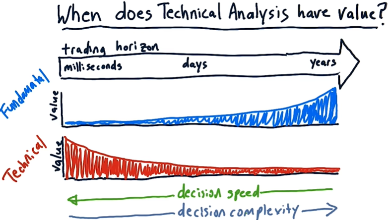
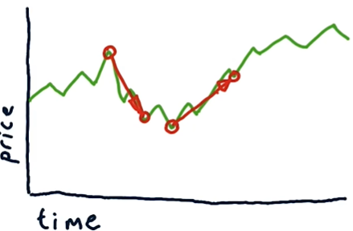
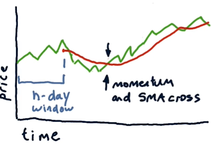
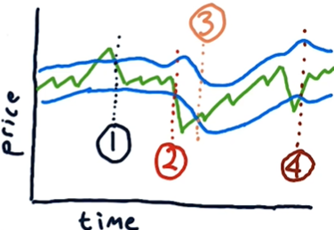
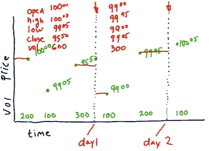
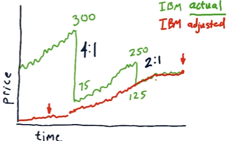
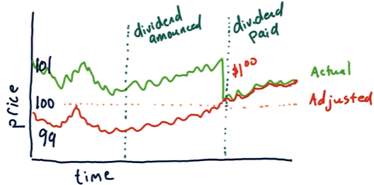
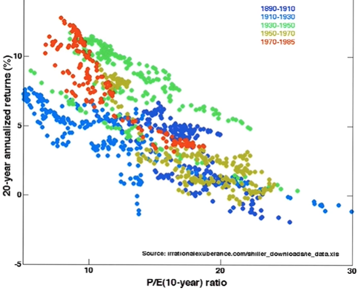

# Lesson 2.06 to 2.08

- [Lesson 2.06 to 2.08](#lesson-206-to-208)
- [2.06 Technical Analysis](#206-technical-analysis)
  - [Fundamental analysis vs. technical analysis](#fundamental-analysis-vs-technical-analysis)
  - [Indicators](#indicators)
- [2.07 Dealing with Data](#207-dealing-with-data)
  - [How data is aggregated](#how-data-is-aggregated)
  - [Dealing with price anomalies](#dealing-with-price-anomalies)
    - [Stock split](#stock-split)
    - [Adjusted close](#adjusted-close)
    - [Dividends](#dividends)
  - [Dealing with survivor bias](#dealing-with-survivor-bias)
- [2.08 Efficient Markets Hypothesis](#208-efficient-markets-hypothesis)
  - [Efficient Markets Hypothesis (EMH)](#efficient-markets-hypothesis-emh)
    - [Where does information come from?](#where-does-information-come-from)
    - [Three forms of EMH](#three-forms-of-emh)
    - [Is the EMH correct?](#is-the-emh-correct)

# 2.06 Technical Analysis

## Fundamental analysis vs. technical analysis

- **Fundamental analysis**: 
    - Looks at the company's value to predict future performance
    - Statistics (e.g. Price/Earnings ratio) based on many factors, e.g. earnings, dividends, book value, cash flow
- **Technical analysis**: 
    - Looks at the stock's historical performance to predict future performance
    - Statistics *based on price and volume only* (e.g. moving averages, \% change) 
    - Statistics are called **indicators** (heuristics that help making decisions)
    - Why it might work:
        - There is information in the price and volume
        - Heuristics work
- Technical analysis is effective when:
    - Individual indicators are weak, but when combined they are stronger
    - Looking for contrasts (stock vs market, stock vs stock, etc.)
    - the time period is short
- The figure below shows the usefulness ("value") of fundamental and technical analysis over time:
    - Fundamental analysis is more useful in the long term
    - Technical analysis is faster and more useful in the short term
    - Short-term analysis (e.g. milliseconds) is done by computers, while long-term analysis is done by humans
    

## Indicators

- **Momentum**: the rate of change
    - Usual range: $-0.5$ to $+0.5$
    
    $\text{Momentum at time t} = \frac{\text{Price}[t]}{\text{Price}[t - n]} - 1$
    where $n$ is the number of days in the past
- **Simple moving average (SMA)**: the average of the last $n$ days
    - Usual range: $-0.5$ to $+0.5$
    
    $\text{SMA at time t} = \frac{\text{Price}[t]}{\text{Price}[t-n \space : \space t].mean()} - 1$
    - lags behind the current price
    - proxy for the company's value: e.g. if the current price is below the SMA, the company is undervalued (a buy signal)
    - At the point where the momentum crosses the SMA, it's a buy/sell signal
- **Bollinger bands**: the SMA plus/minus two standard deviations
    - Usual range: $-1$ to $+1$
  
    $\text{BB}[t] = \frac{\text{Price}[t] - \text{SMA}[t]}{2 \cdot \text{Std}[t]}$
    
    - Tells us how large the deviation of the price is from the SMA: indicates buy/sell signals
        - Look for cross from outside to inside the bands
        - Sell when the price crosses the upper band, buy when it crosses the lower band
    - In the figure below, (1) is a sell signal, (3 )and (4) are buy signals, and (2) is a hold signal
            

Normalization:
- When using multiple indicators together, it's important to normalize them so they have the same scale

    $$\text{Normalized indicator} = \frac{\text{Values} - \text{Mean}}{\text{Std[Values]}}$$

# 2.07 Dealing with Data

## How data is aggregated

- "Tick": a single data point (the finest resolution of data)
- A tick represents a successful buy/sell match or a successful transaction
- Note that a tick is *not* recorded at a a regular time interval, but rather when a transaction occurs (you can have multiple ticks in a second or none at all)
- Tick data can be aggregated into chunks of time intervals (e.g. 1 minute, 5 minutes, 1 hour, etc.)
    - In this course, we will work with 1 day intervals (shorter intervals are more computationally expensive)
- Data can be aggregated into: Open, high, low, close, volume data:
    

    - In the figure above, dotted lines indicated the time intervals (in this case, 1 day intervals)
    - The red horizontal lines represent the open and close prices
    - Volume is provided in the bottom of the figure

## Dealing with price anomalies

### Stock split

- Stock price drops after a stock split
- **Stock split**: a company divides its existing shares into multiple shares 
- Example: 4-for-1 stock split: for every 1 share you own, you will receive 4 shares (your total investment remains the same)
- Why stock split? 
    - When the price rises so high that it becomes less affordable
        - Stocks are usually brought in blocks of 100 shares. If the price of a stock is too high, it may be difficult for some investors to buy the stock. A stock split makes the stock more affordable and more liquid, which helps attract more investors.
    - Lower price per share also allows for more flexibility in portfolio tuning

### Adjusted close

- Before we can work with the data, we need to adjust the stock prices for stock splits
- **Adjusted close**: the price of a stock after accounting for stock splits and dividends (see next section)
- In the figure below, the stock is split twice (4:1 and 2:1). 
    - We first adjust the stock price for the most recent split (2:1) (so the adjusted close price is halved before the split)
    - Then we adjust the stock price for the 4:1 split (so the adjusted close price is quartered before the split)

    

    - To adjust for stock splits:
    - Adjusted close = actual close price / split factor
    - Split factor = 1 / (stock split ratio)

> - Actual and adjusted close prices are the same on the current day
> - Adjusted close price in the past could be *different* from the current adjusted close price! (e.g. more splits could have occurred since then)

### Dividends

- **Dividends**: payments made to shareholders from the company's profits
- Dividends can be paid regularly (e.g. annually) or as a one-time payment
- When a dividend is paid, the stock price drops by the amount of the dividend
- Example: if a stock is worth \$100 and the company announces today that it will pay a \$1 divident per share on a certain date, the stock price rise to \$101 before the payment date and drops to \$100 after the payment
    - The shareholders will then have \$1 in cash and \$100 in stock per share (total value remains the same as right before the dividend payment)
- To adjust for dividends:
    - Adjusted close = actual close price - proportion of dividend per share (not absolute value of dividend)
    - In the figure below, the stock pays a \$1 dividend per share, which is worth 1\% of the *stock price after the payment*. Therefore, we lower the stock price before the payment by 1\%
    - Note that after the adjustment, you still earn \$1 during the period from the day the dividend is announced (when price rises due to the news) to the day the dividend is paid
    
    

## Dealing with survivor bias

- When we assess the performance of a strategy (e.g. by simulating trading using historical data), we may overestimate the performance if we only consider data from companies that still exist today (e.g. today's S&P 500 companies)
    - Today's S&P 500 companies are not the same as the S&P 500 companies in the past
    - Companies that are still in business today are likely to perform better than those that have gone out of business
- **Survivor bias**: the tendency to focus on the companies that have survived (and are still in business)
- To avoid survivor bias, use survivor bias-free data
    - Note: such data is not freely available, but the cost is not expensive

# 2.08 Efficient Markets Hypothesis

## Efficient Markets Hypothesis (EMH)

- **Efficient Markets Hypothesis (EMH)**: markets are efficient - based on these assumptions:
    - large number of rational investors
    - new information arrives randomly
    - prices adjust quickly to new information
    - prices reflect all available information

### Where does information come from?

- Public information:
    - Price/ volume data
    - Fundamental data (e.g. earnings, dividends)
    - Exogenous events (e.g. natural disasters)
- Insider information:
    - might be illegal to trade on insider information

### Three forms of EMH

1. **Weak form**: future prices cannot be predicted by analyzing historical prices
   - i.e. technical analysis does not work, but it leaves room for fundamental analysis
2. **Semi-strong form**: Prices adjust rapidly to new public information
   - i.e. even fundamental analysis won't work
3. **Strong form**: Prices reflect all information, public and private
   - i.e. even insider information does not work

### Is the EMH correct?

- The strong form is probably not true...
    - e.g. People have profited from insider information in the past
- The semi-strong form might be incorrect as well...
    - e.g. P/E ratio (a fundamental indicator) has been shown to predict future returns:
        
        