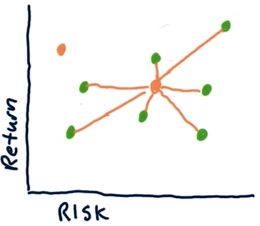
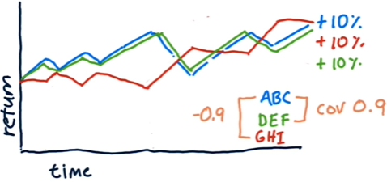
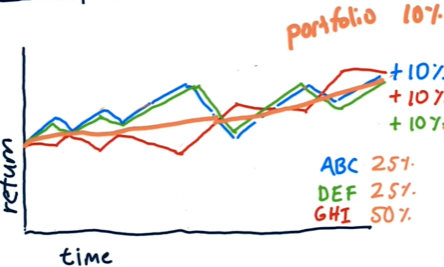
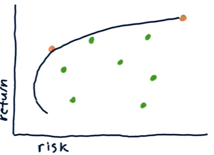
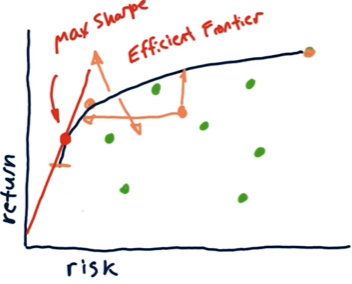

- [Lesson 2.09 - 2.10](#lesson-209---210)
- [2.09 Grinold's Fundamental Law of Active Portfolio Management](#209-grinolds-fundamental-law-of-active-portfolio-management)
  - [Introduction](#introduction)
  - [Measuring performance](#measuring-performance)
    - [Reward vs Risk](#reward-vs-risk)
    - [From coinflipping to Grinold's Fundamental Law](#from-coinflipping-to-grinolds-fundamental-law)
  - [Linking performance to skill and breadth](#linking-performance-to-skill-and-breadth)
    - [Putting it all together](#putting-it-all-together)
- [2.10 Portfolio optimization and the efficient frontier](#210-portfolio-optimization-and-the-efficient-frontier)
  - [Mean-variance optimization (MVO)](#mean-variance-optimization-mvo)
  - [Efficient frontier](#efficient-frontier)

# Lesson 2.09 - 2.10

# 2.09 Grinold's Fundamental Law of Active Portfolio Management

## Introduction

- Investment **performance** is related to the **skill** of the investor and the **breadth** of the investments.
- Investor **skill**: how good the investor is at predicting the future returns
- Investment **breadth**: the number of independent bets taken, i.e. opportunities to apply skill.
- For example, you can have a very skilled investor, but if they only make one bet (narrow breadth), the performance will be poor.

$$\text{Performance} = \text{Skill} \cdot \sqrt{\text{Breadth}}$$

That is:

$$IR = IC \cdot \sqrt{BR}$$

- Performance can be measured in terms of **information ratio **(IR) (Sharpe ratio of excess returns, the way in which the portfolio manager is exceeding the market's performance).
- Skill can be measured in terms of **information coefficient** (IC) (see below).
- Breadth (BR) can be measured in terms of the number of independent bets taken (n).

## Measuring performance

- For simplicity, we will illustrate Grinold's Fundamental Law with coinflipping instead of buying stocks
- Head = making a profit, Tail = losing money
- The outcome of the coinflip is random. This randomness is like $\beta$ in the CAPM equation.
- The coin is biased: P(Head) = 0.51. This is like $\alpha$ in the CAPM equation. (If we know this value, we have an information edge over the market. Skills are needed to identify this value.)
- Betting rule (Even-money bet):
    - You can bet on $N$ independent coinflips (like independent stocks).
    - If you win: get $N$ coins. (i.e. You have $2N$ coins now)
    - If you lose: lose $N$ coins. (i.e. You have $0$ coins now)
- The casino:
    - 1000 tables (each allows $N$ bets)
    - 1000 tokens (1 bet requires at least 1 token)
    - Game (coinflip) runs in parallel
- You can allocate your tokens however you want (e.g. 1 token on each table, or all 1000 tokens on one table, etc.).
    - How should you allocate your tokens?
    - As usual, consider both expected return and risk.

### Reward vs Risk

**Expected return**:
- For an even-money bet game, the expected return is:
    $P(\text{win}) \cdot \text{Tokens bet} - P(\text{lose}) \cdot \text{Tokens bet}$

- Example cases:
    - Single bet: Betting 1000 tokens on one table. The expected return is $0.51 \cdot 1000 - 0.49 \cdot 1000 = 20$.
    - Multi bet: Betting 1 token on each table. The expected return for each table is $0.51 \cdot 1 - 0.49 \cdot 1 = 0.02$. The total expected return is $0.02 \cdot 1000 = 20$.

**Risk**:
- The expected return is the same for both of the cases above, but the risk is a lot higher for the first case:
    - Single bet: You have a $49\%$ chance of losing all your tokens (1000 tokens).
    - Multi bet: You have a $0.49 \cdot 0.49 \cdot 0.49 \cdots = 0.49^{1000} \approx 0$ chance of losing all your tokens (1000 tokens).
- If we know the bet outcomes, we can also quantify the risk using the standard deviation of individual bets:
    - Multi bet: $\text{stdev}(\text{bet outcomes}) = \text{stdev}(\text{1, 1, -1, 1, -1, ...}) = 1$.
    - Single bet: We bet 1000 tokens on one table and 0 tokens on 999 tables. The standard deviation if we win is $\text{stdev}(\text{1000, 0, 0, 0, ...}) = 31.62$. The standard deviation if we lose is $\text{stdev}(\text{-1000, 0, 0, 0, ...}) = 31.62$.

**Risk-adjusted reward** (Just like the Sharpe ratio (SR)):
  
$$\text{Risk-adjusted reward, like SR} = \frac{\text{Expected return}}{\text{Standard deviation}}$$

- For the single bet, the risk-adjusted reward is $\frac{20}{31.62} \approx 0.63$.
- For the multi bet, the risk-adjusted reward is $\frac{20}{1} = 20$.
- Note that the risk-adjusted reward is not thfe same as SR strictly speaking (risk-free rate is not considered), but we for convenience we will use SR for now. We will introduce the concept of information ratio (IR) later.

### From coinflipping to Grinold's Fundamental Law

- Notice that the risk-adjusted reward for the multi bet is $\sqrt{1000}$ times the risk-adjusted reward for the single bet:
    $20 = 0.63 \cdot \sqrt{1000}$.
- In other words, the two cases are related as follows:
    
    $$\text{SR}_{\text{multi}} =\text{SR}_{\text{single}} \cdot \sqrt{N}$$

- Compare this with Grinold's Fundamental Law:
    
    $$\text{Performance} = \text{Skill} \cdot \sqrt{\text{Breadth}}$$

- This helps us understand the relationship between the performance, skill, and breadth of the investments:
    - Performance corresponds to the risk-adjusted reward (SR).
    - Skill corresponds to the risk-adjusted reward of the single bet (SR), i.e. how good the investor is at predicting the future returns.
    - Breadth corresponds to the number of independent bets (N), i.e. execution opportunities.

What we have learned from coinflipping:
- Higher alpha generates a higher Sharpe ratio
- More execution opportunities generate a higher Sharpe ratio
- Sharpe ratio grows with the square root of breadth

## Linking performance to skill and breadth

- **Information coefficient (IC)**: the correlation between the predicted returns and the actual returns
- **Breadth (BR)**: the number of trading opportunities per year. For example:
    - If you are trading 10 stocks per day, the breadth is 10 * 252 = 2520 (assuming 252 trading days in a year).
    - If you are holding 10 stocks for 1 year, the breadth is 10.
    - Note that even if you only buy and hold a portfolio, you need to count all the positions in that portfolio as trading opportunities (i.e. number of positions).

- **Information Ratio (IR)**:
    - Recall the CAPM equation,

        $r_p(t) = \beta_p \cdot r_m(t) + \alpha_p(t)$

        where $r_p(t)$ and $r_m(t)$ are the returns of the portfolio and the market at time $t$, respectively, and $\alpha_p(t)$ is the excess return of the portfolio over the market at time $t$.

    - The $\alpha_p(t)$ component of the return relies on the skill of the investor - i.e. how good they are at predicting the future (e.g. they may have an information edge over the market).
    - The information ratio (IR) is the Sharpe ratio of the excess return (i.e. the skill component, $\alpha$):

        $$IR = \frac{\text{mean}(\alpha_p(t))}{\text{stdev}(\alpha_p(t))}$$

    - Intuitively, IR tells us how much return (i.e.performance) we can expect based on the skill of the investor.
    - Note that IR is calculated using historical data of alpha returns.

### Putting it all together 

$$ IR = IC \cdot \sqrt{BR}$$

- Intuitively, the law tells us that IR (the performance of the investor) is a function of their skill (IC) and the breadth of the investments (BR).
- To improve the performance, we can either improve the skill (IC) or increase the breadth (BR).
    - Sometimes, it is easier to increase the breadth (e.g. by trading more stocks) than to improve the skill, though the square root relationship means that one may need to increase the breadth significantly to see a meaningful improvement in performance.

Example: Simons vs. Buffett
- Both have the same performance (IR).
- Simons' algo (IC) is 1/1000 as smart as Buffett's.
- Buffett's trades 120 stocks a year (BR = 120).
- How many trades must Simons make to achieve the same performance?

    According to the Fundamental Law:

    $IR = IC_{Buffett} \cdot \sqrt{BR_{Buffett}} = IC_{Buffett} \cdot \sqrt{120}$
    $IR = IC_{Simons} \cdot \sqrt{BR_{Simons}}$

    Combining the two formulas, we have:

    $$\begin{align*}
    IC_{Simons} \cdot \sqrt{BR_{Simons}} &= IC_{Buffett} \cdot \sqrt{120}\\
    \sqrt{BR_{Simons}} &= \frac{IC_{Buffett}}{IC_{Simons}} \cdot \sqrt{120}\\
    BR_{Simons} &= (1000 \cdot \sqrt{120})^2\\
    \end{align*}$$

# 2.10 Portfolio optimization and the efficient frontier

- **Portfolio optimization** (e.g. **mean-variance optimization**): Given a set of equities and target return, find the allocation to each equity that minimizes risk (variance).
- Risk = standard deviation of historical daily returns
- In general, higher risk usually means higher return. (see Efficient frontier)
- A portfolio may consist of assets with different risk-return profiles.
    - e.g. If you want to focus on high return, your portfolio will put more weight on the high-risk asset
- We can visualize the risk-return profile of a portfolio as follows:   
    
    

- Green dots represent the risk-return profile of individual assets.
- The middle orange dot (surrounded by the green dots) represents the risk-return profile of the portfolio. (Weighted average of the green dots)
- We can optimize a portfolio such that it has a lower risk (lower variance) than the individual assets in it, while maintaining a high return (e.g. the orange dot to the left of all other dots)
    - e.g. It's been shown that a blend of stocks and bonds can provide a lower risk than either asset class alone.

## Mean-variance optimization (MVO)

- **Mean-variance optimization** (MVO) optimizes the portfolio weights by looking at the covariance matrix of the assets in the portfolio.
- Covariance: measures how two assets move together
- Consider the following case:
    
    

    - The three stocks, ABC, DEF, and GHI have the same cumulative return (+10\%), but different risk profiles (variance over time).
    - ABC and DEF have a high positive correlation (0.9), while GHI has a negative correlation (-0.9) with ABC.
    - If we build a portfolio with 25\% in ABC, 25\% in DEF, and 50\% in GHI, we can achieve a lower risk (lower variance) than the individual stocks while maintaining the same return:
   
        

    - In this case, the return of the portfolio is still 10\%, but the variance is much lower (smoother curve).
    - This is because the anti-correlation between GHI and the ABC-DEF combo helps to offset the variance.
- In general, MVO is looking for assets that are anti-correlated in the short term (to reduce risk) and positively correlated in the long term (to increase return).
- Input to MVO optimizer:
    - Expected returns of the assets
    - Volatility of the assets (from historical data)
    - Covariance matrix of the assets (i.e. how they move together)
    - **target return** of the portfolio:
        - We can achieve anything between the lowest to the highest return of the assets in the portfolio, depending on how we blend them.
- Output of MVO optimizer: a set of weights for each asset in the portfolio that minimizes risk *while achieving the target return*.

## Efficient frontier

- What is the lowest risk for we can achieve for a given target return?
- The relationship between risk and return is not always linear.
- We can visualize the risk-return profile of a portfolio as follows:

    

- The green dots represent the individual assets.
- The two orange dots represent the portfolios with different blend of the assets.
- The black line represents the **efficient frontier**:
    - Any portfolio on the efficient frontier has the lowest risk for a given target return. (i.e. the optimal portfolio for that target return)
    - Any portfolio right of the efficient frontier has a higher risk for a given target return.
    - No portfolio exists to the left of the efficient frontier (you cannot achieve better than the efficient frontier)
    - Note that the lower part of the curve is not efficient (reducing return does not reduce risk), so we usually ignore it (removed in the figure below for simplicity).
    - If we draw a tangent line from the origin to the efficient frontier, the point where the line touches the frontier is the maximum possible Sharpe ratio we can achieve with a portfolio constructed with the given assets.
    
        