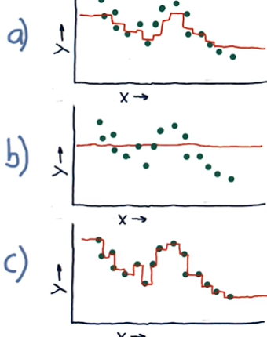
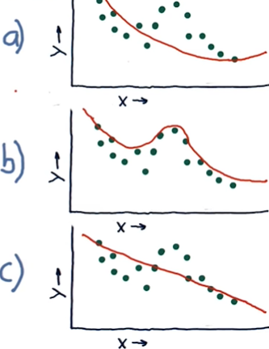
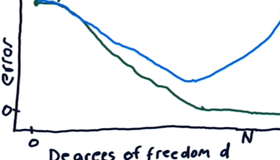
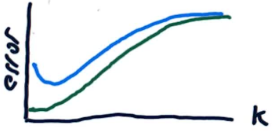
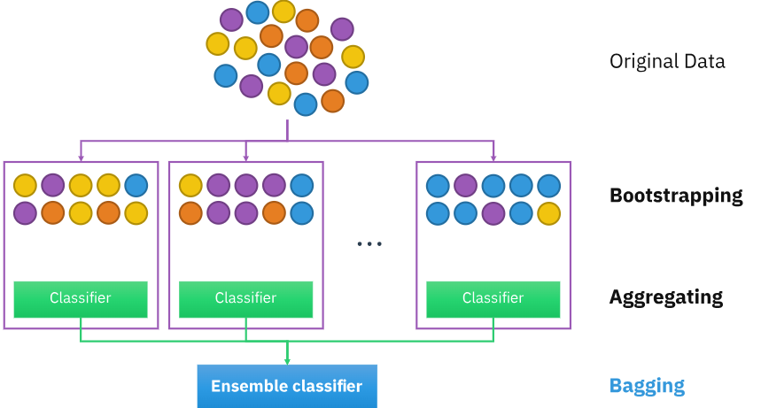

# Lesson 3.01 - 3.04

- [Lesson 3.01 - 3.04](#lesson-301---304)
- [3.01 How Machine Learning is used at a hedge fund](#301-how-machine-learning-is-used-at-a-hedge-fund)
  - [Supervised Regression Learning](#supervised-regression-learning)
  - [How ML works with stock data](#how-ml-works-with-stock-data)
  - [General steps](#general-steps)
  - [Problems with regression](#problems-with-regression)
- [3.02 Regression](#302-regression)
  - [Parametric regression](#parametric-regression)
  - [K-nearest neighbors (KNN)](#k-nearest-neighbors-knn)
  - [Kernel regression](#kernel-regression)
  - [Parametric vs. non-parametric models](#parametric-vs-non-parametric-models)
  - [Data for training and testing](#data-for-training-and-testing)
  - [Example Python class for regression](#example-python-class-for-regression)
- [3.03 Assessing a learning algorithm](#303-assessing-a-learning-algorithm)
  - [Overfitting](#overfitting)
  - [Metrics for testing](#metrics-for-testing)
    - [Root Mean Squared Error (RMSE)](#root-mean-squared-error-rmse)
    - [Correlation](#correlation)
    - [Other metrics](#other-metrics)
  - [In-sample testing, out-of-sample testing, and cross-validation](#in-sample-testing-out-of-sample-testing-and-cross-validation)
    - [In-sample vs. out-of-sample testing](#in-sample-vs-out-of-sample-testing)
    - [Cross-validation](#cross-validation)
    - [Overfitting - in-sample vs. out-of-sample error](#overfitting---in-sample-vs-out-of-sample-error)
- [3.04 ensemble learners - bagging and boosting](#304-ensemble-learners---bagging-and-boosting)
  - [Ensemble learners](#ensemble-learners)
  - [Bootstrap aggregating (bagging)](#bootstrap-aggregating-bagging)
  - [Boosting](#boosting)

# 3.01 How Machine Learning is used at a hedge fund

## Supervised Regression Learning

- "**Supervised**": learning from labeled data
- "**Regression**": predicting a continuous value
- Three main types in this lesson:
  - Linear/ polynomial regression (parametric)
  - Decision tree (instance-based)
  - Random forest (an ensemble of trees)
- **Parametric** models: learn a number of parameters from the data. (Once you've learned the parameters, you don't need the data anymore.)
- **Instance-based** models: They store the data and make predictions based on similarity to other data points.
  - Decision tree: each node is a decision point based on a feature, and the leaves are the predictions.

## How ML works with stock data

- Stock data is time series data
- Example historical data (multiple stocks):
  - A table where each column is a stock, and each row is a day
  - A table represent a factor (i.e. "feature", such as prices). You may have multiple tables for different features.
- The training data (i.e. historical data) is denoted as $X$, and the target data (i.e. the value you want to predict) is denoted as $y$.
- Each feature vector is denoted as $x_1, x_2, ..., x_n$.
- Each pair of $X$ and $y$ is a training example.

## General steps

1. Select features to used ($X$)
2. Decide what to predict ($y$)
3. Decide the time period and the stock universe (i.e. which stocks) to use for training
4. Train the model
5. Make predictions

- **Backtesting**: testing a model on historical data to see how well your model (i.e. the optimized strategy) would have performed in the past

## Problems with regression

- Noisy and uncertain forecasts
- Difficult to estimate confidence
- Difficult to decide how to trade based on the forecast
  - e.g. Holding time, allocation, etc.
- Reinforcement learning addresses these issues (will be covered later)

# 3.02 Regression

## Parametric regression

- Example: linear regression model:
  - $y = mx + b$
  - $m$ and $b$ are the parameters
- The goal is to find the best-fit parameters
- Linear model has only one term ($mx$), a polynomial model has multiple terms ($mx^2, mx^3, ...$)

## K-nearest neighbors (KNN)

- The goal is to find the $k$ nearest neighbors to the point you want to predict
- Example: you want to predict the rainfall on a given day based on the change in barometric pressure (a feature):
  - Find the $k$ days with the most similar barometric pressure to the day you want to predict
  - Average the rainfall on those days - that's your prediction

## Kernel regression

- Similar to KNN, but uses a weighted average of the neighbors
- The weight is based on the distance to the point you want to predict (i.e. the values of the features you're using to make the prediction) 
- Example: the days that have the most similar barometric pressure to the day you want to predict will have the most weight in the average

## Parametric vs. non-parametric models

- **Parametric models**: 
  - best suited for problems that you have a good guess about how the input data is related to the outcome (e.g. the location where a ball lands has a parabolic relationship with the angle you throw it at)
  - Such models provide a **biased** solution, i.e. the model is biased towards the assumed relationship
- **Non-parametric models**:
  - best suited for problems where you don't have a good guess about how the system behaves
  - Such models provide an **unbiased** solution
- Parametric models: slow training but fast query time
- Non-parametric models: fast training but slow query time
  - New instances can be added to the model without retraining (since there's no training to begin with)
  - Query can be slow because it has to compare the new instance to all the instances in the training set (this may involve e.g. sorting the data)

## Data for training and testing

- Data is split into training ($X_{train}$, $y_{train}$) and testing sets ($X_{test}$, $y_{test}$)
- and testing sets ($X_{test}$, $y_{test}$)
- **Out-of-sample testing**: testing the model on data it hasn't seen before
- For time series data, you generally use the older data for training and the newer data for testing

## Example Python class for regression

```python
class LinRegLearner():
    def __init__(self):
        pass

    def train(self, X, Y):
        self.m, self.b = your_linReg_algorithm(X, Y)
    
    def query(self, X):
        y = self.m * X + self.b
        return y
```

# 3.03 Assessing a learning algorithm

## Overfitting

For KNN:
- the *lower the $k$*, the more complex the decision boundary (i.e. more likely to **overfit**)
- In the figure Below:
  - $k=3$ in (a)
  - $k=N$ in (b) ($N$ is the number of data points)
  - $k=1$ in (c) (Overfitting)

    

For polynomial regression:
- The *higher the degree ($d$)* of the polynomial, the more complex the decision boundary (i.e. more likely to **overfit**)
- In the figure below:
  - $d=2$ in (a)
  - $d=3$ in (b) (Overfitting)
  - $d=1$ in (c)
  
    


## Metrics for testing

### Root Mean Squared Error (RMSE)

- **RMSE** measures the difference (i.e. the error) between the predicted values and the actual values

    $\displaystyle RMSE = \sqrt{\frac{1}{N} \sum_{i=1}^{N} (y_i - \hat{y}_i)^2}$
    - $N$: number of data points
    - $y_i$: actual value
    - $\hat{y}_i$: predicted value
- Intuition: RMSE is essentially measuring the average error. The error is squared at each point:
  - to avoid positive and negative errors canceling each other out
  - to emphasize larger errors (see note)

> Note: A model may make only a few small errors but one large error, this doesn't mean the model better or worse than a model that makes many small errors. RMSE takes this into account by emphasizing larger errors through squaring.

### Correlation

- Correlation between $y_{test}$ and $y_{predict}$
- A good model will have a high correlation
- Note that correlation doesn't tell you how far off the predictions are.
  - Usually, high RMSE goes with low correlation, but not always
- To calculate correlation using Numpy:

    ```python
    np.corrcoef(y_test, y_predict)
    ```

### Other metrics

- Memory space for saving model
- Compute time to train
- Compute time to query
- Ease to add new data

## In-sample testing, out-of-sample testing, and cross-validation

### In-sample vs. out-of-sample testing

- **In-sample testing**: testing the model on the same data it was trained on
- **Out-of-sample testing**: testing the model on data it hasn't seen before
- In general, in-sample testing will generate a lower RMSE than out-of-sample testing (see the section: Overfitting - in-sample vs. out-of-sample testing)
- Out-of-sample testing is a better way to evaluate the model

### Cross-validation

- In some cases (e.g. when you have a small dataset), you may not have enough data to use out-of-sample testing
- One solution is to use **cross-validation**:
  - split the data into $k$ parts (folds), train the model on $k-1$ parts, and test it on the remaining part
  - Repeat this process $k$ times, each time using a different part as the test set
  - Average the RMSE over all $k$ tests
- For time series data, use **roll forward cross-validation**:
  - split the data into parts like in cross-validation, but the part you test on is always *later* in time than the part you train on
  - This avoids peeking into the future

### Overfitting - in-sample vs. out-of-sample error

- In-sample error: error on the training data (in-sample testing)
- Out-of-sample error: error on the testing data (out-of-sample testing)
- In the figures below, green line represents the in-sample error, and the blue line represents the out-of-sample error

- For polynomial regression, the out-of-sample error decreases as $d$ increases, but then starts to rise again
  - The point at which the out-of-sample error starts to rise is the point where the model starts to overfit (compare this with the in-sample error: the is also the point where the in-sample error levels off)

    

- For KNN, the error on the testing data drops initially as $k$ increases, but then starts to rise again
  - Overfitting occurs when before the point where the out-of-sample error stops decreasing and starts to rise 
  
    

# 3.04 ensemble learners - bagging and boosting

## Ensemble learners

- **Ensemble learners**: combine multiple model *outputs* to improve performance
- Different ways to combine the models depending on the problem. For example:
  - Classification: majority vote
  - Regression: average the outputs
- Advantages:
  - Lower error
  - Less overfitting (because each learner has A different bias)
- NOte that you are not creating a new model, you are just combining the outputs of existing models 

## Bootstrap aggregating (bagging)

- **Bootstrap aggregating**, a.k.a. **bagging**: training multiple models on different subsets of the training data and averaging the outputs
- **Bootstrap**: sampling with replacement

    
    Source: https://upload.wikimedia.org/wikipedia/commons/c/c8/Ensemble_Bagging.svg


- Advantage: less likely to overfit 
  - e.g. a 1NN model (KNN with $k=1$) trained on the entire training set is likely to overfit, while an ensemble of 1NN models trained on different subsets of the data is less likely to overfit
  - each 1NN model overfits to specific parts of the data, but the average of the models is less likely to overfit to any one part of the data

## Boosting

- **Boosting**: a variant of bagging where the models are trained sequentially
- Example: AdaBoost (Adaptive Boosting)
  - Randomly sample the training set and train a model
  - Test the model on the entire training set
  - Find the data points that the model got the largest errors on
  - Sample the training set again, but instead of sampling randomly, the data points that the model got wrong are more likely to be sampled
  - Train another model with the new sample
  - Perform testing again, but this time combine the outputs of the two models
  - Repeat this process with more models
- Boosting: train models sequentially, with each model learning from the previous one's errors
- Boosting is more likely to overfit than bagging though. This is because each model is trained to correct the errors of the previous model