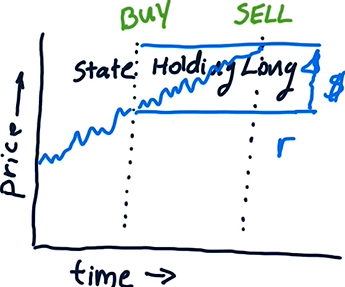

# Lesson 3.05 - 3.07

- [Lesson 3.05 - 3.07](#lesson-305---307)
- [3.05 Reinforcement Learning (RL)](#305-reinforcement-learning-rl)
  - [Introduction](#introduction)
  - [Markov Decision Process (MDP)](#markov-decision-process-mdp)
  - [Finding the optimal policy](#finding-the-optimal-policy)
- [3.06 Q-Learning](#306-q-learning)
  - [Introduction](#introduction-1)
  - [What is Q-value?](#what-is-q-value)
  - [Q-function](#q-function)
  - [Q-learning update rule](#q-learning-update-rule)
    - [The algorithm](#the-algorithm)
  - [Exploration vs. Exploitation:](#exploration-vs-exploitation)
  - [Trading as an RL problem](#trading-as-an-rl-problem)
  - [State representation](#state-representation)
- [3.07 Dyna-Q](#307-dyna-q)
  - [Introduction](#introduction-2)
  - [The algorithm](#the-algorithm-1)


# 3.05 Reinforcement Learning (RL)

## Introduction

Why Reinforcement Learning?

- Supervised Learning or time-series analysis: 
    - makes predictions only, doesn't tell us the certainty of the prediction -- our decisions are based on how much we *trust* the prediction
- RL finds the optimal policy, which tells us what to do next (it makes the decision for us)
- A **policy** is a mapping from states to actions

General steps:

- RL agent interacts with the *environment*
- Agent observes the state of the environment
- Agent takes an action
- Environment transitions to a new state and gives a reward
- Agent learns from the reward and updates its policy
- The goal is to find the *optimal policy* that maximizes the total rewards

## Markov Decision Process (MDP)

- Consists of sequences of $<s, a, r, s'>$
- $S$: set of **states**
- $A$: set of **actions**
- $T(s, a, s')$: **transition probability** from state $s$ to state $s'$ after taking action $a$
- $R(s, a)$: **reward** received after taking action $a$ in state $s$
- $\gamma$: **discount factor**
- **Policy**: $\pi(s) \rightarrow a$, a function that maps states to actions

## Finding the optimal policy

- RL can find the optimal policy $\pi^*$ with or without a **model** of the world, i.e. the "rules" of the environment ($T$ and $R$)
- When $T$ and $R$ are known: 
    - use **model-based** RL (e.g. value iteration, policy iteration) 
- When $T$ and $R$ are unknown:
    - learn the model of the environment ($T$ and $R$) from experience (i.e. **experience tuples** $<s, a, r, s'>$), then use **model-based** RL
    - alternatively, use model-free RL (e.g. Q-learning)

# 3.06 Q-Learning

## Introduction

- **Q-learning** is model-free: learns the best policy *directly* from experience, which involves updating the "Q-values"
- **Q-value**: the value of taking an action in a state (see next section)
- Q-values tell the agent how good it is to take an action in a state
- During RL, the agent keeps a **Q-table** (or **Q-function**) that stores the Q-values for each state-action pair
- Q-values are updated using the *Bellman equation* (See the section Q-learning update rule)

## What is Q-value?

- Q-value: the **expected total reward** you will get in the *end* (or in the *long run*) when you start in state $s$, take action $a$, and then follow the policy $\pi$ thereafter
    - "in the end" means the end of the episode, e.g. a goal state, a time/step limit, etc. (**finite horizon**)
    - For problems with an **infinite horizon**, the total reward "in the long run" can be made finite by using a **discount factor** $\gamma$ (Otherwise, any policy would have infinite total reward and there would be no optimal policy!)
    - Discounted total reward: $R = \sum_{t=0}^{\infty} \gamma^t r_t$, where $\gamma \in (0, 1]$

## Q-function

- **Q-function**, $Q(s, a)$: returns the Q-value of taking action $a$ in state $s$
- Q-function can be represented as a table (Q-table) or a function. (Either form gives you the Q-value for each state-action pair.)
- Let's say you are in state $s$ and you take action $a$: Q$(s, a)$ can be expressed recursively as the **immediate reward** you get after taking action $a$, plus all the rewards you will get in the future starting from the next state $s'$:

    $$Q(s, a) = r + \gamma \max_{a'} Q(s', a')$$

    - $r$ is the immediate reward, i.e. $R(s, a)$ 
    - $\displaystyle \max_{a'} Q(s', a')$ is the expected total reward you will get starting from the next state $s'$ taking the best action $a'$
    - $\gamma$ is the discount factor
    - Notice the recursion of the Q-function here

## Q-learning update rule

- During RL, you adjust the Q-values with improved estimates based on recent experience, weighted by a **learning rate** $\alpha$:
    $$Q_{new} \leftarrow (1 - \alpha) \cdot Q_{old} + \alpha \cdot \text{improved estimate of }Q$$
- The learning rate $\alpha$ controls how much the new estimate will be influenced by the old estimate
- The improved estimate of $Q$ takes into account the most recent experience $<s, a, r, s'>$:
    $$r + \gamma \max_{a'} Q(s', a')$$

- More formally, the Q-learning update rule is:
    $$Q_i(s, a) \leftarrow (1 - \alpha) Q_{i-1}(s, a) + \alpha [r + \gamma \max_{a'} Q_{i-1}(s', a')]$$

    where $Q_i$ is the Q-function after the $i$-th iteration, and $Q_{i-1}$ is the Q-function from the previous iteration.
- The Q-learning update rule is applied iteratively to update the Q-values with new experience tuples $<s, a, r, s'>$
- The Q-values converge to the optimal Q-values, $Q^*(s, a)$, which represent the maximum expected total reward under the optimal policy $\pi^*$:
    $$Q^*(s, a) = \max_{\pi^*} Q^{\pi^*}(s, a)$$

- Similarly, the optimal policy can be derived from the optimal Q:
    $$\pi^*(s) = \text{argmax}_a Q^*(s, a)$$

> The Q-learning update rule is often written as:
> $$Q_i(s, a) \leftarrow Q_{i-1}(s, a) + \alpha [r + \gamma \max_{a'} Q_{i-1}(s', a') - Q_{i-1}(s, a)]$$
> where the term in the square brackets is the **TD error (Temporal Difference error)**, i.e. the difference between the target value $r + \gamma \max_{a'} Q_{i-1}(s', a')$ (the improved estimate) and the current estimate $Q_{i-1}(s, a)$.

### The algorithm

1. Initialize the Q-table with random values
2. Observe the current state $s$
3. Choose an action $a$ (e.g. using an $\epsilon$-greedy policy, see next section)
4. Take action $a$ and observe the reward $r$ and the next state $s'$
5. Update $Q(s, a)$ with $<s, a, r, s'>$ using the Q-learning update rule
6. Set $s \leftarrow s'$ and repeat from step 2 until convergence

## Exploration vs. Exploitation:

- **Exploration**: trying out different states and actions to learn more about the environment
- **Exploitation**: using the current knowledge about the environment to maximize the rewards
- Insufficient exploration can lead to suboptimal policies
- **$\epsilon$-greedy policy**: a way to balance exploration and exploitation
    - With probability $\epsilon$, choose a random action (exploration); otherwise, choose the best action (exploitation)
- $\epsilon$ usually decays over time to shift from exploration to exploitation as the agent knows the world better

## Trading as an RL problem

- Environment: stock market
- States: represent market conditions, features of the stock, etc.
- Actions: buy, sell, hold
- Reward: e.g. daily return from a trade



> Notes
> - Daily return (immediate reward) is used instead of the cumulative return (delayed reward) because it is more frequent and can help the agent converge faster
> - Daily return can also be used to represent a state and it can help to make decisions, e.g. sell if the current return so far reaches a certain threshold

Using trading data for RL:

- Earlier data is used as the training set and later data is used as the test set
- Each trade forms an experience tuple $<s, a, r, s'>$

## State representation

- States help the agent to make decisions. They should be derived from features that are *informative* and *relevant*:
    - bad features: the stock price (e.g. adjusted close), SMA, etc. (They don't generalize well)
    - good features: Adjusted close/SMA, Bollinger values, P/E ratio, holding stock, return since last entry, etc.
- State space can be **continuous** or **discrete**
- Discrete state space: 
    - finite number of states, hence easier to handle
    - each state can be represented as a unique integer
- Many real-world problems have continuous state spaces, but they can be discretized:
    - **Discretization**: converting continuous features into discrete states
    - e.g. binning a continuous feature into intervals (e.g. low, medium, high, or 0, 1, 2, 3 ...)
    - each feature of a state can be discretized separately (i.e. using different bin sizes)
    - The more bins you use, the higher the resolution of the state space

    Example discretization algorithm:
    
    ```
    bin_size = size(data) / num_bins
    data.sort()
    for i in range(0, num_bins):
        bin_thresholds[i] = data[(i + 1) * bin_size]
    ```

# 3.07 Dyna-Q

## Introduction

- Q-learning requires gaining experience from lots of interactions with the environment (expensive)
- What if we could learn from simulated experience (cheaper than real experience)?
- **Dyna-Q** combines Q-learning with **planning**
    - Planning: simulate (aka *hallucinate*) experience using the model of the environment
    - A blend of model-based and model-free RL: In each iteration, Dyna-Q updates the model of the environment using the current experience, and then uses the model to simulate additional experience

## The algorithm

> Initialize the Q-table 
> Initialize the model of the environment ($T$ and $R$)
> For each episode:
> 1. Observe the current state $s$
> 2. Choose an action $a$
> 3. Take action $a$ and observe the reward $r$ and the next state $s'$
> 4. Update $Q(s, a)$ with observed experience, i.e., $<s, a, r, s'>$
> 5. Update $T(s, a, s')$ and $R(s, a)$ with observed experience
> 6. For $k$ Dyna steps:
>    - Sample a state from the set of explored states
>    - Sample an action from the set of explored actions in state $s$
>    - Infer the next state using $T$
>    - Infer the reward using $R$
>    - Update $Q(s, a)$ with hallucinated experience
> 7. Set $s \leftarrow s'$ and repeat from step 2 until convergence

- Steps 1-4: same as Q-learning
- Step 5: One way to learn $T$ is to count the number of each $<s, a, s'>$ tuple observed so far and normalize it by the total number of times the state $s$ has been visited:
    $$T(s, a, s') = \frac{\text{count}(s, a, s')}{\sum_{s'} \text{count}(s, a, s')}$$
- $R$ can be learned as follows:
    $$R(s, a) = \text{average}(r | s, a)$$

    Alternatively, you can also update $R$ using the observed reward $r$, weighted by a learning rate $\alpha$:
    $$R_{new}(s, a) \leftarrow (1 - \alpha) \cdot R_{old}(s, a) + \alpha \cdot r$$