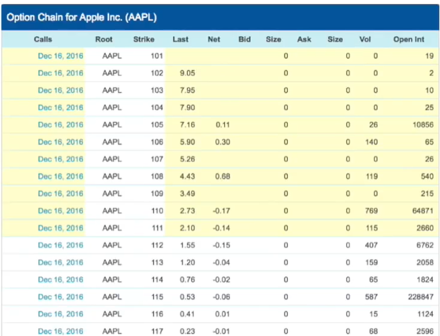
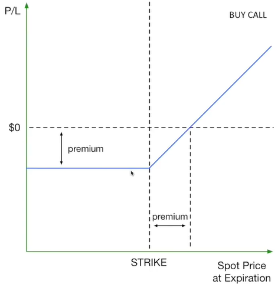
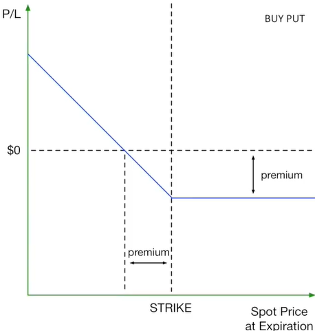
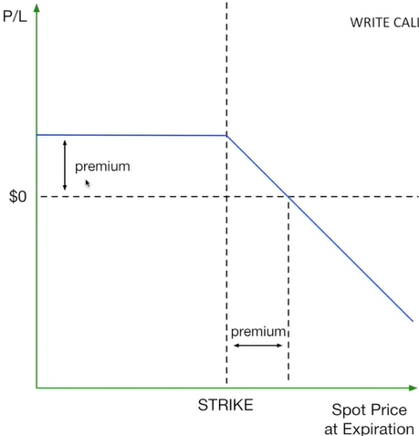
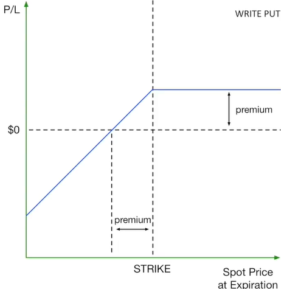
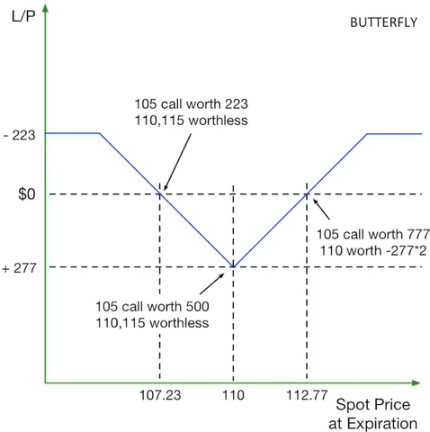

# Supplimentary lectures

- [Supplimentary lectures](#supplimentary-lectures)
- [Decision Trees](#decision-trees)
  - [Decision Tree vs. KNN](#decision-tree-vs-knn)
- [Time Series Data (for Project 6)](#time-series-data-for-project-6)
  - [Backtesting lies](#backtesting-lies)
  - [Project 6](#project-6)
    - [indicator](#indicator)
    - [Strategy](#strategy)
    - [Implementation](#implementation)
      - [Iteration: the easy way](#iteration-the-easy-way)
      - [Vectorization](#vectorization)
- [Interview with Tammer Kamel - Founder of Quandl](#interview-with-tammer-kamel---founder-of-quandl)
- [Options](#options)
  - [Buying options vs. buying stocks](#buying-options-vs-buying-stocks)
  - [How are options priced?](#how-are-options-priced)
  - [Trading options](#trading-options)
    - [Buying call options:](#buying-call-options)
    - [Buying put options:](#buying-put-options)
    - [Writing call options:](#writing-call-options)
    - [Writing put options:](#writing-put-options)
  - [Option trading strategies:](#option-trading-strategies)
    - [Covered call and married put](#covered-call-and-married-put)
    - [The Butterfly strategy](#the-butterfly-strategy)

# Decision Trees

- Basics and theories: See the reading list
- Tubular implementation: more efficient than using a graphical tree structure. See additional slides and videos
- Tubular view of the decision tree: videos

## Decision Tree vs. KNN

- Both are non-parametric models (i.e. they do not assume a specific form for the underlying data distribution)
- KNN: need to normalize the data so all dimensions (factors) are of similar range. 
    - Otherwise, the factor that has a wide range will become the most important factor.
- Decision trees: data normalization is not necessary
    - Whether you normalize the data or not does not affect which factor to be selected as the node and what split value to use. (Factors are selected based on e.g. entropy, correlation, etc. Split values are based on e.g. median.)

# Time Series Data (for Project 6)

- In Project 6, we will build a ML model from time series data
- The model will predict future prices on a certain day
- Two datasets will be provided:
    - Historical prices
    - Tick data
- Tick data is a 3D DataFrame:
    - rows: tickers (data for each stock)
    - columns: time
    - pages: features (e.g., price, volume)
- The model will be trained on features ($X$) from the tick data and labels ($y$) from the historical prices
- Each training example $(X, y)$ will be a feature vector and a label for a specific time. For example:
    - $X$ is the feature vector covering data from the last 10 days ($t-10, t-9, \ldots, t-1$)
    - $y$ is the price on day $t$

## Backtesting lies

1. In-sample backtesting
    - Testing a model on the same data it was trained on
    - To avoid it, do out-of-sample testing (e.g. roll-forward cross-validation: always test on data older than the data used for training)
    - Note that during model tuning (e.g. selecting features to use), you should limit the data used for tuning to a fixed time period, and then test the final model on different test data
2. Survivor bias
    - Considering only stocks that survived until today (e.g. those listed in today's S&P 500) can lead to overestimating the performance of a strategy
    - To prevent it, use the following indices as your universe for testing:
        - Use historical index membership (e.g. S&P 500 in the past)
        - Pair with SBF-free data
3. Observing the close
    - You assume you can observe information recorded at market close and trade on it
4. Ignoring market impact
    - The act of trading affects price:
        - Historical data does not include your trades and is therefore not an actual representation of the price you would get
        - For example, your strategy may be profitable in backtesting for a stock traded at low volume, but when you try to trade it (e.g. buying a large amount of shares, which is not accounted for in your model), the strategy may not work
    - To account for it, use a slippage model/ include market impact in your backtesting

## Project 6

- You will create a custom technical indicator with the tick data provided (can be compound)
- Use the indicator to create a trading strategy:
    - Input to the strategy: date range and symbols
    - Output: orders file
- You will then backtest the strategy on historical data to evaluate its performance
    - (Will we do in-sample backtesting for the project, though we should do out-of-sample backtesting in practice?)
- A file for orders will be created based on the strategy (same format as in the project Market Simulator)

### indicator

- Example. A "basket" indicator that:
    - combines several technical indicators into one to look for divergence between stock and index (e.g. the stock goes up while the market goes down)
    - constituents:
        - **Price/SMA ratio** 
            - e.g. Today's price/10-day SMA (simple moving average)
        - **Bollinger Bands \%**
            - normalized: 0\% if the price is at the lower band, 100\% if at the upper band
        - **Relative Strength Index (RSI)**
            - an oscillator that tells you when a stock reaches a high or a low
            - relative strength: the ratio of average gain (how much the stock goes up on average on up days) to average loss (how much the stock goes down on average on down days)
            - normalized between 0 and 100 (below 30 is oversold and may soon go up, above 70 is overbought and may soon go down)

### Strategy

- Go long when symbol is oversold, index is not. (You expect it will go up soon)
    - e.g. Price/SMA ratio < 0.95, Bollinger Bands \% < 0, RSI < 30
- Go short (or sell to close) when symbol is overbought, index is not.
    - e.g. Price/SMA ratio > 1.05, Bollinger Bands \% > 1, RSI > 70
- Close position when symbol crosses through its SMA
    - You close it because you don't now what will happen next
- Divergence strategy

### Implementation

#### Iteration: the easy way

- e.g. Use of nested loop to loop through all the tickers and all the time points to calculate the SMA

#### Vectorization

- First write the loop version to make sure it works
- Then vectorize each loop one by one

# Interview with Tammer Kamel - Founder of Quandl

Quandl:
- a platform for financial, economic, and alternative data
- provides a single API to access data from multiple sources

Jump diffusion:
- a mathematical model to capture the "six-sigma" events (sudden large movements in stock prices)
- simulating the market with multiple normal distributions
- Example use case: risk management in finance
    - simulate the market using a normal distribution with the parameters obtained from training, but switch to another normal distribution with a higher standard deviation with some random probability
    - this gives you a better sense of the risk in the market

Market in the 90s vs. now:
- 90s: 
    - more day traders
    - less algorithmic trading
    - higher inter-stock volatility (i.e. less correlation between stocks) because of the lack of information
    - less efficient market
    - more opportunity for technical analysis
- now:
    - more algorithmic trading
    - more efficient market and lower volatility (more people trading with the same information and similar strategies)
    - requires more information to capture the market behavior
    - To gain information advantage, you need to have a better model or a better data source

# Options

- **Options** are contracts that give the holder the right (but not the obligation) to buy or sell an underlying asset at a specified price (**strike price**) ON or BEFORE the expiration date
    - **Call options**: give the holder the right to buy (equivalent to a long position)
    - **Put options**: give the holder the right to sell (equivalent to a short position)
- Assets can be stocks, futures, commodities, currencies, etc.
- US: options can be exercised at any time before expiration
- European: options can only be exercised on the expiration date
- **Exchange traded options** are traded on exchanges (e.g. CBOE, Chicago Board Options Exchange)
- **Employee stock options** (ESOs) are options granted to employees
- **Option chain**: a list of available options for a given underlying asset (strick price and expiration date)
 
    
    
    - This screenshot shows the option chain for the stock AAPL on a specific date (Taken after the market closed)
    - `Call`: expiration date for call options
    - `Root`: the underlying asset (i.e. AAPL stock)
    - `Strike`: Strike price. Price per share of AAPL that you are guaranteed to buy at when you exercise the option.
    - `Last`: last price of the option (not the price of AAPL!) traded at the market close. Note that the price here is not the total cost (**premium**) of the option, but the cost of the *right to buy* one share of AAPL.
        - e.g. If the option price is \$2.73 and it gives you the right to buy 100 shares of AAPL, you will pay \$273 for the option.  (Indeed, a contract ALWAYS represents 100 shares of the underlying asset, so I don't know why they don't just show the total price of the contract instead of the price per share)
    - Note that bid size and ask size were zero because the market was closed so there were no open orders
    - `Open int`: Open interest. Number of total positions of an option that are open in the market (contracts that have not been exercised or closed yet)
- To calculate profit, remember to subtract the cost of the option. For example, if you paid \$273 for the option that gives you the right to buy 100 shares of AAPL at \$110, and the price of AAPL goes up to \$120, you will make a profit of \$(120 - 110) x 100 - 273 = \$727. (For illustration purposes, transaction costs are ignored)

## Buying options vs. buying stocks

Consider the following scenarios:
1. AAPL price today: \$111.57. You buy 100 shares directly for \$11157. A month later, the price goes up to \$120. You sell the shares for \$12000. Profit: \$843.
2. You buy a call option instead for \$273 that gives you the right to buy 100 shares at \$110. A month later, the price goes up to \$120. You exercise the option and then sell the shares IMMEDIATELY. Profit: \$727 (i.e. \$12000 - \$11000 - \$273).

Although the profit is lower in the second case, but options give you some advantages:
- Cash flow: you can control a large amount of shares with a small amount of premium (e.g. \$273 for 100 shares instead of \$11000) before the option expires.
- Leverage: you can make a lot of money with a small amount of cash. You will still get most of the upside potential of the stock.
- Risk management: If the stock price goes down, you can just let the option expire and lose only the premium paid (e.g. \$273).

Downsides:
- The premium is lost money
- Options have expiration dates:
    - You can hold a stock for as long as you want, but options expire on a specific date. In other words, while buying stocks and options both mean that you are betting on the price to go up (or down), with options you have a more specific bet: the price has to go up (or down) before the expiration date.
- You don't own the underlying asset (so you don't get dividends or voting rights)

## How are options priced?

- The price of an option depends on the intrinsic value and the time value of the option
- **Intrinsic value**: the difference between the option strike price and the current price of the underlying asset if the option is *in-the-money*
    -  **In-the-money option** has a non-negative intrinsic value. You could make money by buying the option and immediately exercising it and selling the stock
    - **Out-of-the-money options** have no intrinsic value, i.e. you could not exercise the option at a profit due to where the stock price is right now

    >Example
    >- AAPL price today: \$111.57
    >- Call option with strike price \$110:
    >    - Intrinsic value: \$111.57 - \$110 = \$1.57 (in-the-money)
    >    - If you buy the option for \$2.73, you will lose money if you exercise it today (you will lose \$1.16 per share because you paid \$2.73 for the option with an intrinsic value of \$1.57)

- **Time value**: the excess cost of the option over its intrinsic value, attributed to the time-to-expiration
    - It is the amount of money you are willing to pay for the possibility that the option will be in-the-money before expiration.
    - The more time until expiration, the higher the time value
    - **Time decay** (*theta*): the rate at which an option loses its time value as it approaches expiration

## Trading options

- Options can be traded just like stocks
- As an option approaches its expiration, its time value decreases and its price approaches its intrinsic value
- People who trade option usually try to close their positions (i.e. they don't exercise the option) at least 2 weeks before expiration to avoid losing time value.
- We will look at 4 scenarios:
    - Buying call options
    - Buying put options
    - Selling call options
    - Selling put options
    (Selling options = "writing" option contracts) 

Profit/ loss (P/L) curve (see examples below):
- Helps visualize the profit/loss of a trading strategy using options
- y-axis: Profit or loss (P/L). $0 means break-even (i.e. no profit or loss). 
- x-axis: Spot price at expiration (i.e. the price of the underlying asset at expiration).

### Buying call options:

- Consider this strategy: excercise a call option only when the spot price is above the strike price and then sell the stock immediately.
- The premium paid upfront results in an initial loss. This is also the maximum loss you can incur with this strategy (if the spot price doesn't go above the strike price, so you will just let the option expire).
- To break even, the spot price must exceed the strike price by the amount of the premium paid per share.
- If you execute this strategy when the spot price is above the strike price but below the break-even point, you will still incur a loss. However, when the spot price exceeds the strike price by the amount of the premium, you will make a profit.
- Theoretically, the maximum profit is unlimited because the stock price can go up indefinitely.
- Note that the curve increases linearly because both the strike price and the premium are both priced per share (profit/loss is the difference between the two prices multiplied by the number of shares).

    

### Buying put options:

- Consider this strategy: excercise a put option (short the stock) only when the spot price is below the strike price and then buy the stock back and close your position immediately.
- The curve is simply the opposite of the call option curve above.
- Unlike the call option, the maximum profit is limited to the strike price minus the premium, as the stock price won't go below zero.

    

### Writing call options:

- Best case: The buyer doesn't exercise the option, so you get to keep the stock (not forced to sell it at the strick price) and make a profit equal to the premium.
- The P/L curve is the buying call option curve flipped upside down.
- Naked options: writing options without owning the underlying asset. This is risky because the maximum loss is unlimited as the stock price can go up indefinitely.
- The maximum profit is limited to the premium received.

    

### Writing put options:

- Writing a put option is like giving someone the right to sell us the stock at the strike price.
- If the stock price goes up above the strike price, the buyer will not exercise the option and you get to keep the premium.
- The P/L curve is the buying put option curve flipped upside down.
- THe maximum loss is limited to the strike price minus the premium received, as the stock price won't go below zero. (If the stock price goes to zero, you will be forced to buy it at the strike price even though it is worthless.)
- Again, the maximum profit is limited to the premium received.

    

- Given that about 90\% of options expire unexercised, the odds that you are losing money are usually low. This makes writing options a popular strategy even though the maximum profit is limited to the premium.

## Option trading strategies:

### Covered call and married put

- **Covered call**: writing a call option on a stock you already own.
    - Buy a stock, then write a call.
    - Three possible outcomes:
        1. The stock price goes up above the strike price before expiration. Your stock will be "called away". (i.e. You will need ot sell it at strike and lose the upside potential). 
        `Profit = strike price - stock price at purchase + premium`
        2. The stock price goes up, but below the strike price. The option will not be exercised and you get to keep the stock and the premium. (best case)
        `Profit = current stock price - stock price at purchase + premium`
        3. The stock price goes down. The option will not be exercised. The premium helps offset the loss on the stock.
        `Loss = current stock price - stock price at purchase + premium`
    - **Married put**: a hedging strategy where you buy a stock and then buy a put option on it. 
        - This is like buying insurance for the stock. The put option will protect you from losses if the stock price goes down. 
        - Besides, you may avoid tax liabilities by selling the put option instead of selling the stock (e.g. capital gains tax may apply if you sell the stock)

### The Butterfly strategy

- Options have more moving parts than stocks, so they offer more ways to construct a more complex trading position than with stocks alone.
- If you think a stock will go sideways for a while, options can be used to profit from the sideways movement 
- **Butterfly**: a strategy for profiting from a stock that is expected to move sideways.
    - constructed by:
        - buying a call option with a strike price *below* the current stock price
        - buying a call option with a strike price *above* the current stock price
        - writing two call options with a strike price between the two bought options (The price at which you expect the stock to stay near)
    -  You pay a premium for the two bought options and receive a premium for the two written options. The net cost is the difference between the premiums.
- Butterfly strategy profits when the stock price is between the two bought options at expiration.

Example:
- AAPL price today: \$111
- Buy a call option with strike price \$105 for \$7.16
- Buy a call option with strike price \$115 for \$0.53
- Write two call options with strike price \$110 for \$2.73 each
- Net cost: -\$7.16 + 2*(\$2.73) -\$0.53 = -\$2.23 per share ($223 for 100 shares)

- Note that in the figure above, the y-axis is upside down simply because it makes the graph look more like a butterfly.
- Maximum profit happens when the stock price is at the strike price of the written options (i.e. \$110).
- Maximum loss happens when the stock price is below the lower strike price or above the upper strike price of the bought options (i.e. \$105 or \$115).
- The maximum loss is limited to the net cost of the strategy (i.e. \$223). For example, if the stock price is below \$105:
    - You will not exercise the bought options.
    - Your sold options will not be exercised.
    - You loss will just be the net cost of the strategy (i.e. \$223).
- The break-even point occurs when the stock price is between the strike price of one of the bought options and that of the written options.
- The wider the butterfly (i.e. the more difference between the two bought options), the more profit potential, but also the more risk. (i.e. the maximum loss is higher)
- An unbalanced butterfly favors price movement in one direction. (i.e. the two bought options are not equidistant from the written options)