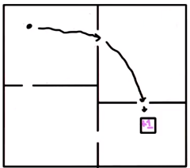
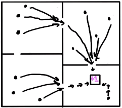
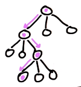
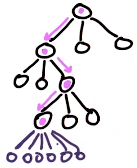
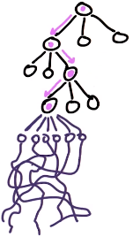
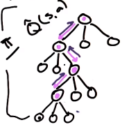

# L10 Options

These are my personal lecture notes for Georgia Tech's [Reinforcement Learning course (CS 7642, Spring 2024)](https://omscs.gatech.edu/cs-7642-reinforcement-learning) by Charles Isbell and Michael Littman. All images are taken from the course's lectures unless stated otherwise.

# References and further readings

- Sutton, R. S., Precup, D., & Singh, S. (1999). Between MDPs and semi-MDPs: A framework for temporal abstraction in reinforcement learning. Artificial intelligence, 112(1-2), 181-211.
- Jong, N. K., Hester, T., & Stone, P. (2008, May). The utility of temporal abstraction in reinforcement learning. In AAMAS (1) (pp. 299-306).
- Jong, N. K., Hester, T., & Stone, P. (2008, May) -- slides: https://www.cs.utexas.edu/~pstone/Courses/394Rfall16/resources/week9a-nick.pdf

# Table of Contents

- [Overview](#overview)
- [Temporal Abstraction](#temporal-abstraction)
    - [Example](#example)
    - [Temporal Abstraction: Options](#temporal-abstraction-options)
    - [Value function for semi-MDP (SMDP)](#value-function-for-semi-mdp-smdp)
        - [SMDP vs MDP](#smdp-vs-mdp)
    - [State abstraction](#state-abstraction)
    - [Remarks on temporal abstraction](#remarks-on-temporal-abstraction)
- [Goal abstraction](#goal-abstraction)
    - [Modular RL](#modular-rl)
        - [Greatest Mass Q-learning](#greatest-mass-q-learning)
        - [Top Q-learning](#top-q-learning)
        - [Negotiated W-learning](#negotiated-w-learning)
        - [All of the above methods have a problem](#all-of-the-above-methods-have-a-problem)
- [Scaling up: Monte Carlo Tree Search (MCTS)](#scaling-up-monte-carlo-tree-search-mcts)
    - [Tree search](#tree-search)
    - [Monte Carlo Tree Search (MCTS)](#monte-carlo-tree-search-mcts)
        - [Rollout policy](#rollout-policy)
    - [MCTS properties](#mcts-properties)

# Overview

- This lecture is about generalizing generalizing! There are techniques to make RL more efficient for problems with large state spaces and action spaces
- We'll look at:
    - abstraction
    - scale
    - search

- What makes RL hard computationally
    - delayed rewards (not like supervised learning)
    - boostrapping (use estimates to make estimates -> need exploration)
    - Large state spaces/ action spaces (makes bigO bad)

- We've been focusing on generalizing states (e.g. value function approximation), now we'll look at ways to generalize actions
- Generalizing actions allows us to scale to larger problems

# Temporal Abstraction

## Example

- A grid world with four rooms. The goal is to get to the goal state indicated by "+1" (see figure below). Primative actions are "up", "down", "left", "right".
- To get to the goal, you can give the agent a detailed sequence of actions to take (e.g. go right, right, right... then go down, down, down...)
- Alternative, you can also give the agent a high-level plan (e.g. pass the door in the east, then go down until you pass the door in the south, then go down until you reach the goal):

    

- The high-level plan is an example of temporal abstraction. Each step is a temporally abstracted action that generalizes over many primitive actions.
- The high-level plan saves time and computation resources (the agent doesn't have to consider every possible primitive action at every step).
- Temporal abstraction reduces the search space and allows the agent to make decisions at a higher level of abstraction:

    

    - In the figure above, each dot represents a state. The agent can now make decisions at the level of rooms instead of individual states. (i.e. states in the same room are treated as equivalent in terms of optimal actions).

- Computational benefits of temporal abstraction:
    - Reduces the search space
    - Allows the agent to make decisions at a higher level of abstraction
    - Values are backed up faster (because there are fewer state-action pairs along the path to the goals), i.e. the agent can learn faster

## Temporal Abstraction: Options

- An option is a way to generalize actions (like using a mini-policy to achieve a subgoal):

    Option, $o = <I, \pi, \beta>$

- $I$ is the initiation set of states
- $\pi$ is the policy, $(s,a)\in[0,1]$ (probability distribution over actions)
- $\beta$ is the termination set of states
    - Note: option can end at any time (an option can be realized in different paths), so $\beta$ is a probability distribution over states: $\delta\in[0,1]$
- options = temporally extended actions

## Value function for semi-MDP (SMDP)

- We have an SMDP (see below) instead of an MDP when the agent takes options instead of primitive actions.

- Value function for an SMDP:

    $\displaystyle V_{t+1}(s) = max_o (R(s,o) + \sum_{s'} F(s,o,s')V_t(s'))$

- Note that the above equation is a bit different from the standard value function for MDP. Here, we need to account for the fact that options can have variable durations:
    - Primatice/ Atomic actions have equal duration in MDPs (Each dot below represents a state):

        `o - o - o - o - o - o - o - o - o ...`

    - However, options can have variable durations:

        `o --------- o - o ----- o ----- o ...`

        (This is called a **semi-MDP (SMDP)** as there are jumps in time)
    
- First, the reward here is not just the immediate reward for taking one timestep, but the expected set of rewards over the entire duration of the option (k steps):

    $R = E[r_1 + \gamma r_2 + \gamma^2 r_3 + ... + \gamma^{k-1} r_k | s, k  \text{ steps}]$

    - Note that the reward is discounted by $\gamma$
    - i.e. Although the agent seems to be taking a single step (an option), we still need to consider the every reward at each timestep within the option.

- Second, the transition function $F(s,o,s')$ is different from the standard transition function $T(s,a,s')$ for primitive actions. Here, we need to consider the timesteps within the option:

    $F = E[\gamma^{k} \Delta_{s_k, s'} | s, k \text{ steps}]$

    $\Delta_{s_k, s'}$ is 1 if $s_k = s'$ (i.e. the agent ends in $s'$) and 0 otherwise.

### SMDP vs MDP:
- An SMDP can be expressed as an MDP by unrolling the options into primitive actions as shown above
- An SMDP is "semi" markovian in the sense that the state transitions are not memoryless (i.e. the state you end up in depend on the time elapsed):
    - The states you can reach after taking an option depends on the time elapsed (e.g. if the option took 1 timestep, you could only reach the states that are 1 step away)
 - We can convert a non-markovian process into a markovian one by keeping track of history (states visited). In this case, knowing the elapsed time is enough (e.g. the expected reward for taking an option can be estimated by knowing the timesteps elapsed, i.e. $k$)
- Therefore, by having $k$ as a parameter in the above value function, we can express an SMDP as an MDP.

## State abstraction 

Consider the example: Pac-Man

- Rules:
    - Collect all the dots
    - Avoid the ghosts
    - Get the big dot to eat the ghosts

- Actions: up, down, left, right

- Possible features of a state:
    - Location of Pacman
    - Location of ghosts
    - Location of dots
    - Location of big dots
    - Whether the ghosts are scared (i.e.edible)

- Possible options:
    - eat a dot
    - eat a big dot
    - eat a ghost
    - avoid a ghost

### From temporal abstraction to state abstraction

- For the option "eat a dot", what feature(s) does Pac-Man need to know? Only the location of the dots (strictly speaking)

- Temporal abstraction allows us to think about the problem in terms of goals and subgoals (options)
    - Therefore, for each option, we don't need to know every feature of a state, but only the features that are relevant to the goal of the option
    - This means states with the same relevant features are treated as equivalent - the state space is abstracted

## Remarks on temporal abstraction

- Options inherit optimality, convergence, and exploration from the underlying MDP with regular actions
    - Note: True optimality is not guaranteed if the set of options you have is not sufficient to solve the problem
    - Hierarchical optimality: given the set of options, you can converge to an optimal policy *with respect to these options*
- It avoids the "boring" parts of the state space
    - i.e. the agent doesn't have to consider every possible action at every step, wandering around the state space
    - The agent just needs to focus on places where it needs to make decisions
    - more efficient exploration
- State abstraction: options can be defined in a way that they don't require knowing the exact state (i.e. every feature of the state)

# Goal abstraction

- Even though the agent is executing options sequentially, it can have multiple goals at the same time:
    - Each option has a goal to achieve
    - at every decision point there are multiple options with competing goals (i.e. parallel goals)
    - The agent needs to decide which option to execute (i.e. which goal to pursue)
    - e.g. in Pacman, the agent can have the goal to eat a dot and the goal to avoid a ghost at the same time
- Options help us think about a problem in terms of goals and subgoals

## Modular RL:

- Modularize the problem into modules (i.e. options)
- Each module has its own subgoal (but they have the same ultimate goal)
- The agent decides which module to execute at each decision point (Arbitration)

### Greatest Mass Q-learning

- Each action has a different Q-value for each module, $Q_i(s,a)$ (recall that each module has its own goal)
- The Q-value for an action is the sum of the Q-values for each module,

    $Q(s,a) = \sum Q_i(s,a)$

- The agent chooses the action with the highest Q-value
    - Kind of like voting: the action with the highest total number of votes (Q-values) wins
- Note: This method does not always work, e.g. the action chosen might not be the best action for any of the modules even though it has a high total Q-value

### Top Q-learning

- The agent chooses the action with the highest Q-value for the module with the highest Q-value

    $Q(s,a) = max_i Q_i(s,a)$

- Note: This method does not always work, e.g. the module with the highest Q-value might just have high Q-values for every action, not just the chosen action

### Negotiated W-learning

- Minimize loss:
    - The agent chooses the action that minimizes the loss for the module with the highest potential loss (i.e. difference between the Q-value of the chosen action and the highest Q-value for that module)

### All of the above methods have a problem

- For these methods to work, the modules are assumed to have comparable Q-values:
    - different modules give different values to the same action because they have different goals and care about different things (e.g. in Pac-Man, a module might want to eat as many dots as possible, while another module might want to survive as long as possible)
    - the goal that each module trying to achieve must be compatible, so that the Q-values are comparable
- To compare actions across modules fairly:
    - the modules need to use the same units for Q-values (e.g. the same reward function)
    - or the arbitrator knows whether the action helps achieve the ultimate goal

# Scaling up: Monte Carlo Tree Search (MCTS)

- MCTS is a way to scale up RL to large problems

## Tree search

- Tree search is a way to explore the state space more efficiently
- A tree has nodes (states) and edges (actions)
- 4 step-loop:
    - Selection: choose a node (i.e. a state) to expand
    - Expansion: expand the tree from the selected node
    - Simulation: simulate the rest of the tree from the expanded node
    - Backup: update the estimated value of the nodes along the path back to the root

- Initially, you don't have enough information to know which node to select, so you just pick one, expand the tree from there, simulate the rest of the tree, and back up the value (using Bellman equation)
- Repeat this process many times to get a good estimate of the value of each node or until you run out of time

## Monte Carlo Tree Search (MCTS)

- Let's say we have a policy $\pi$ that tells us which action to take at each state up to a certain depth (Pink path in the figure below)

    

- The next step is to expand the tree from the the last state $s$ in the pink path. Here you can sample a few actions ($a$) to take:

    

- You can then simulate the rest of the tree from each of these states ($s'$) using a rollout policy, $\pi_r$ (e.g. a random policy):

    

- For each of the randomly simulated paths, you can get some estimates of rewards
- Repeat the simulation many times so you collect enough samples to estimate the Q value for each state-action pair for the last state in the pink path, $\hat Q(s,a)$
- Backup the new estimated value of $s$ to update the value of previous states in the path
- Repeat the above process many times until you are confident enough about $\hat Q$, then update the policy so now it knows what action to take next. Take the next action and expand the tree:

    

Note:

- To do the simulation, you need to have the transition model or you have some way of simulating the world
- When to stop the above loop and stop expanding the tree? YOu may stop until e.g. you run out of computational power, or you are bored (hitting a time limit)
- MCTS may seems like a lot of computation, but it's more efficient than explore the entire state space (like in brute force search)
- MCTS can be thought of as a policy search
    - You are searching for the best policy by exploring the policy space
    - You proceed by expanding the tree and updating the policy
    - The policy is updated as in Monte Carlo methods
- A more efficiently way to do MCTS is probably using options instead of primitive actions
    - you can go deeper in the tree with the same computational resources

### Rollout policy

- A random rollout policy may lead to an underestimation of the Q value
- A way to improve the random policy is to use constraints. e.g. in Pac-Man:
    - Instead of searhing randomly, Pac-Man is constrained to avoid the ghosts
    - Note that the option "avoid the ghosts" has no definite end (you need to keep avoiding the ghosts as long as they are around). Options like this are good constraints

## MCTS properties

- Useful for large state spaces
    - it's a way to scale up RL
- Need lots of samples to get a good estimate
    - this is just how Monte Carlo sampling works
- Planning time independent of the size of the state space, $|S|$
    - To get a good estimate, you don't need to explore the entire state space, but just a good sample of states
    - The sample size depends on how much randomness the transition model has (if it's deterministic, you need fewer samples)
- Running time - exponential in the horizon, $H$ (i.e. the depth of the tree)
    - How far in the future you need to look to make a decision
    - Complexity: $O((|A|\cdot x)^H)$, where $|A|$ is size of action space, $x$ is number of steps in the simulation
    - The horizon depends on the problem and the discount factor $\gamma$ (how much you care about the future)
- Scaling: tradeoff between number of states to sample and depth of the tree: reduce $O(|S|)$ but increase $O(H)$