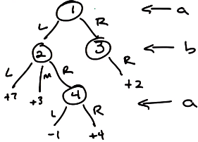
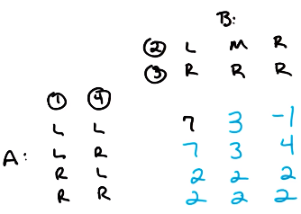
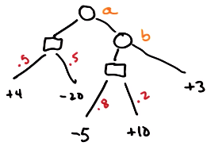
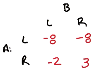
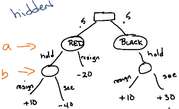
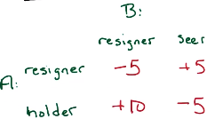
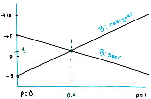
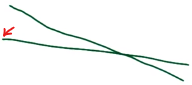
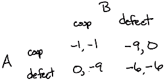

# L11A Game Theory

These are my personal lecture notes for Georgia Tech's [Reinforcement Learning course (CS 7642, Spring 2024)](https://omscs.gatech.edu/cs-7642-reinforcement-learning) by Charles Isbell and Michael Littman. All images are taken from the course's lectures unless stated otherwise.

# References and further readings

# Overview

- Game theory is the "mathematics of conflict" (conflict of interest)
- The world likely has multiple agents, each with their own objectives
    - Even in an single-agent context, the agent could be competing against the environment or other hidden agents that are not explicitly modeled (hidden in the transition model)
- A topic of interest in economics, political science, biology, and increasingly in AI/ML

# Two-player zero-sum finite deterministic game of perfect information

- Let's consider a simple game: Two-player zero-sum finite deterministic game of perfect information
    - Two agents, a and b, take turns to make choices
    - zero sum: the sum of the rewards of the two players is always the same (here it's 0)
    - finite: the game has a finite number of states
    - deterministic: deterministic transition model
    - perfect information: both players know the state of the game at all times

- Both players are assumed to be rational (they make optimal decisions)

- Here is a game tree that captures the dynamics of the game:

    

- The turns are denoted by the player who is making the choice
- Leaves indicates the rewards for player a
- The rewards for player b are the negative of the rewards for player a

## Strategies

- Each player has a strategy
- A strategy is a mapping from states to actions (like a policy, but specific to one player)
- A pure strategy is a deterministic strategy (i.e. always take the same action in the same state)

4 possible strategies for player a:
- In S1 -> go left. In S4 -> left.
- In S1 -> go left. In S4 -> right.
- In S1 -> go right. In S4 -> left.
- In S1 -> go right. In S4 -> right.

3 possible strategies for player b:
- In S2 -> go left. In S3 -> right.
- In S2 -> go to middle. In S3 -> right.
- In S2 -> go right. In S3 -> right.

(Note that player b can only go right in S3)

## Payoff matrix

- The above payoff matrix captures the payoffs for player a (payoffs for player b are the negative of these and are not shown here).
    - Each row corresponds to a strategy that player a follows
    - Each column corresponds to a strategy that player b follows
    - e.g. First row, first column: player a goes left in S1 and left in S4; player b goes left in S2 and right in S3. The payoff for player a is 7.

## Minimax

- What is the best strategy for player a?
- If player a chooses its strategy first, player b will know the strategy of player a (since it's a game of perfect information). Player b will then choose a counter strategy that minimizes the payoff for player a:
    - If player a chooses the first row, player b will choose the last column (player a's payoff=-1)
    - If player a chooses the second row, player b will choose the second column (player a's payoff=3)
    - Since choosing the second row gives the highest payoff in the worst-case scenario, player a will choose the second row.

- What is the best strategy for player b?
    - Using the same logic, player b will choose the second row. The payoff for b is -3. (satifies the definition of a zero-sum game)

- The above strategy is called the minimax strategy:
    - you choose the strategy that maximizes your payoff in the worst-case scenario, assuming your opponent always tries to minimize your payoff

- Here the value of the game is the payoff for player a (the game has a unique solution in this case)

### Minimax theorem

- In a two-player zero-sum game of perfect information:
    - minimax $\equiv$ maximin
    - There always exists an optimal pure strategy for each player
    - Note: "optimal" here means that the strategy is optimal in the worst-case scenario, not necessarily the absolute maximum payoff

# Two-player zero-sum *non-deterministic* game of perfect information

- The game is similar to the previous one, except that it is non-deterministic
- The game tree is the same as before, but now there are chance nodes (represented by squares)
    - The red numbers indicate the probability of transitioning to the next state

- The payoff matrix is now a matrix of **expected** values:

    

- Each player has only two strategies now (at each chance node, the player have no control over the transition)
- Using the minimax strategy, player a will go right and player b will go left
(payoff for player a=-2)

# Two-player zero-sum non-deterministic game of *hidden information*

- The game is similar to the previous one, except that it is a game of hidden information
- Consider the a mini-poker game:
    - A is dealt a card, 50% red or black
    - Only A knows the color of the card, but B doesn't (hidden information, empty circles in the tree)
    - Black is good for A (so it will always hold the card)
    - If card = red, A may resign or hold the card:
        - If A resigns, payoff for A = -20 cents
        - If A holds (i.e. A bluffs), B has to decide:
            - If B resigns, payoff for A = +10 cents
            - IF B choose to see the card:
                - If card = red, payoff for A = -40 cents
                - If card = black, payoff for A = +30 cents

    

    - The player's turn is indicated by the orange text

## Pure strategy

Payoff matrix for player A:

- Here both players have pure strategies
    - e.g. If A is a resigner, it will always resign
    - For example, if A is always a resigner and B is always a seer, the payoff for A is $(-20 + 30)/2 = +5$

- Minimax theorem does not work for games of hidden information:
    - For example, B doesn't know the color of the card, so if A holds, B would not know if A is bluffing (i.e. the card is red) or being honest (i.e. the card is black)
        - Whether B will always resign or always see the card (we are talking about pure strategy here, so B always does the same thing) cannot be predicted by the minimax theorem (for example, B may be a resigner simply because it's a risk-averse player, or it knows A is a honest player and will never bluff)
        - Likewise, A's strategy cannot be predicted because we know A doesn't know what B will do
    - Therefore, a pure strategy can't be the optimal strategy because the players don't have enough info
    - You can't find the value of the game with a pure strategy

## Mixed strategy

- Mixed strategy: a probability distribution over the pure strategies
- e.g. A may *hold* with probability $p$ and *resign* with probability $1-p$

What is the value of the game if A uses a mixed strategy while B uses a pure strategy?

- Two situations to consider:
    - If B is a resigner, the expected payoff for A is
        
        $-5(1-p) + 10p = 15p - 5$

    - If B is a seer, the expected payoff for A is

        $5(1-p) + (-5)p = 5 - 10p$

- The value of the game is the expected payoff for A when the payoff is the same regardless of B's strategy. Therefore, $p$ should be:

    $15p - 5 = 5 - 10p$

    $p = 0.4$

- The expected value of the game is $15(0.4) - 5 = 1$ (or $5 - 10(0.4) = 1$)

- Note that the two functions for the payoff are linear. Their unique solution can be thought as the intersection of two lines:

    

    The two lines cross at $p=0.4$, and the corresponding payoff (y-axis) is 1.

What if B also uses a mixed strategy?

- The expected value of the game will still fall between the two lines (they set the max. and min. payoff A can get regardless whether B is a resigner or a seer)
    - e.g. If B is a resigner 50% of the time, the value will fall in the middle btween the two lines for any $p$
- Regardless what mixed strategy B uses, there is only one value where the expected value stays the same regardless of A or B's strategies
    - In this case, it is the intersection where the expected payoff for A is the highest
    - In some cases, it may be one of the extreme points. For example, in the following case, the expected value is $p=0$ because it is where the expected payoff for A is the highest regardless of B's strategy:

        

# Two-player *non-zero-sum* non-deterministic game of hidden information

- e.g. The prisoner's dilemma
    - Two prisoners, A and B, are arrested for a crime they committed together
    - They can't communicate with each other
    - The police offer each prisoner a deal:
        - If you defect and your partner doesn't, you go free and your partner gets 9 months in jail
        - If you both defect, you both get 6 months
        - If neither of you defect (both cooperate), you both get 1 month

Payoff matrix:

Note: 
- Each prisoner has two strategies: cooperate (coop) or defect
- The first number in each cell is the payoff for A, and the second number is the payoff for B
- The game is non-zero-sum because the sum of the payoffs is not zero

What is the strategy that A would pick?

- If B cooperates, A should defect to get 0 months instead of 1 month
- If B defects, A should still defect to get 6 months instead of 9 months
- Therefore, A should always defect

What is the strategy that B would pick?

- Likewise, B should also always defect
- Therefore, the the defect strategy *strictly dominates* for both players
- The expected value of the game is -6 for both players

## Nash equilibrium

- For n players with n sets of strategies ($S_1, S_2, ... S_n$)
- Each player chooses the optimal strategy: $S_1^* \in S_1, S_2^* \in S_2, ... S_n^* \in S_n$ 

- $S_1^*, S_2^*, ... S_n^*$ are in Nash equilibrium iff:

    $\forall_i S_i^* = argmax_{S_i}[U_i(S_i, S^* \text{ for other players})]$

    where $U_i$ is the utility (payoff) for player $i$

- In other words, in a Nash equilibrium:
    - everything is balanced in the sense that no player can improve their payoff by changing their strategy when other players keep their strategies unchanged (everyone is already using their optimal strategy)

- Nash equilibrium works for both pure and mixed strategies (i.e. you can have a pure or mixed Nash equilibrium)

- Some theorems about Nash equilibrium:
    - In an n-player pure strategy game, if elimination of strictly dominated strategies leaves a unique combination of strategies, that combination is the Nash equilibrium
    - Any Nash equilibrium will survive the elimination of strictly dominated strategies
    - If n is finite and $\forall_i S_i$ is finite (i.e. finite game), there exists at least one Nash equilibrium (pure or mixed)

## What if the Prisoner's Dilemma game is repeated?

- If the game is repeated, the players can use a strategy that is not optimal in the short term but is optimal in the long term

- Change the game (e.g. **mechanism design**: change people's behaviors by changing the payoffs):
    - care
    - punishment for defecting

