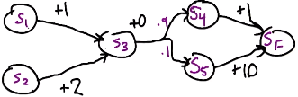
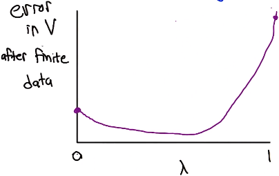

# L3 TD and Friends

These are my personal lecture notes for Georgia Tech's [Reinforcement Learning course (CS 7642, Spring 2024)](https://omscs.gatech.edu/cs-7642-reinforcement-learning) by Charles Isbell and Michael Littman. All images are taken from the course's lectures unless stated otherwise.

# References and further readings

- Littman, M. L. (1996). Algorithms for sequential decision-making. Brown University. (Chapter 2)
- Sutton, R. S. (1988). Learning to predict by the methods of temporal differences. Machine learning, 3, 9-44.
- Sutton, R. S., & Barto, A. G. (2018). Reinforcement learning: An introduction. MIT press.
        
    Chapters: 4.1-4.8, 5.1-5.4, 5.10, 6.1-6.7, 6.9, 8.1-8.5, 8.12-8.13

# Table of Contents

- [RL context](#rl-context)
- [TD Lambda](#td-lambda)
    - [Example](#example)
    - [Estimating from data](#estimating-from-data)
    - [Computing estimates incrementally](#computing-estimates-incrementally)
    - [Properties of learning rates](#properties-of-learning-rates)
    - [Selecting learning rates](#selecting-learning-rates)
- [TD(1) update rule](#td1-update-rule)
    - [Details](#details)
    - [TD(1) example](#td1-example)
    - [TD(1) example with repeated states](#td1-example-with-repeated-states)
    - [Why TD(1) is "wrong"?](#why-td1-is-wrong)
- [TD(0) update rule](#td0-update-rule)
    - [TD(1) vs TD(0)](#td1-vs-td0)
- [TD($\lambda$) update rule](#tdlambda-update-rule)
- [K-step estimators](#k-step-estimators)
    - [TD($\lambda$) in terms of k-step estimators](#tdlambda-in-terms-of-k-step-estimators)
- [TD($\lambda$) empirical performance](#tdlambda-empirical-performance)

# RL context

- An RL algorithm takes sequences of $<s,a,r>^*$ (* indicates sequence) as inputs and learns a policy $\pi$:

    $<s,a,r>^* \rightarrow$ `RL algorithm` $\rightarrow \pi$ 

Three main families of RL algorithms:

1. Model-based: learn a model of the transitions and rewards (T and R), then solve the MDP to get the optimal value function Q* ($\pi^*$ can be derived from Q* by taking argmax):
    
    $<s,a,r>^* \rightarrow$ `Model learner` $\leftrightarrows T, R \rightarrow$ `MDP solver` $\rightarrow Q^* \rightarrow$ `argmax` $\rightarrow \pi$

    > Note: $\leftrightarrows$ means the model learner also takes the current estimate of T and R to improve the model.

2. Model-free (value-function-based): learn Q directly from $<s,a,r>$:

    $<s,a,r>^* \rightarrow$ `Value update` $\leftrightarrows Q^* \rightarrow$ `argmax` $\rightarrow \pi$

3. Model-free (policy-based): learn $\pi$ directly from $<s,a,r>$:

    $<s,a,r>^* \rightarrow$ `Policy update` $\leftrightarrows \pi$

- From type 1 to 3, the learning becomes more direct and less supervised.
- Different problems may be better suited for different types.
- The 2nd type above (value-function-based) strikes a nice balance between computational and learning simplicity.

# TD Lambda

- TD (Temporal Difference): Learning to predict over time.

    $S_0\xrightarrow{r_0}S_1\xrightarrow{r_1}S_2\xrightarrow{r_2}S_F \text{ (final state)}$

    - We are trying to predict the sum of discounted rewards.

## Example

Learn $V(s)= 
\begin{cases}
    0,& \text{if } s = S_F\\
    E[r+\gamma v(s')],& \text{otherwise}
\end{cases}
$

Given $\gamma=1$, what is the value of $V(S_3)$? $V(S_1)$?

Answer:

$V(S_3)= 0 + \gamma \cdot V(S_4) \cdot 0.9 + \gamma \cdot V(S_5) \cdot 0.1 =1.9$

$V(S_1)= 2.9$

## Estimating from data

- In the above example, we already know the model of the MDP (i.e. we know T and R). What if we don't know the model?
- Consider the exact same MDP as we have in the above example, but we don't have info about T and R this time. Given the following data (five episodes of simulations), estimate $V(S_1)$ after 3 episodes and 4 episodes (assume $\gamma=1$):

    1. $S_1\xrightarrow{+1}S_3\xrightarrow{+0}S_4\xrightarrow{+1}S_F$
    2. $S_1\xrightarrow{+1}S_3\xrightarrow{+0}S_5\xrightarrow{+10}S_F$
    3. $S_1\xrightarrow{+1}S_3\xrightarrow{+0}S_4\xrightarrow{+1}S_F$
    4. $S_1\xrightarrow{+1}S_3\xrightarrow{+0}S_4\xrightarrow{+1}S_F$
    5. $S_2\xrightarrow{+2}S_3\xrightarrow{+0}S_5\xrightarrow{+10}S_F$

    - Answer:
    
        $V(S_1)$ in episode 1 $= 1 + 0 + 1 = 2$

        $V(S_1)$ in episode 2 $= 1 + 0 + 10 = 11$

        $V(S_1)$ in episode 3 $= 1 + 0 + 1 = 2$

        $V(S_1)$ in episode 4 $= 1 + 0 + 1 = 2$

        Average of $V(S_1)$ after 3 episodes $= \frac{2+11+2}{3} = 5$

        Average of $V(S_1)$ after 4 episodes $= \frac{2+11+2+2}{4} = 4.25$

    - With more data, the estimate will be closer to the true value (2.9 for this MDP).

## Computing estimates incrementally

- Instead of averaging the values of all episodes so far, we can also compute the estimate incrementally by updating the estimate after each episode. For example:
    
    - After three episodes, we have:

        $V_3(S_1) = 5$

        ($V_3(S_1)$ means the average of $V(S_1)$ after 3 episodes)

    - In episode 4, we have:

        $R_4(S_1) = 2$
        
        (the total return of $S_1$ (i.e. value of $S_1$) we got from episode 4)

    - To update the estimate with info we just got from episode 4, we can compute the weighted average as follows:

        $\displaystyle V_4(S_1)=\frac{3 \cdot V_3(S_1) + R_4(S_1)}{4} = \frac{3 \cdot 5 + 2}{4} = 4.25$

        where 3 is the number of episodes the estimate is based on so far.

    - We can generalize the above formula as follows:

        $\displaystyle V_{T}(S_1) = \frac{(T-1) V_{T-1}(S_1) + R_T(S_1)}{T}$

        where $T$ indicates the episode number.
    
    - Rearrange the above formula, we have:

        $V_{T}(S_1) = V_{T-1}(S_1) + \alpha _T (R_T(S_1) - V_{T-1}(S_1))$  
            
        where $\alpha _T = \frac{1}{T}$ in this case (Learning rate)

    - In other words, the estimate is updated by a weighted difference between the recent data $R_T(S_1)$ and the old estimate $V_{T-1}(S_1)$ (i.e. "error").
    - As $T$ increases, $\alpha _T$ decreases, which means we are getting smaller and smaller updates.

# Properties of learning rates

- If $T$ is big enough, we will be able to learn the true expected value.

    $\displaystyle \lim_{T \to \infty} V_T(S) = V(S)$

    Given that the following conditions are met:

    1. $\displaystyle \sum_{T=1}^{\infty} \alpha _T = \infty$

    2. $\displaystyle \sum_{T=1}^{\infty} \alpha _T^2 < \infty$

    - First condition: learning rate doesn't decrease too fast, so that we can keep learning.
    - Second condition: learning rate doesn't decrease too slow, so that we can converge to the true value.

## Selecting learning rates

Example:

Which of the following learning rates satisfy the two conditions above?

1. $\displaystyle \alpha _T = \frac{1}{T^2}$
2. $\displaystyle \alpha _T = \frac{1}{T}$
3. $\displaystyle \alpha _T = \frac{1}{T^{2/3}}$
4. $\displaystyle \alpha _T = \frac{1}{T^{1/2}}$
5. $\displaystyle \alpha _T = \frac{1}{100}$

Hint: An infinite series of the form

$\displaystyle \sum \frac{1}{T^p}$

converges if and only if $p>1$.

Answer: 2 and 3.

# TD(1) update rule

>    For each episode T:
>
>   - For all $s$, initialize $e(s)$ and $V_T(s)$
>   - For each step $t$ in this episode:
>       - Update $e(s_{t-1})$
>       - For all $s$:
>           - Update $V_T(s)$
>           - Decay $e(s)$

## Details

For each episode T:

- Initialize $e(s)$ and $V_T(s)$:

    For all $s$,

    $e(s) = 0$, where $e(s)$ is the eligibility of state $s$   
    $V_T(s) = V_{T-1}(s)$ (i.e. initialize with the previous estimates)

- For each step $t$ in this episode:  
    $s_{t-1} \xrightarrow{r_t}  s_t$

    1. Update $e(s_{t-1})$:

        $e(s_{t-1}) = e(s_{t-1}) + 1$

    2. For all $s$, 
        
        1. Update the values by the temporal difference:

            $V_T(s) = V_{T}(s) + \alpha _T (R_T(s_t) - V_{T-1}(s_{t-1}))\cdot e(s)$

            i.e.

            $V_T(s) = V_{T}(s) + \alpha _T (r_t + \gamma V_{T-1}(s_t) - V_{T-1}(s_{t-1}))\cdot e(s)$

            Notes:

            - $s$ here refers to all states, not just $s_{t-1}$ and $s_t$.
            - $V_T(s)$ on the right-hand side is not updated yet.
            - We update $V_T$ for all $s$ with the same temporal difference obtained from step $t$, but $e(s)$ is different for different $s$.

        2. Decay the eligibility:
            
            $e(s) = \gamma e(s)$

## TD(1) example

$S_1\xrightarrow{r_1}S_2\xrightarrow{r_2}S_3\xrightarrow{r_3}S_F$

Episode 1:
First, Initialize $e(s)$ and $V_1(s)$:

$e(S_1) = 0$  
$e(S_2) = 0$  
$e(S_3) = 0$

> Let's first look at the first step:  
>   $S_1\xrightarrow{r_1}S_2$

1. Update $e(S_1)$

    $e(S_1) = 0 + 1 = 1$

2. For all $s$

    1. Update $V_1(s)$ using the temporal difference as follows:

        $\alpha (r_1 + \gamma V_{T-1}(S_2) - V_{T-1}(S_{1}))\cdot e(s)$

        (For simplicity, we'll only write down the temporal difference here)

        So we have:

        $\Delta V_1(S_1) = \alpha(r_1 + \gamma V_0(S_2) - V_0(S_1))$

        $\Delta V_1(S_2) = 0$

        $\Delta V_1(S_3) = 0$

        (Values for $S_2$ and $S_3$ are not updated since $e(S_2) = e(S_3) = 0$)

    2. Decay $e(s)$

        $e(S_1) = \gamma e(S_1) = \gamma$  
        $e(S_2) = \gamma e(S_2) = 0$  
        $e(S_3) = \gamma e(S_3) = 0$

> Let's look at the second step:  
>	$S_2\xrightarrow{r_2}S_3$

1. Update $e(S_2)$

    $e(S_2) = 0 + 1 = 1$

2. For all $s$

    1. Update $V_1(s)$

        Temporal difference for this step is:

        $\alpha(r_2 + \gamma V_0(S_3) - V_0(S_2))\cdot e(s)$
    
        Add the temporal difference to the previous estimate, weighted by $e(s)$ (again, for simplicity, we'll only write down the total temporal difference here):

        $\Delta V_1(S_1) = \alpha (r_1 + \gamma V_0(S_2) - V_0(S_1)) + \gamma\alpha(r_2 + \gamma V_0(S_3) - V_0(S_2))$

        $\Delta V_1(S_2) = 0 + \alpha(r_2 + \gamma V_0(S_3) - V_0(S_2))$

        $\Delta V_1(S_3) = 0$

        Simplify the above equations:

        $\Delta V_1(S_1) = \alpha (r_1 + \gamma r_2 + \gamma^2 V_0(S_3) - V_0(S_1))$

        $\Delta V_1(S_2) = \alpha(r_2 + \gamma V_0(S_3) - V_0(S_2))$

        $\Delta V_1(S_3) = 0$
        
    2. Decay $e(s)$

        $e(S_1) = \gamma e(S_1) = \gamma^2$  
        $e(S_2) = \gamma e(S_2) = \gamma$  
        $e(S_3) = \gamma e(S_3) = 0$

> Let's look at the third step:  
>   $S_3\xrightarrow{r_3}S_F$

1. Update $e(S_3)$

    $e(S_3) = 0 + 1 = 1$

2. For all $s$

    1. Update $V_1(s)$

        Temporal difference for this step is:

        $\alpha(r_3 + \gamma V_0(S_F) - V_0(S_3))\cdot e(s)$

        Therefore:

        $\Delta V_1(S_1) = \alpha (r_1 + \gamma r_2 + \gamma^2 r_3 + \gamma^3 V_0(S_F) - V_0(S_1))$

        $\Delta V_1(S_2) = \alpha(r_2 + \gamma r_3 + \gamma^2 V_0(S_F) - V_0(S_2))$

        $\Delta V_1(S_3) = \alpha(r_3 + \gamma V_0(S_F) - V_0(S_3))$

    For episode T:

    $\Delta V_T(S_1) = \alpha (r_1 + \gamma r_2 + \gamma^2 r_3 + \gamma^3 V_0(S_F) - V_{T-1}(S_1))$

    $\Delta V_T(S_2) = \alpha(r_2 + \gamma r_3 + \gamma^2 V_0(S_F) - V_{T-1}(S_2))$

    $\Delta V_T(S_3) = \alpha(r_3 + \gamma V_0(S_F) - V_{T-1}(S_3))$

> Notes
>
> - $e(s)$ helps keep track of how many times a state has been visited, e.g. $e(S_1) = 1$ means $S_1$ has been visited once, $e(S_1) = \gamma$ means $S_1$ has been visited twice, etc.
> - $\Delta V_1(s)$ can be seen as the weighted difference between:
>    - the sum of rewards from the current step to the final step, and the discounted value of the final state, 
>    - and the old estimate $V_0(s)$.
> - Since the value of $S_F$ is zero, we can simplify the above equations as follows:
>
>    $\Delta V_T(S_1) = \alpha (r_1 + \gamma r_2 + \gamma^2 r_3 - V_{T-1}(S_1))$
>
>    $\Delta V_T(S_2) = \alpha(r_2 + \gamma r_3 - V_{T-1}(S_2))$
>
>    $\Delta V_T(S_3) = \alpha(r_3 - V_{T-1}(S_3))$
>
> - The above example shows that TD(1) is exactly the same as outcome-based updates (if no repeated states), i.e. we update $V(s)$ with the discounted sum of all the rewards we see during learning ('outcome') minus the old estimate.

## TD(1) example with repeated states

$S_1\xrightarrow{r_1}S_2\xrightarrow{r_2}S_3\xrightarrow{r_3}S_1\xrightarrow{r_1'}S_F$

- In the above example, we have a repeated state $S_1$.
- If we were doing outcome-based updates, we would have:

    $\Delta V_T(S_1) = \alpha (r_1 + \gamma r_2 + \gamma^2 r_3 + \gamma^3 r_1' - V_{T-1}(S_1))$

    - i.e. We don't learn from things we've seen before. (We ignore the things we know about $S_1$ from the first visit.)

- However, with TD(1), when we see $S_1$ again, we sort of backup its value, capturing the fact that the last time we saw $S_1$, we went from $S_1$ to $S_2$ and got a reward of $r_1$.

    - TD(1) is like outcome-based updates with extra learning

## Why TD(1) is "wrong"?

Let's look at the same MDP and the same episodes we had before:

1. $S_1\xrightarrow{+1}S_3\xrightarrow{+0}S_4\xrightarrow{+1}S_F$
2. $S_1\xrightarrow{+1}S_3\xrightarrow{+0}S_5\xrightarrow{+10}S_F$
3. $S_1\xrightarrow{+1}S_3\xrightarrow{+0}S_4\xrightarrow{+1}S_F$
4. $S_1\xrightarrow{+1}S_3\xrightarrow{+0}S_4\xrightarrow{+1}S_F$
5. $S_2\xrightarrow{+2}S_3\xrightarrow{+0}S_5\xrightarrow{+10}S_F$

What is the value of $V(S_2)$ based on:
- outcome-based TD(1) estimate?
- maximum likelihood estimate? (i.e. compute $V(S_2)$ using a model derived from the data)

(assume $\gamma=1$)

Answers:

- outcome-based TD(1) estimate:

    $V(S_2) = 2 + 0 + 10 = 12$

- maximum likelihood estimate:
    
    $T(S_3, a, S_4) = \frac{3}{5} = 0.6$   
    (we go from $S_3$ to $S_4$ in 3 out of 5 episodes)

    $T(S_3, a, S_5) = \frac{2}{5} = 0.4$  
    (we go from $S_3$ to $S_5$ in 2 out of 5 episodes)

    where $a$ is the action that we take in $S_3$.

    Therefore:

    $V(S_2) = 2 + V(S_3)$

    $V(S_2) = 2 + 0 + 1\cdot (0.6 \cdot 1 + 0.4 \cdot 10) = 6.6$

- Recall that the actual value of $V(S_2)$ for this MDP is 3.9. The estimate from outcome-based TD(1) is less accurate than the estimate from maximum likelihood because less information is available (only episode 5) and it happens that the episode used for the estimate is not representative of the model.
- In other words, estimates from TD(1) can be far off from the true value if the data is not representative of the model.

# TD(0) update rule

- It finds the MLE (maximum likelihood estimate) with finite data repeated infinitely often. (You'll see what this means and how it is related to TD(1) later.)

- In episode T, we went from $s_{t-1}$ to $s_t$ and got a reward of $r_t$. With this new information, we update the estimate of $V(s_{t-1})$ by the temporal difference:

    $V_T(s_{t-1}) = V_{T}(s_{t-1}) + \alpha _T (r_t + \gamma V_{T}(s_t) - V_{T}(s_{t-1}))$

    > Note that the update equation can be written as follows in some literature:
    >
    > $V_T(s_{t-1}) = V_{T}(s_{t-1}) + \alpha _T (r_t + \gamma V_{T-1}(s_t) - V_{T-1}(s_{t-1}))$
    >
    > Notice that on the right hand side $V_{T-1}$ instead of $V_T$ are used to compute the temporal difference. This doesn't matter because $V_{T-1}$ and $V_T$ are the same before the update. (Recall that we initialize $V_T$ with $V_{T-1}$.) Also, we are looking at one step at a time, so in step $t$, we are only updating the value of $s_{t-1}$, not $s_t$. Therefore, the value of $s_t$ is not updated yet (i.e. $V_T(s_t)$ equals to $V_{T-1}(s_t)$).
    

    
- We update the value at a learning rate of $\alpha _T$: Remember that we are not replacing the old estimate completely, but updating it by a weighted difference between the new information and the old estimate. One reason for this is that the new information we get in the current episode may not be representative of the model, as we may end up in different next states ($s_t$'s) in different episodes.
- If we repeat the TD(0) update rule over the data infinitely often to sample all possible $s_t$'s, and the probability of seeing each $s_t$ can be used as the weight to compute the expected update.
- In other words, TD(0) finds the MLE (maximum likelihood estimate):

    $\displaystyle V_T(s_{t-1}) = \mathbb{E}_{s_t} [r_t + \gamma V_{T}(s_t)]$

## TD(1) vs TD(0)

- For TD(1), because we update the value with the rewards we see in every episode without considering the probability of seeing each $s_t$, even if we repeat TD(1) over the data infinitely, we will still be updating the value with the same reward sequence we see in every episode. This means we will still get the same estimate. Consider the following equation which computes the expected sequence of discounted rewards:

    $\displaystyle V_T(s_{t-1}) = \mathbb{E}[r_t + \gamma r_{t+1} + \gamma^2 r_{t+2} + \gamma^3 r_{t+3} + \cdots]$

    - The expected value is the same no matter how many times we run TD(1) over the data, because the reward sequence we see will be the same in every run.

- In the previous example, $S_2$ is only visited in episode 5. Even if we repeat the data infinitely, we will still be updating the value of $S_2$ with the same reward sequence we see in episode 5.

# TD($\lambda$) update rule

- TD($\lambda$) is a generalization of TD(0) and TD(1).

Compare the algorithms for TD(1) and TD(0):

> **TD(1):**
>    
>    For each episode T:
>
>   - For all $s$, initialize $e(s)$ and $V_T(s)$
>
>       $e(s) = 0$
>
>       $V_T(s) = V_{T-1}(s)$
>
>   - For each step $t$ in this episode:
>       - Update $e(s_{t-1})$
>
>           $e(s_{t-1}) = e(s_{t-1}) + 1$
>
>       - For all $s$:
>           - Update $V_T(s)$
>
>             $V_T(s) = V_{T}(s) + \alpha _T (r_t + \gamma V_{T-1}(s_t) - V_{T-1}(s_{t-1}))\cdot e(s)$
>
>           - Decay $e(s)$
>
>              $e(s) = \gamma e(s)$

> **TD(0):**
>
>    For each episode T:
>
>   - For all $s$, initialize $V_T(s)$
>
>       $V_T(s) = V_{T-1}(s)$
>
>   - For each step $t$ in this episode:
>       - Update $V_T(s_{t-1})$
>
>         $V_T(s_{t-1}) = V_{T}(s_{t-1}) + \alpha _T (r_t + \gamma V_{T-1}(s_t) - V_{T-1}(s_{t-1}))$

- To generalize the above two algorithms, we can introduce a parameter $\lambda$ to control the trade-off between TD(0) and TD(1).

> TD($\lambda$):
>
> $\cdots$
>
> Same algorithm as TD(1), but decay $e(s)$ by an additional factor of $\lambda$:
>
> $e(s) = \gamma \lambda e(s)$

- When $\lambda=0$, we get TD(0), and when $\lambda=1$, we get TD(1).

# K-step estimators

- TD(0) is a 1-step estimator, because it only looks one step ahead.
- TD(1) is an infinite-step estimator, because it looks all the way to the end of the episode.
- Consider the following estimators from one step to infinite steps ahead:

    - $E_1$: $V(s_t) = V(s_t) + \alpha_T (r_{t+1} + \gamma V(s_{t+1}) - V(s_t))$
    - $E_2$: $V(s_t) = V(s_t) + \alpha_T (r_{t+1} + \gamma r_{t+2} + \gamma^2 V(s_{t+2}) - V(s_t))$
    - $E_3$: $V(s_t) = V(s_t) + \alpha_T (r_{t+1} + \gamma r_{t+2} + \gamma^2 r_{t+3} + \gamma^3 V(s_{t+3}) - V(s_t))$
    - $E_k$: $V(s_t) = V(s_t) + \alpha_T (r_{t+1} + \cdots + \gamma^{k-1} r_{t+k} + \gamma^k V(s_{t+k}) - V(s_t))$
    - $E_{\infty}$: $V(s_t) = V(s_t) + \alpha_T (r_{t+1} + \cdots + \gamma^{k-1} r_{t+k} + \cdots - V(s_t))$

        Note that for $E_{\infty}$, the term $\gamma^k V(s_{t+k})$ drops out because $\gamma^k$ goes to zero as $k$ goes to infinity.

## TD($\lambda$) in terms of k-step estimators

- A way to think about TD($\lambda$) is that it is a weighted combination of all the k-step estimators.

- The weight of each k-step estimator is $\lambda^{k-1}(1-\lambda)$:

    - $E_1$: $1-\lambda$
    - $E_2$: $\lambda(1-\lambda)$
    - $E_3$: $\lambda^2(1-\lambda)$
    - $E_k$: $\lambda^{k-1}(1-\lambda)$
    - $E_{\infty}$: $\lambda^\infty$

- If $\lambda=1$, all the weights become zero except for $E_{\infty}$ where the weight will be 1 (we only get $E_{\infty}$, i.e. TD(1)).
- If $\lambda=0$, all the weights become zero except for $E_1$ where the weight will be 1 (we only get $E_1$, i.e. TD(0)).
- If $0<\lambda<1$, we get a weighted combination of all the k-step estimators.

> Note that all the weights sum to 1:
>
>    $\displaystyle \sum_{k=1}^{\infty} \lambda^{k-1}(1-\lambda) = (1-\lambda) \sum_{k=1}^{\infty} \lambda^{k-1} = (1-\lambda) \frac{1}{1-\lambda} = 1$
>
>    (This is a geometric series: $a + ar + ar^2 + \cdots = \frac{a}{1-r}$ where $a$ here is $1-\lambda$ and $r$ is $\lambda$.)
 
# TD($\lambda$) empirical performance

We can run TD($\lambda$) with different $\lambda$'s and compare the $V$ we get from running over finite data and the $V$ we get from running over infinite data (i.e., the error; y-axis in the plot below).

- TD(1) typically has the largest error. (Recall the previous example: it has high variance and you can get very different estimates depending on whether the data is representative of the model.)
- The error is usually smallest when $\lambda$ is somewhere between 0 and 1.
- The best $\lambda$ depends on the problem, but usually it is around 0.3-0.7.

