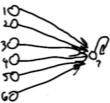
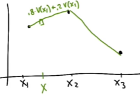

# L8 Generalization

These are my personal lecture notes for Georgia Tech's [Reinforcement Learning course (CS 7642, Spring 2024)](https://omscs.gatech.edu/cs-7642-reinforcement-learning) by Charles Isbell and Michael Littman. All images are taken from the course's lectures unless stated otherwise.

# References and further readings

- Gordon, G. J. (1995). Stable function approximation in dynamic programming. In Machine learning proceedings 1995 (pp. 261-268). Morgan Kaufmann.
- Baird, L. (1995). Residual algorithms: Reinforcement learning with function approximation. In Machine learning proceedings 1995 (pp. 30-37). Morgan Kaufmann.
- Sutton, R. S., & Barto, A. G. (2018). Reinforcement learning: An introduction. MIT press.
        
    Chapters: 9.1-9.5, 9.7, 9.12, 10.1, 10.6, 11.1-11.3, 11.10, 13.1-13.8

# Table of Contents

- [Introduction](#introduction)
- [Linear function approximation](#linear-function-approximation)
    - [Features](#features)
        - [Choosing features](#choosing-features)
    - [Basic update rule for function approximation](#basic-update-rule-for-function-approximation)
    - [Linear value function approximation](#linear-value-function-approximation)
    - [Does linear function approximation work?](#does-linear-function-approximation-work)
        - [Baird's counterexample](#bairds-counterexample)
        - [Bad update sequence](#bad-update-sequence)
- [Averagers](#averagers)
    - [Connection to MDPs](#connection-to-mdps)

# Introduction

- Generalization: leverage info we get from the states that we have seen to make predictions about states we haven't seen.
- Why do we need generalization?
    - In many cases, there are too many states to visit all of them.
- Two methods for generalization in this lesson:
    - Linear function approximation
    - Averagers

# Linear function approximation

What can we generalize?
- Policy
    - e.g. instead of mapping each state to an action, we can map a set of similar states to an action.
    - e.g. Policy gradient methods (popular in robotics)
- Value function (for example, Q)
    - e.g. instead of mapping each state-action pair to a value, we approximate the estimated return.
- Model
    - e.g. we can learn from examples about the dynamics of the environment (what state we will end up in after taking an action in a state).
    - Generalizing models is actual not that well understood
- This lecture will focus on generalizing value functions.

## Features

- A state can be represented by a set of features.
- e.g. In the taxi example, a state can be represented by a 5-dimensional feature vector $f$:
    - $f_1$: fuel level
    - $f_2$: x-coordinate of the taxi
    - $f_3$: y-coordinate of the taxi
    - $f_4$: near wall
    - $f_5$: always 1

- Using these features, we can tell how similar two states are. (e.g. we can be in different states but have the same fuel level)

### Choosing features

- Different representations can lead to different generalization.
- Selecting the right features makes learning easier.
- Features should be:
    - Computationally efficient to acquire
    - informative

## Basic update rule for function approximation

- We have a value function $Q(s,a)$ that we want to approximate:

    $Q(s,a) = F(w^a, f(s))$

- $F$ is the function approximator.
- $w^a$ is the weight vector for action $a$.
- $f(s)$ is the feature vector for state $s$.
- Each feature has a corresponding weight in the weight vector.
- To update the weights (aka parameters), we use the following update rule:

    $\Delta w^a_i = \alpha [r + \gamma \max_{a'} Q(s', a') - Q(s,a)] \frac{\partial Q(s,a)}{\partial w^a_i}$

    - $\alpha$ is the learning rate
    - $w^a_i$ is the $i$-th weight in the weight vector $w^a$.
    - $r + \gamma \max_{a'} Q(s', a') - Q(s,a)$ is the TD error (i.e. the difference between the target and the current estimate, $Q(s,a)$)
    - $\frac{\partial Q(s,a)}{\partial w^a_i}$ is the gradient of the value function with respect to the weight $w^a_i$. (i.e. how much the parameter $w^a_i$ affects the value function)
    - $\Delta w^a_i$ tells us how much we should change the weight $w^a_i$ to reduce the TD error
- Compare the above update rule with supervised learning:
    - In supervised learning (SL), we also have a target value and we update the weights to reduce the difference between the target and the predicted value. The difference is that in SL, the target is given (aka the label) while in RL, the target is the TD target obtained by bootstrapping.

## Linear value function approximation

- One way to approximate the value function is to use a linear function approximator
- Q-function can be represented as a linear function:
    
    $\displaystyle Q(s,a) = \sum_{i=1}^{n} w^a_i \cdot f_i(s)$
    - $n$ is the number of features
    - This is a dot product of weights and features
- Since the weights are *shared* across all features, it provides a way to generalize across states.
- Weights give "importance" to each feature in contributing to an action's value

- Given the above definition of Q, what is $\frac{\partial Q(s,a)}{\partial w^a_i}$ then?
    - It's simply the i-th feature's value of state $s$, $f_i(s)$
    - Hint: Treat the feature value as a constant, $\frac{\partial}{\partial w} (w \cdot c) = c$

## Does linear function approximation work?

- It has been shown to work well in some cases:
    - 3-layer backpropagation
    - CMAC
    - Linear networks
    - Deep networks (e.g. Minh et al. about solving Atari games)
- But it can also fail:
    - Baird's counterexample

### Baird's counterexample

Consider the following MDP:

- There are 7 states, each with a single action that transitions to State 7. (State 7 goes back to itself)
- The transitions are deterministic
- There is no choice in the actions
- The reward is 0 for all transitions

Each state is represented by the a feature vector of size 8 as follows:

| State | $f_0$ | $f_1$ | $f_2$ | $f_3$ | $f_4$ | $f_5$ | $f_6$ | $f_7$ |
|-------|-------|-------|-------|-------|-------|-------|-------|-------|
| 1     | 1     | 2     | 0     | 0     | 0     | 0     | 0     | 0     |
| 2     | 1     | 0     | 2     | 0     | 0     | 0     | 0     | 0     |
| 3     | 1     | 0     | 0     | 2     | 0     | 0     | 0     | 0     |
| 4     | 1     | 0     | 0     | 0     | 2     | 0     | 0     | 0     |
| 5     | 1     | 0     | 0     | 0     | 0     | 2     | 0     | 0     |
| 6     | 1     | 0     | 0     | 0     | 0     | 0     | 2     | 0     |
| 7     | 7     | 0     | 0     | 0     | 0     | 0     | 0     | 1     |

- Given that the reward is 0 for all transitions, the value function for all states should be 0
- What should the weights be for the linear function approximator?
- There are infinitely solutions to this problem
    - e.g. $w = [0, 0, 0, 0, 0, 0, 0, 0]$
    - or $w = [-1, 1/2, 1/2, 1/2, 1/2, 1/2, 1/2, 7]$
    - Therefore, the value function is said to be *multiplely (or infinitely) representable*.
    - This is a problem because we want a unique value function.

### Bad update sequence

- Baird showed that the value update may go out of control with linear function approximation in some cases.
- Let's write down the value function for each state first:

    $V(1) = f(1) \cdot w = w_0 + 2w_1$
    
    $V(2) = w_0 + 2w_2$

    $V(3) = w_0 + 2w_3$

    $V(4) = w_0 + 2w_4$

    $V(5) = w_0 + 2w_5$

    $V(6) = w_0 + 2w_6$

    $V(7) = 7w_0 + w_7$

- For the case where,
    - $w_i > 0$
    - $V(7) >> V(i)$
    - $\gamma = 0.9$
    - $\alpha = 0.1$
    - The update episodes ($s,r,s'$) are:
        - $<1,0,7>$
        - $<2,0,7>$
        - $<3,0,7>$
        - $<4,0,7>$
        - $<5,0,7>$
        - $<6,0,7>$
        - $<7,0,7>$
- What is the value of $w_0$ after one update (i.e. after the first episode $<1,0,7>$)?
- Let's say we initialize the weights to $1$. (So $V(1) = 3$, $V(7) = 8$)
    - Using the update rule, we have:

        $\begin{align}
        \notag \Delta w_0 &= \alpha [r + \gamma V(s') - V(s)] \frac{\partial V(s)}{\partial w_0} \\
        \notag &= 0.1 [0 + 0.9 \cdot 8 - 3] \cdot 1 \\
        \notag &= 0.42 
        \end{align}$

    - What happens after each subsequent update?
        - $w_0$ will keep increasing!
        - This is also true for $w_1, w_2, ..., w_6$
        - We will never converge

- What if we initialize the weights to $0$?
    - The weights will stay at $0$ forever
    - The value function will never be updated

- Lesson: If we have shared weights, everything depends on everything else, then even a simple update rule is not guaranteed to converge.

# Averagers

- A class of function approximators that avoid the problem of multiple representations and it will converge
- The idea is to represent the value that we want to approximate as a *convex combination* of points we know

- Consider the following example:
    
    

    - The states $x_1, x_2, x_3$ are called the **anchor points**
    - We want to estimate the value of the square point in the figure based on the values of the anchor points
    - We can **interpolate** by taking the average of the two anchor points weighted by e.g. the distance to the anchor points: $0.8 \cdot V(x_1) + 0.2 \cdot V(x_2)$
    - There are other ways to interpolate, as long as we have a **convex combination of the anchor points**
    - If the point we want to estimate is outside the range of the anchor points, the estimate must be within the range of the anchor points

- We can generalize the above idea as follows:

    $V(s) = \sum_{s_b \in B} w(s, s_b) V(s_b)$

    - $s_b$ is the anchor point (basis state)
    - $B$ is the set of anchor points (basis set)
    - $w(s, s_b)$ is the convex combination weight

    - Note that the weights $w(s, s_b)$ are pre-defined while the values of the anchor points $V(s_b)$ are the parmaeters we want to learn

    - Also note that the approximator is subject to:

        $w(s, s_b) \geq 0$, $ \forall s,s_b$ 
        
        $\displaystyle \sum_{s_b \in B} w(s, s_b) = 1$, $\forall s$

- KNN is an example of an averager. In fact, many kernel methods are averagers.

## Connection to MDPs

- We can incorporate the averager into the MDP framework as follows:

    $\begin{align}
    \notag V(s) &= \max_a[ R(s,a) + \gamma \sum_{s'} T(s,a,s') \cdot  V(s')] \\
    \notag &= \max_a[ R(s,a) + \gamma \sum_{s'} T(s,a,s') \sum_{s_b \in B} w(s', s_b) \cdot  V(s_b)] \\
    \notag &= \max_a[ R(s,a) + \gamma \sum_{s_b \in B}(\sum_{s'} T(s,a,s') w(s', s_b)) \cdot V(s_b)]
    \end{align}$

- We can rewrite $\sum_{s'} T(s,a,s') w(s', s_b)$ as $ T'(s,a,s_b)$

    $\begin{align}
    \notag V(s) &= \max_a[ R(s,a) + \gamma \sum_{s_b \in B} T'(s,a,s_b) \cdot V(s_b)]
    \end{align}$

- $T'(s,a,s_b)$ acts like a transition function:
    - It is non-negative
    - It sums to 1 over $s_b$ because $T(s,a,s')$ and $w(s', s_b)$ are both convex combinations
- Therefore, the Bellman equation still holds with the averager in place.
    - The averager method can be viewd as an MDP over the basis states $s_b$:
    - Intuitively, you can think that the agent transitions to a new state $s'$, where it takes an extra step to the basis states $s_b$ and estimates the value of $s'$ based on the values of the basis states.
