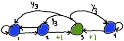
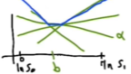
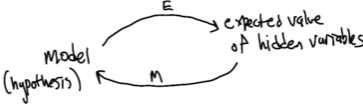
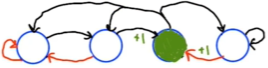

# L9 Partially Observable MDPs (POMDPs)

These are my personal lecture notes for Georgia Tech's [Reinforcement Learning course (CS 7642, Spring 2024)](https://omscs.gatech.edu/cs-7642-reinforcement-learning) by Charles Isbell and Michael Littman. All images are taken from the course's lectures unless stated otherwise.

# References and further readings

- Littman, M. L. (2009). A tutorial on partially observable Markov decision processes. Journal of Mathematical Psychology, 53(3), 119-125.
- Sutton, R. S., & Barto, A. G. (2018). Reinforcement learning: An introduction. MIT press.
        
    Chapter: 17.3

# Table of Contents

# Introduction

- A way of talking about "non-Markovian" environments (current state does not contain all the info needed to make optimal decisions)
- In MDPs, we have $<S, A, T, R>$
- In POMDPs, we have $<S, A, T, R, Z, O>$
    - $Z$ is a set of observables
    - $O$ is the observation function
    - $O(s, z)$ is the probability of observing $z$ in state $s$
- POMDPs generalize MDPs:
    - A POMDP is an MDP when $Z = S$ and $O(s, z) = 1$ iff $s = z$

## Example

- Consider the following example:

    

    - There are 4 states: $s_1, s_2, s_3, s_4$
    - Each state has 2 actions: Left and Right
    - For $s_3$, no matter what action we take, we have equal probability of going to $s_1$, $s_2$, or $s_4$
    - Only entering $s_3$ gives a reward of +1
    - The only observation we have is the color (green or blue)
- Assume that:
    - We know the probability for starting in $s_1, s_2, s_3$ and $s_4$ are $1/3, 1/3, 1/3$ and $0$
    - we first took left and observed blue, then took right and observed blue. If we then talk left, what is the probability of observing blue?

        $L \text{ (see blue)} \rightarrow R \text{ (see blue)} \rightarrow L \text{ (see ?)}$
    
    - We can keep track of the probability of being in each state:

        Probability of being in $[s_1, s_2, s_3, s_4]$:

        - Starting: $[1/3, 1/3, 1/3, 0]$

        - Step 1: go left

            Possible transitions given that we observed blue, and the transition probabilities: 
            
            $s_1 \rightarrow s_1$ (100%)
            
            $s_2 \rightarrow s_1$ (100%)

            $s_3 \rightarrow s_1, s_2, s_4$ (1/3, 1/3, 1/3)

            So the probability of being in $s_1$ is $\frac{1}{3} \cdot 1 + \frac{1}{3} \cdot 1 + \frac{1}{3} \cdot \frac{1}{3} = \frac{7}{9}$

            The probability of being in $s_2$ is $\frac{1}{3} \cdot 0 + \frac{1}{3} \cdot 0 + \frac{1}{3} \cdot \frac{1}{3} = \frac{1}{9}$

            The probability of being in $s_4$ is $\frac{1}{3} \cdot 0 + \frac{1}{3} \cdot 0 + \frac{1}{3} \cdot \frac{1}{3} = \frac{1}{9}$

            Therefore, after taking left and observing blue, the probability of being in $[s_1, s_2, s_3, s_4]$ is
            
            $[7/9, 1/9, 1/9, 0]$

        - Step 2: go right

            Possible transitions given that we observed blue, and the transition probabilities:  
            
            $s_1 \rightarrow s_2$ (100%)

            $s_4 \rightarrow s_4$ (100%)

            Like how the probabilities are calculated in step 1, we get the probability of being in $[s_1, s_2, s_3, s_4]$ as

            $[0, 7/9, 0, 1/9]$

            Note that the probabilities do not sum to 1. We can normalize them by scaling them up by 9/8:

            $[0, 7/8, 0, 1/8]$

        - Step 3: go left

            Possible transitions:

            $s_2 \rightarrow s_1$ (100%)

            $s_4 \rightarrow s_3$ (100%)

            The probability of being in $[s_1, s_2, s_3, s_4]$ is

            $[7/8, 0, 1/8, 0]$

            Since $s_1$ is blue and $s_3$ is green, we have:

            $Pr(\text{see blue}) = 7/8$

            $Pr(\text{see green}) = 1/8$

# State estimation

- We can turn an POMDP into a "belief MDP" with state estimation (SE)
- Belief state, $b(s)$: a probability distribution over states (it is a vector of probabilities)
- e.g. We start in $b$, take action $a$, observe $z$, and end up in a new belief state $b'$

    $b,a,z \rightarrow b'$
    
    (i.e. $b' = SE(b, a, z)$)

- $b'(s')$ is the probability of being in state $s'$ according to our new belief $b'$, i.e.

    $\begin{align}
    \notag b'(s') &= Pr(s' | b, a, z) \\
    \notag &= \sum_s Pr(s | b, a, z) Pr(s' | b, a, z, s) \\
    \notag &= \sum_s b(s) Pr(s' | a, z, s) \\
    \notag &= \sum_s b(s) \frac{Pr(z | s', a, s) Pr(s' | a, s)}{Pr(z | a, s)} \\
    \notag &= \frac{\sum_s b(s) O(s', z) T(s, a, s')}{\sum_s \sum_{s'} b(s) O(s', z) T(s, a, s')}
    \end{align}$

- This "belief MDP" has an infinite number of belief states (since it is a probability distribution)
    - We can use VI, PI or LP to solve it, but we need to employ some tricks (see below)

# Value iteration in POMDPs

- Initialize $V(b) = 0$ for all $b$
- The Bellman equation is

    $\displaystyle V_t(b) = \max_a [R(b, a) + \gamma \sum_z Pr(z | b, a) \cdot V_{t-1}(b')]$

    where $b' = SE(b, a, z)$

    $R(b, a) = \sum_s b(s) R(s, a)$

## Piecewise, Linear and Convex

- The problem with the above equation is that there is an infinite set of possible belief states.
- We can solve this by rewriting the equation as a "piecewise, Linear and Convex" function using a finite set of vectors $\Gamma_t$:

    $\displaystyle V_t(b) = \max_{\alpha \in \Gamma_t} \alpha \cdot b = \max_{\alpha \in \Gamma_t} \sum_s \alpha(s) \cdot b(s)$

- Now $V_t(b)$ is a maximum over a finite set of linear functions:

    

    - Each green line is a linear function
    - This example has two possible states: $s_0$ and $s_1$, and the belief states that we are in $s_0$ and in $s_1$ are $b(s_0) = 0$ and $b(s_1) = 1$
    - Each linear function can handle an infinite number of belief states.
    - The blue line is the max of the green lines.

### Where does the $\Gamma_t$ come from?

- Assume we have $\Gamma_{t-1}$ s.t. $\displaystyle V_{t-1}(b) = \max_{\alpha \in \Gamma_{t-1}} \alpha \cdot b$

- We will build $\Gamma_t$ s.t. $\displaystyle V_t(b) = \max_{\alpha \in \Gamma_t} \alpha \cdot b$

    $V_t(b) = \displaystyle \max_{a \in A}V_t^a(b)$

    $V_t^a(b) = \sum_z V_t^{a, z}(b)$ (This is like the Q-function)

    $\displaystyle V_t^{a, z}(b) = \sum_s \frac{R(s,a)b(s)}{|z|} + \gamma Pr(z | b, a) V_{t-1}(SE(b, a, z))$

    - The first term is the expected immediate reward. The second term is the expected value of the next belief state.

- Each of the above equations contains a dot product of a belief state and a finite set of vectors. The vectors can be represented as follows:

    $\Gamma_t = \cup_a \Gamma_t^a$ (union over all actions = max over all actions)

    $\Gamma_t^a = \bigoplus_z \Gamma_t^{a, z}$ (sum over all observations)

    $\Gamma_t^{a, z} = \{ \frac{1}{|z|} R(s, a) + \gamma \sum_{s'} \alpha(s') O(s', z) T(s, a, s') | \alpha \in \Gamma_{t-1} \}$

    - Note that every element here is finite: finite state space, finite action space, finite observation space.
- $V_{t-1}(SE(b, a, z))$ in the above equation for $V_t^{a, z}(b)$ can be written as follows:

    $\displaystyle V_{t-1}(SE(b, a, z)) = \max_{\alpha \in \Gamma_{t-1}} \frac{\sum_{s'} \alpha(s) O(s', z) \sum_{s} T(s, a, s')b(s)}{Pr(z|a,b)}$

- So we can rewrite $V_t^{a, z}(b)$ as:

    $\displaystyle V_t^{a, z}(b) = \sum_s \frac{R(s,a)b(s)}{|z|} + \gamma \cancel{Pr(z|b,a)} \max_{\alpha \in \Gamma_{t-1}} \frac{\sum_{s'} \alpha(s) O(s', z) \sum_{s} T(s, a, s')b(s)}{\cancel{Pr(z|a,b)}}$

    $\displaystyle = \sum_s \frac{R(s,a)b(s)}{|z|} + \gamma \max_{\alpha \in \Gamma_{t-1}} \sum_{s'} \alpha(s) \sum_{s} O(s', z) T(s, a, s')b(s)$

- You can use a program called POMDP-solve to solve POMDPs.

### Algorithmic approach

- We can purge $\Gamma_t$ by removing dominated vectors.

# RL for POMDPs

- Planning vs Learning
    - Planning: you know everything (the model)
    - Learning: you don't know the model and you need to interact

- Model-based RL for POMDPs
    - Learn the model
    - i.e. learn a POMDP
    - Use the model to plan

- Model-free RL for POMDPs
    - Map observations to actions

## Model-based RL for POMDPs

- Models can be controlled or uncontrolled, observable or partially observable:

    |   | Controlled | Uncontrolled |
    |------------|------------|--------------|
    | Observable | MC        | MDP        |
    | Partially observable | HMM | POMDP |

- We can learn the model using the EM (Expectation-Maximization) algorithm

    

## Model-free RL for POMDPs

- Learning memoryless policies (memoryless means that you don't know the past and you are not learning a sequence of actions)
- Consider the following MDP:

    

    Red: left action; Black: right action

    $\gamma = 1/2$

- If we are in any of the open circles, what is the optimal policy (The probability distribution over actions)?

    - We will go right in two out three states, and go left in one out of three states.
    - Pr(R) = 2/3
    - Pr(L) = 1/3

- What is the value of each of the open circle states ($x, y, z$), and the expected return of the policy?
    
    $x = Pr(R) \cdot \gamma y + Pr(L) \cdot \gamma x = 2/3 \cdot 1/2y + 1/3 \cdot 1/2x$

    $5x = 2y$

    $y = Pr(R) \cdot 1 + Pr(L) \cdot \gamma x = 2/3 + 1/3 \cdot 1/2x$

    $x = 6y - 4$

    Solving the above two equations, we get $x = 2/7$ and $y = 5/7$

    $z = ... = 1/2$

    So the expected return of the policy is $1/3 \cdot 2/7 + 1/3 \cdot 5/7 + 1/3 \cdot 1/2 = 1/2$

# Bayesian RL

- We can think of RL itself being a POMDP
- In Bayesian RL, we keep a distribution (Bayesian posterior) over the possible MDPs we are in
- We can behave optimally with a good balance between exploration and exploitation
- RL becomes planning

