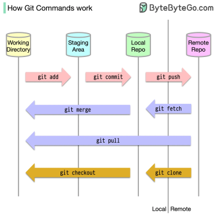

# Git workflow and commands



Figure credit: https://blog.bytebytego.com/p/ep49-api-architectural-styles

Four main components of Git:
- Workspace (working directory)
- Index (staging area)
- Local repository (HEAD)
- Remote repository

To start a new repository:
1. Create a new repository or *clone* an existing one
2. *Add* files to the index (files are staged)
3. *Commit* changes to the local repository 
4. *Push* changes to the remote repository

- If the files are already in the workspace, Steps 2 and 3 can combined with `git commit -a`

To update the workspace with changes from the remote repository:
1. *Fetch* changes from the remote repository to the local repository
2. *Merge* changes from the local repository to the workspace

# Git commands

- Basic commands
    - `git init`: Initialize a new repository
    - `git clone <repository address>`: clone a repository (Note: `origin` is the default name for the remote repository)
    - `git mv` can be used to move files
    - `git rm` can be used to remove files
    - `git help <command>`: get help on a specific command
    - `git config`: Configure Git e.g.

        ```
        git config --global user.name "George P. Burdell"
        git config --global user.email "gpbud@gatech.edu"
        ```

- Update the repository/ workspace
    - `git add <file>`: add a file to the index
    - `git add .`: add all files to the index
    - `git commit -m "message"`: commit changes to the local repository with a message
    - `git commit -a -m "message"`: add all files to the index and commit changes
    - `git push`: push changes to the remote repository
    - `git push origin <branch-name>`: push changes to a specific branch in the remote repository
    - `git push --all`: push all branches to the remote repository
    - `git fetch`: fetch changes from the remote repository to the local repository
    - `git merge`: merge changes from the local repository to the workspace
    - `git pull`: fetch and merge changes from the remote repository to the workspace

- Check history, status, and differences
    - `git log`: see the history of commits
    - `git status`: check the status of the repository
    - `git show <commit>`: see the changes in a specific commit
    - `git diff`: check the differences between the workspace and the index
        - `git diff HEAD`: check the differences between the workspace and the local repository

- Branching
    - Create a branch so that you can work on a feature without affecting the main branch. 
    - You can decide if you want to merge the branch with the main branch later. (e.g. when you just want to experiment with a feature)
    - `git branch`: see the branches (The current branch is marked with an asterisk)
    - `git branch <branch-name>`: create a branch
    - `git checkout <branch-name>`: switch to a branch (e.g. `git checkout main` to switch to the main branch)
    - `git checkout -b <branch-name>`: create a branch and switch to it
    - `git merge <branch-name>`: merge a branch with the current branch
    - `git merge <branch-name> -m "<your message>"`: message is optional but recommended
    - `git branch -d <branch-name>`: delete a branch
    - `git reset --hard HEAD^`: reverse the merge and go back to the state before the merge (use with caution, as it will discard all changes in the working directory and index. `--hard` is used to discard all changes in the working directory and index. `HEAD^` refers to the previous commit)
    - Note: You may encounter merge conflicts when merging branches. You need to resolve these conflicts manually.

- Scenario: You want to create a new branch (local) and work on a new feature, then push the branch to the remote repository
    ```bash
    git checkout -b <local-branch-name> # create a new branch and switch to it
    git push -u origin <local-branch-name> # push the branch to the remote repository: see note below
    ```
    - Note: `git push -u origin <local-branch-name>`: push a local branch to the remote repository (a remote branch with the same name will be created). `-u` stands for "upstream," and it tells Git to remember the remote branch so that you can use `git push` and `git pull` without specifying the remote branch name. Alternatively, you don't have to use the `-u` flag, but you will need to specify the remote branch name every time (e.g., `git push origin <local-branch-name>`)

- Scenario: You want to merge a branch with the main branch in the remote repository
    - You will need to create a pull request (PR) in the remote repository (e.g., GitHub) and merge the branch with the main branch.
  
- Scenario: To tag the current version of the main as “V1” and push the tag to the remote repository:
    
    ```bash
    git tag -a V1 -m "V1"
    git push origin V1
    ```
